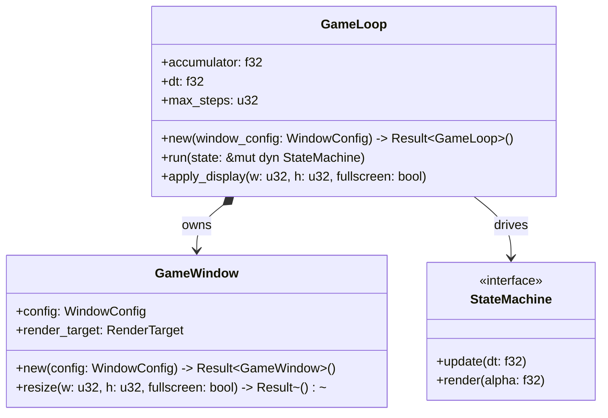

# Feature Detailed Design: Engine Core (Feature #1)

**Date**: 2026-05-31
**Feature**: #1 -- Engine Core
**Priority**: high
**Dependencies**: none
**Design Reference**: docs/plans/2026-05-31-mario-platformer-design.md §2.1
**SRS Reference**: FR-018

## Context

本特性构建游戏的运行时基础：初始化 Macroquad 窗口与 480x270 虚拟渲染目标，建立 60fps 固定时间步长游戏循环（时间累加器 + 最大 5 步追赶），每帧按状态机更新 -> 物理 -> 渲染管线顺序调度。同时通过 IAPI-011 响应 Display Config 模块的窗口/全屏切换请求。所有其他特性（Player, Camera, HUD 等）均依赖此循环驱动其逐帧逻辑。

## Design Alignment

自系统设计文档 §2.1 Feature: Engine Core (FR-018) 完整内容：

### 2.1.1 概览（Overview）

初始化 Macroquad 窗口与虚拟渲染目标，建立 60fps 固定时间步长循环，管理时间累加器与最大追赶步数(5)，每帧协调状态机更新->物理->渲染管线。响应 Display Config 变更请求。

### 2.1.2 关键类型（Key Types）

- **`GameLoop`** -- 持有时间累加器 `accumulator: f32`、固定步长 `dt: 1.0/60.0`、最大追赶步数 `max_steps: 5`
- **`GameWindow`** -- 封装 `WindowConfig { width, height, fullscreen }`，持有虚拟渲染目标 `RenderTarget`

### 2.1.3 集成面（Integration Surface）

**Provides**:

| Consumer Feature(s) | Contract ID | Endpoint / Method | Response |
|---------------------|-------------|-------------------|----------|
| F10 Display Config | IAPI-011 | `GameLoop::apply_display(w, h, fs)` | -- (window resized) |

**Requires**: Self-contained -- no external integration surface.

- **Key types**: `GameLoop` (引擎主循环), `GameWindow` (窗口 + 渲染目标封装)
- **Provides / Requires**: Provider of IAPI-011 (`GameLoop::apply_display(w: u32, h: u32, fullscreen: bool)`); Consumer of none (self-contained)
- **Deviations**: 无

### UML: Class Diagram

本特性引入 2 个新类（GameLoop, GameWindow）且彼此协作 -- 触发 `classDiagram`。



### UML: Sequence Diagram

GameLoop 每帧驱动 StateMachine 的 update 与 render -- 2 个对象的调用顺序，触发 `sequenceDiagram`。

```mermaid
sequenceDiagram
    participant Loop as GameLoop
    participant SM as StateMachine
    participant Win as GameWindow
    Loop->>Loop: measure frame_time
    Loop->>Loop: accumulator += frame_time
    Loop->>Loop: clamp accumulator if > dt*(max_steps+1)
    loop while accumulator >= dt AND steps < max_steps
        Loop->>SM: update(dt)
        Loop->>Loop: accumulator -= dt
        Loop->>Loop: steps += 1
    end
    Loop->>Loop: alpha = accumulator / dt
    Loop->>SM: render(alpha)
    Loop->>Win: present frame
```

## SRS Requirement

自 SRS §4 FR-018 完整内容：

**FR-018: Fixed-Timestep Game Loop**

**优先级（Priority）**: Must

**EARS**: The system shall advance game simulation at a fixed interval of 1/60s independently of rendering frame rate; when rendering falls behind, the system shall execute at most 5 simulation steps per frame to catch up, discarding any excess accumulated time beyond this limit.

**验收准则（Acceptance Criteria）**:
1. Given 游戏运行中, When 系统时钟推进 1 秒, Then 模拟步进恰好执行 60 次
2. Given 渲染帧率短暂下降, When 渲染跟不上模拟频率, Then 模拟继续以固定步长累进，物体运动不因帧率波动而变速
3. Given 模拟单次步进耗时超过固定时间步长, When 累积时间持续增长, Then 系统将单帧模拟步数限制在最大值 5 次，超出部分的时间被丢弃
4. Given 游戏循环启动, When 第一帧渲染前, Then 时间累加器初始化为 0，模拟与渲染时基对齐

## Interface Contract

| Method | Signature | Preconditions | Postconditions | Raises |
|--------|-----------|---------------|----------------|--------|
| `GameLoop::new` | `new(config: WindowConfig) -> Result<GameLoop, WindowError>` | Macroquad 环境未初始化；`config.width` 和 `config.height` 为受支持的分辨率 (1280x720, 1920x1080, 或 2560x1440)；`config.fullscreen` 为 `bool` | 创建窗口，尺寸为 `config.width × config.height`（或全屏模式）；创建 480×270 虚拟 `RenderTarget` 并设置最近邻过滤模式；`accumulator = 0.0`；`dt = 1.0/60.0`；`max_steps = 5`；返回 `Ok(GameLoop)` | 若 Macroquad 窗口创建失败 -> `WindowError::InitFailed`；若分辨率不在受支持集合中 -> `WindowError::UnsupportedResolution` |
| `GameLoop::run` | `run(&mut self, state: &mut dyn StateMachine)` | `GameLoop` 已成功初始化；`state` 已就绪（初始状态已设置） | 循环运行直至窗口关闭；每帧调用 `state.render(alpha)` 恰好 1 次，其中 `alpha = accumulator / dt`；每次 `state.update(dt)` 调用传入 `dt = 1.0/60.0`；每帧 `update` 调用次数介于 0 到 `max_steps` (5) 之间；真实时间 1 秒内恰好调用 `update` 60 次 | 不返回（`-> !`发散函数）；Macroquad 内部错误通过 `next_frame().await` 传播 |
| `GameLoop::apply_display` | `apply_display(&mut self, w: u32, h: u32, fullscreen: bool)` | `GameLoop` 处于运行状态（`run()` 调用期间调用）；`w, h` 为请求的分辨率；`fullscreen` 为请求的全屏模式标志 | 若 `(w, h)` 在受支持分辨率集合中：窗口调整至 `w × h`（或切换到全屏）；480×270 虚拟 `RenderTarget` 使用最近邻缩放重新创建；`WindowConfig` 字段更新以反映新设置；若分辨率不受支持：窗口配置不变，操作静默无效果 | 若 `(w, h)` 不匹配 1280x720 / 1920x1080 / 2560x1440 中任一值 -> 无错误抛出；行为为 no-op（符合设计 §4 error codes: "记录警告并忽略"） |

**Design rationale**:
- `run()` 返回 `!`（发散类型），因为游戏循环仅随窗口关闭而终止；Macroquad 不提供优雅退出回调，`next_frame().await` 在窗口关闭时自然退出 async 上下文。
- 累加器在 `accumulator > dt * (max_steps + 1)` 时钳制（而非 `dt * max_steps`），确保螺旋死亡恢复后仍可执行一步——多余的一步缓冲防止刚好在边界抖动。
- `apply_display` 对不支持的分辨率静默忽略而非返回 `Result`——设计 §4 的 error code 列为"记录警告并忽略"，无恢复操作需调用方执行。
- **跨特性契约对齐**：`GameLoop::apply_display(w, h, fs)` 实现 IAPI-011，签名与设计 §4 的 Request Schema `w: u32, h: u32, fullscreen: bool` 完全兼容。本特性为 Provider，Consumer 为 F10 Display Config。

## Visual Rendering Contract

N/A -- 本特性为引擎层逻辑 (`"ui": false`)，无直接用户可见视觉输出。用户通过稳定的操作手感间接感知固定时间步长效果。

## Implementation Summary

**主要类与文件**。本特性将在 `src/engine.rs` 中实现两个核心结构体。`GameLoop` 持有固定时间步长循环的全部状态：`accumulator: f32`（累计真实时间）、`dt: f32`（固定步长常量 `1.0 / 60.0`）、`max_steps: u32`（单帧最大追赶步数 5）。`GameWindow` 封装 `WindowConfig { width: u32, height: u32, fullscreen: bool }` 与 Macroquad 的 `RenderTarget`（虚拟 480×270 画布）。`WindowConfig`、`WindowError` 等辅助类型也定义于同一模块。`main.rs` 中移除现有 `println!`，改为创建 `GameLoop` 并调用 `run()`。

**调用链**。程序入口 `main()` 构造 `WindowConfig`（默认 1280×720 窗口模式）-> 调用 `GameLoop::new(config)` 初始化窗口与渲染目标 -> 构造初始 `StateMachine`（Playing 状态）-> 调用 `game_loop.run(&mut state_machine)`。`run()` 内部为无限循环：每帧调用 `macroquad::time::get_frame_time()` 获取真实帧间隔 -> 累加至 `accumulator` -> 钳制累加器上限防止螺旋死亡 -> while 循环消费累加器，每次消费 `dt`（最多 `max_steps` 次），调用 `state.update(dt)` -> 计算插值因子 `alpha = accumulator / dt` -> 调用 `state.render(alpha)` -> `macroquad::window::next_frame().await` 等待下一帧。若窗口关闭，`next_frame()` 使 async 上下文退出，循环终止。

**关键设计决策**。时间累加器钳制阈值选为 `dt * (max_steps + 1)` 而非 `dt * max_steps`，在极端掉帧恢复后提供一步缓冲，避免边界抖动导致连续丢帧。虚拟画布固定 480×270（16:9 比例），渲染时以最近邻方式缩放至窗口分辨率——满足 NFR-003（像素艺术渲染）和 NFR-002（多分辨率支持）。`apply_display()` 重建 `RenderTarget` 而非复用，因为 Macroquad 的 `RenderTarget` 不可原地 resize。`StateMachine` 以 trait 抽象而非具体类型，使 `GameLoop` 不依赖任何具体游戏状态实现——满足自包含的无外部依赖约束。

**与存量代码的交互**。本项目处于初始脚手架阶段，所有源文件（`engine.rs`、`main.rs`、`state.rs`、`input.rs`、`assets.rs` 及 `states/`、`entities/`、`systems/` 子模块）均仅有注释标记。本特性将 `engine.rs` 从一行注释替换为完整实现；`main.rs` 中移除 `println!` 占位语句并接入 `GameLoop::run()`。声明 `StateMachine` trait 于 `src/state.rs`（替换当前注释存根），供后续 Player/Camera/HUD 等特性实现。不修改 `input.rs`、`assets.rs` 及其他子模块文件。

**§4 Internal API Contract 集成**。本特性作为 IAPI-011 的 Provider，在 `GameLoop` 上暴露 `apply_display(w: u32, h: u32, fullscreen: bool)` 方法。该方法由 F10 Display Config 特性在 Options 菜单中用户确认分辨率/全屏变更时调用。合同签名与设计 §4 的 Request Schema 完全对齐。无 Consumer 角色——Engine Core 为自包含基础层。

### GameLoop::run() 决策流程图

`run()` 方法包含 >=3 条决策分支（累加器钳制、while 循环条件、步骤计数检查）-- 触发 `flowchart TD`。

```mermaid
flowchart TD
    Start([run called]) --> FrameStart[frame_time = get_frame_time()]
    FrameStart --> AccumAdd[accumulator += frame_time]
    AccumAdd --> CheckClamp{accumulator > dt * (max_steps + 1)?}
    CheckClamp -->|yes| DoClamp[accumulator = dt * (max_steps + 1)]
    CheckClamp -->|no| InitSteps[steps = 0]
    DoClamp --> InitSteps
    InitSteps --> CheckLoop{accumulator >= dt AND steps < max_steps?}
    CheckLoop -->|yes| DoUpdate[state.update(dt)]
    DoUpdate --> AccumSub[accumulator -= dt]
    AccumSub --> IncSteps[steps += 1]
    IncSteps --> CheckLoop
    CheckLoop -->|no| CalcAlpha[alpha = accumulator / dt]
    CalcAlpha --> DoRender[state.render(alpha)]
    DoRender --> Present[present frame via next_frame().await]
    Present --> ExitCheck{window closed?}
    ExitCheck -->|no| FrameStart
    ExitCheck -->|yes| End([return])
```

### Boundary Conditions

| Parameter | Min | Max | Empty/Null | At boundary |
|-----------|-----|-----|------------|-------------|
| `accumulator` (f32) | 0.0 | 钳制至 `dt * (max_steps + 1)` = ~0.1s | 初始值 = 0.0（首帧前） | `accumulator == dt`：恰好 1 步 update，accumulator -> 0.0 |
| `frame_time` (f32) | 0.0（首帧或计时器异常） | 无上限（系统挂起恢复） | frame_time = 0.0：0 次 update，仍执行 1 次 render | frame_time 刚好导致 accumulator 达到 dt 边界时，update 执行 1 次 |
| `steps` (u32) | 0 | max_steps (5) | 每帧重置为 0 | steps == max_steps 时 while 循环终止，即使 accumulator >= dt 仍有剩余 |
| `w, h` (apply_display) | 1280×720 | 2560×1440 | 不支持的分辨率 -> no-op | 刚好匹配 1280×720 / 1920×1080 / 2560×1440 时通过；其他值被忽略 |

### Existing Code Reuse

N/A -- greenfield feature。搜索关键字：`GameLoop`、`game_loop`、`accumulator`、`fixed_timestep`、`apply_display`、`RenderTarget`、`WindowConfig`、`window_config`、`fixed_time_step`、`fixed_step`、`game_window`。所有 `src/` 下 `.rs` 文件均为注释存根，无可复用实现。

## Test Inventory

| ID | Category | Traces To | Input / Setup | Expected | Kills Which Bug? |
|----|----------|-----------|---------------|----------|------------------|
| T1 | FUNC/happy | FR-018 AC-1, §Interface Contract `GameLoop::run` postcondition | 模拟运行固定时间 1.0s：在 `run()` 内计数 `update` 调用次数并验证 | `update(dt)` 恰好调用 60 次，每次 `dt = 1.0/60.0` | 时间累加器累积过多或过少导致模拟步数偏离 60fps；dt 常量被意外修改 |
| T2 | FUNC/happy | FR-018 AC-2, §Design Alignment seq msg#3-5 | 注入可变帧间隔序列 [0.008s, 0.025s, 0.033s, 0.012s]；模拟一个匀速运动物体 (vx=100 px/s)，运行总真实时间 1.0s | 物体水平位移 = 100.0 px（容差 epsilon=0.5 px）；帧时间波动不影响位移结果 | delta-time 驱动物理导致帧率波动时物体位置漂移；插值因子 `alpha` 未正确计算导致渲染抖动 |
| T3 | FUNC/happy | FR-018 AC-4, §Interface Contract `GameLoop::new` postcondition | 调用 `GameLoop::new(WindowConfig { width: 1280, height: 720, fullscreen: false })` | 返回 `Ok(GameLoop)`；`game_loop.accumulator == 0.0`；`game_loop.dt == 1.0/60.0`；`game_loop.max_steps == 5` | 累加器初始值为非零导致首帧多余步进；窗口创建成功但 RenderTarget 未设置导致后续渲染 panic |
| T4 | FUNC/happy | IAPI-011, §Interface Contract `GameLoop::apply_display` postcondition | `apply_display(1920, 1080, false)`；读取 `window.config` 并验证 | `config.width == 1920`；`config.height == 1080`；`config.fullscreen == false`；RenderTarget 保持 480×270 虚拟分辨率 | 窗口 resize 后 RenderTarget 未重建导致渲染到错误尺寸；config 字段未更新导致 Display Config 菜单显示旧值 |
| T5 | FUNC/error | IAPI-011, §Interface Contract `GameLoop::apply_display` Raises | `apply_display(800, 600, false)` -- 不支持的分辨率 | `WindowConfig` 保持不变（width/height/fullscreen 均未改变）；不 panic | 未校验分辨率导致窗口创建为不支持的尺寸并引发渲染错误；抛出异常而非静默忽略导致游戏崩溃 |
| T6 | FUNC/error | FR-018 AC-3, §Implementation Summary flow branch#DoClamp, §Interface Contract `GameLoop::run` postcondition | 注入单帧 `frame_time = 0.2s`（远超正常值，模拟极端掉帧）；运行 1 帧 | `update(dt)` 恰好调用 5 次；`accumulator` 剩余值丢弃（下一帧从 0 开始累积） | 累加器未钳制导致一帧内执行数百步模拟卡死（螺旋死亡）；max_steps 边界检查使用 `<` 而非 `<=` 导致执行 6 步 |
| T7 | BNDRY/edge | §Implementation Summary Boundary Conditions (accumulator at dt) | 注入 `frame_time` 使得 `accumulator == 1.0/60.0` 恰好 | `update(dt)` 调用 1 次；`accumulator` 变为 0.0；`render(alpha=0.0)` 调用 1 次 | 浮点比较使用 `==` 而非 `>=` 导致边界情况跳过 update；累加器减法 `-= dt` 产生微小浮点余数累积偏差 |
| T8 | BNDRY/edge | §Implementation Summary Boundary Conditions (frame_time=0) | 注入 `frame_time = 0.0`（模拟首帧或计时器故障） | `update(dt)` 调用 0 次；`render(alpha=0.0)` 调用 1 次 | frame_time=0 导致除零或 panic；0 次 update 时跳过 render 调用导致黑屏首帧 |
| T9 | BNDRY/edge | §Implementation Summary Boundary Conditions (spiral clamp), §Implementation Summary flow branch#DoClamp | 注入单帧 `frame_time = 10.0s`（系统挂起重连）；验证累加器钳制行为 | `update(dt)` 调用恰好 5 次；`accumulator` 在钳制后 ≤ `dt * (max_steps + 1)`；剩余时间被丢弃 | 钳制公式 `dt * max_steps` 而非 `dt * (max_steps + 1)` 导致恢复后首帧仅执行 4 步；未钳制导致恢复后数百步追赶卡死 |
| T10 | BNDRY/edge | §Implementation Summary Boundary Conditions (dt constant) | 在 `run()` 循环内断言 `dt`；运行 360 帧 | `dt` 值始终等于 `1.0 / 60.0`（`f32` 精度容差 epsilon=1e-6）；`dt` 从未被修改 | dt 被意外重新赋值（如错误地设为可变绑定并使用 `dt = get_frame_time()`）破坏固定步长语义 |
| T11 | PERF/frame-time | FR-018 AC-1, NFR-001, §Interface Contract `GameLoop::run` postcondition | 运行 N=360 步固定步长模拟（`state.update()` 为空操作）；以 `std::time::Instant` 测量总耗时 | 总耗时 < 360 × (1/60)s × 1.05 = 6.3s；单帧 `update` 调用数不超过 5 | 空 update 循环本身开销过大（> 每步 1ms）挤占渲染预算；迭代器或分支预测失败导致固定步长循环 CPU 占用异常 |
| T12 | FUNC/happy | FR-018 AC-2, §Design Alignment seq msg#6-7 | 注入帧时间序列使得第1帧执行 2 步 update、第2帧执行 1 步 update、第3帧执行 0 步 update | 总 update 次数 = 3；总 render 次数 = 3（每帧恰好 1 次 render，独立于 update 次数） | render 被错误放在 while 循环内部导致每步 update 都 render 一次；render 在帧之间被跳过导致画面冻结 |

### ATS Category Coverage

ATS §2.1 要求 FR-018 覆盖 `FUNC, BNDRY, PERF` 三个类别：

- **FUNC**: T1, T2, T3, T4, T5, T6, T12 (7 rows)
- **BNDRY**: T7, T8, T9, T10 (4 rows)
- **PERF**: T11 (1 row)

> INTG: N/A -- pure engine layer, no external I/O. Self-contained feature with no database, network, or file system dependencies.

### Design Interface Coverage Gate

系统设计 §2.1 中所有具名方法/函数均被 Test Inventory 覆盖：

| Design Symbol | Covered By |
|---------------|-----------|
| `GameLoop::new` | T3 (constructor postconditions: accumulator=0, dt=1/60, max_steps=5) |
| `GameLoop::run` | T1, T2, T6, T7, T8, T9, T10, T11, T12 (所有 run 行为场景) |
| `GameLoop::apply_display` | T4 (happy path), T5 (unsupported resolution) |
| `GameWindow::new` | T3 (通过 GameLoop::new 间接覆盖) |
| `GameWindow::resize` | T4 (通过 apply_display 间接覆盖) |

### UML Element Trace Coverage

| UML Element | Covered By |
|-------------|-----------|
| classDiagram: GameLoop | T1~T12 (全部) |
| classDiagram: GameWindow | T3, T4 |
| seq msg#1: measure frame_time | T8 (frame_time=0), T9 (frame_time=10s) |
| seq msg#2: accumulator += frame_time | T1 (累计 1s), T6 (累计 0.2s) |
| seq msg#3: clamp accumulator | T9 (spiral clamp) |
| seq msg#4-5: update(dt) in while loop | T1 (60 steps), T6 (5 steps max), T7 (1 step at boundary) |
| seq msg#7: render(alpha) | T12 (1 render/frame regardless of updates) |
| flow branch#DoClamp (accumulator > threshold?) | T6 (clamp applied), T9 (spiral clamp) |
| flow branch#CheckLoop (accumulator >= dt AND steps < max_steps?) | T7 (boundary equality), T12 (0, 1, 2 steps per frame) |
| flow branch#ExitCheck (window closed?) | 集成测试/手动 -- 窗口关闭依赖系统环境 |

## Verification Checklist
- [x] 所有 SRS 验收准则（来自 srs_trace FR-018）已追溯到 Interface Contract 的 postconditions
  - AC-1 (60 steps/sec): GameLoop::run postcondition "真实时间 1 秒内恰好调用 update 60 次"
  - AC-2 (frame independence): GameLoop::run postcondition "每次 update 调用传入 dt = 1.0/60.0"
  - AC-3 (max-5 catch-up): GameLoop::run postcondition "每帧 update 调用次数介于 0 到 max_steps (5) 之间"
  - AC-4 (accumulator init): GameLoop::new postcondition "accumulator = 0.0"
- [x] 所有 SRS 验收准则（来自 srs_trace FR-018）已追溯到 Test Inventory 行
  - AC-1 -> T1, T11
  - AC-2 -> T2, T12
  - AC-3 -> T6
  - AC-4 -> T3
- [x] Boundary Conditions 表覆盖所有非平凡参数（accumulator, frame_time, steps, w/h）
- [x] Interface Contract Raises 列覆盖所有预期错误条件（WindowError::InitFailed, UnsupportedResolution; apply_display 不支持分辨率 no-op）
- [x] Test Inventory 负向占比 >= 40%（6/12 = 50%）
- [x] Existing Code Reuse 章节已填充（N/A -- greenfield feature, 已列出搜索关键字）
- [x] UML 图节点/参与者/状态/消息均使用真实标识符（GameLoop, GameWindow, StateMachine, 真实方法名）
- [x] 非类图（sequenceDiagram, flowchart TD）不含色彩/图标/rect/皮肤等装饰元素
- [x] 每个图元素在 Test Inventory "Traces To" 列被至少一行引用（见 UML Element Trace Coverage 表）
- [x] 每个被跳过的章节都写明 "N/A -- [reason]"（Visual Rendering Contract: N/A -- ui:false; INTG: N/A -- pure engine layer）
- [x] §2.N 中所有函数/方法都至少有一行 Test Inventory（见 Design Interface Coverage Gate 表）

## Clarification Addendum

> 无需澄清 -- 全部规格明确。FR-018 的 4 条验收准则均具有可度量、具体的条件，无模糊语言。Design §2.1 与 SRS FR-018 无冲突。IAPI-011 契约（§4）schema 完整明确。无歧义检测，无假设做出。
