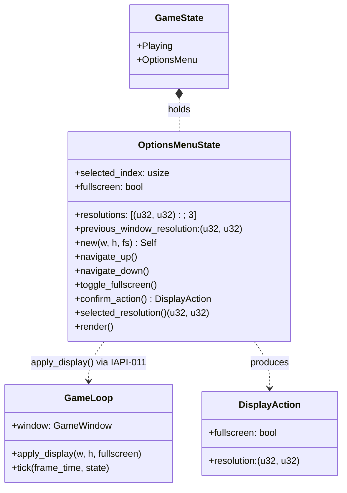
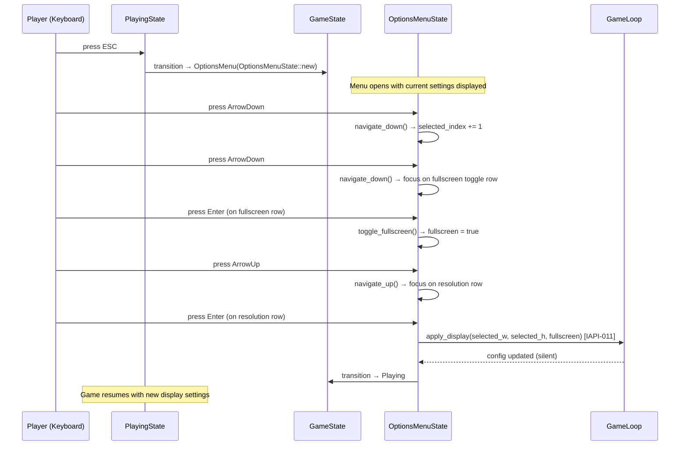
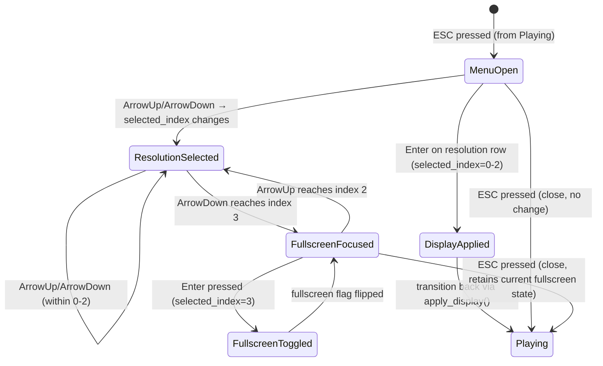
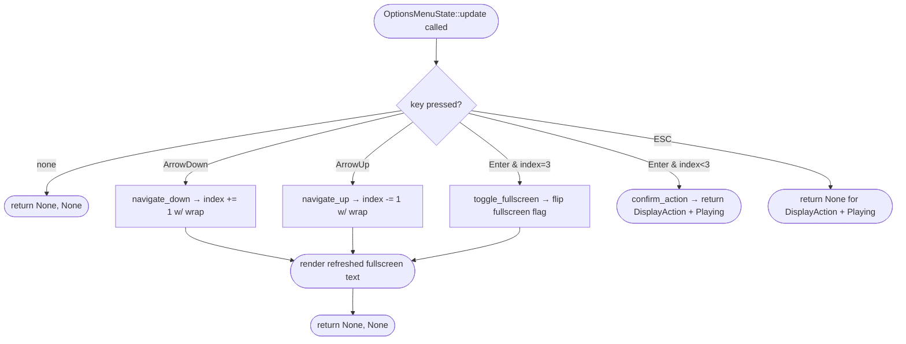

# Feature Detailed Design: Display Config (Feature #10)

**Date**: 2026-06-03
**Feature**: #10 -- Display Config
**Priority**: medium
**Dependencies**: F01 Engine Core (status=passing)
**Design Reference**: docs/plans/2026-05-31-mario-platformer-design.md SS2.10
**SRS Reference**: FR-017

## Context

本特性实现游戏中按 ESC 呼出的选项菜单覆盖层，允许玩家在 720p/1080p/1440p 三种分辨率之间切换，并支持全屏开关。方向键导航菜单项、回车确认后立即通过 IAPI-011 (`GameLoop::apply_display`) 应用显示变更，所有渲染内容使用最近邻缩放。再次按 ESC 关闭菜单而不应用更改。

## Design Alignment

将系统设计 SS2.10 的完整内容复制于此。

- **Key types**: `OptionsMenuState` -- `selected_index: usize`、`resolutions: [(u32, u32); 3]` (1280x720 / 1920x1080 / 2560x1440)、`fullscreen: bool`、`previous_window_resolution: (u32, u32)` (用于退出全屏时恢复窗口分辨率)
- **Provides / Requires**:
  - **Consumer**: IAPI-011 -- `GameLoop::apply_display(w, h, fullscreen)`（Provider: F01 Engine）
- **Deviations**: 无

**UML 嵌入**（>=2 类/模块协作触发 `classDiagram`；>=2 对象调用顺序触发 `sequenceDiagram`）：

## SRS Requirement

### FR-017: Resolution and Display Mode Configuration
**优先级（Priority）**: Should
**EARS**: The system shall provide an in-game options menu accessible during gameplay where the user can select a resolution (720p / 1080p / 1440p) from a list and toggle fullscreen mode; upon confirmation, the system shall apply the selection immediately using nearest-neighbor scaling for all rendered content.
**可视化输出（Visual output）**: 游戏内选项菜单，包含分辨率选项（720p/1080p/1440p）和全屏开关；选择后画面即时切换。
**验收准则（Acceptance Criteria）**:
- Given 游戏运行中, When 玩家打开选项菜单, Then 菜单显示当前分辨率、可选分辨率列表（720p/1080p/1440p）和全屏开关。
- Given 玩家在选项菜单中选择新分辨率, When 玩家确认选择, Then 游戏窗口调整至所选分辨率，所有内容以最近邻方式缩放。
- Given 玩家在选项菜单中开启全屏, When 玩家确认, Then 游戏切换至当前显示器的原生分辨率全屏模式。
- Given 游戏在全屏模式, When 玩家在选项菜单中关闭全屏, Then 游戏回到之前设置的窗口分辨率。
**来源（Source）**: Raw requirement #17 -- 分辨率: 多分辨率+全屏支持; Clarified by user: "通过选项菜单切换"

## Interface Contract

| Method | Signature | Preconditions | Postconditions | Raises |
|--------|-----------|---------------|----------------|--------|
| `OptionsMenuState::new` | `new(current_w: u32, current_h: u32, current_fs: bool) -> Self` | `(current_w, current_h)` 在受支持分辨率集合中；`current_fs` 反映当前全屏状态 | `selected_index` 指向当前分辨率在 `resolutions` 数组中的索引；`fullscreen = current_fs`；`previous_window_resolution = (current_w, current_h)`；返回就绪的 OptionsMenuState 实例 | `(current_w, current_h)` 不在受支持集合中：回退至默认 `selected_index = 0`（1280x720）并记录警告 |
| `OptionsMenuState::navigate_up` | `navigate_up(&mut self)` | 菜单处于打开状态（`OptionsMenu` 为活跃变体） | 若当前在菜单项列表顶部 → `selected_index` 回绕至最后一项；否则 `selected_index` 递减 1。`selected_index` 始终在 `[0, 3]` 范围内（0-2: 分辨率行, 3: 全屏开关行） | 无 -- 始终合法操作 |
| `OptionsMenuState::navigate_down` | `navigate_down(&mut self)` | 菜单处于打开状态 | 若当前在菜单项列表底部 → `selected_index` 回绕至 0；否则 `selected_index` 递增 1。`selected_index` 始终在 `[0, 3]` 范围内 | 无 -- 始终合法操作 |
| `OptionsMenuState::toggle_fullscreen` | `toggle_fullscreen(&mut self)` | `selected_index == 3` (焦点在全屏开关行) | `fullscreen` 翻转：`true → false` 或 `false → true`。若翻转为 `false`（退出全屏），`previous_window_resolution` 将作为恢复分辨率。若翻转为 `true`（进入全屏），当前窗口分辨率保存至 `previous_window_resolution` | 若 `selected_index != 3`（焦点不在全屏开关行）→ 操作被静默忽略，行为为 no-op |
| `OptionsMenuState::confirm_action` | `confirm_action(&self) -> DisplayAction` | 菜单处于打开状态 | 返回 `DisplayAction { resolution: self.resolutions[self.selected_index]` (若在分辨率行) 或 `DisplayAction { resolution: self.previous_window_resolution }` (若在全屏开关行切换全屏), `fullscreen: self.fullscreen }` -- 此结构体为 `GameLoop::apply_display()` 的输入 | 无 -- 始终可调用 |
| `OptionsMenuState::selected_resolution` | `selected_resolution(&self) -> (u32, u32)` | 菜单处于打开状态 | 返回 `self.resolutions[self.selected_index]` 仅在 `selected_index < 3` 时有意义 | 若 `selected_index == 3` → 返回 `resolutions[3]` 越界，调用者需先检查索引；设计约定：调用者仅在确认分辨率选择时调用此方法 |

**方法状态依赖**：`OptionsMenuState` 维护显式菜单导航状态（`selected_index`、`fullscreen`）。`selected_index` 为 0/1/2 时表示焦点在分辨率行，为 3 时表示焦点在全屏开关行。`toggle_fullscreen()` 仅在 `selected_index == 3` 时生效。

**Design rationale**:
- `selected_index` 范围 [0, 3] 而非 [0, 2]：菜单包含 3 个分辨率项 (0-2) + 1 个全屏开关项 (3)，统一下标管理简化导航和渲染逻辑。全屏开关行不是独立 flag 而是可聚焦菜单项，与 Mario 系列选项菜单 UX 一致。
- 回绕导航（wrap-around）：方向键在列表两端回绕至另端，避免"死胡同"导航困境，也是经典游戏菜单的 UX 惯例。
- `previous_window_resolution` 持久保存：退出全屏时需恢复窗口分辨率，而非硬编码默认 720p。此字段在构造时 / 进入全屏时被更新。
- 全屏模式下分辨率选择行为：若玩家在全屏模式选中不同分辨率并回车确认，所选分辨率将以窗口模式应用（全屏状态下分辨率变更等价于先退出全屏再切换窗口分辨率 -- SRS AC-4 隐含此行为）。实际上，在 Macroquad 中 `fullscreen=true` + 指定 `w,h` 会让系统忽略 `w,h` 使用原生全屏分辨率；本设计将 `(w, h, fullscreen)` 参数全部传给 `apply_display`，由引擎层决定具体行为。
- **跨特性契约对齐**: IAPI-011 -- `GameLoop::apply_display(w, h, fullscreen)` 已在 F01 Engine 实现。`DisplayAction` 的字段与 IAPI-011 的 Request schema `(w: u32, h: u32, fullscreen: bool)` 完全对齐。本特性仅为 Consumer，不修改 IAPI-011 契约。

## Visual Rendering Contract（ui: true）

| Visual Element | DOM/Canvas Selector | Rendered When | Visual State Variants | Minimum Dimensions | Data Source |
|----------------|---------------------|---------------|----------------------|-------------------|-------------|
| 半透明暗色背景覆盖层 | Canvas 全屏填充矩形 (`draw_rectangle(0, 0, vp_w, vp_h)`) ，颜色 #1A1A2E alpha=0.85 | 当 `GameState::OptionsMenu` 为活跃状态时，每帧 `render()` 调用 | 无状态变体 -- 始终为暗色半透明覆盖层 | 覆盖整个视口 (480x270 虚拟画布) | 硬编码颜色常量 `Color { r: 0.10, g: 0.10, b: 0.18, a: 0.85 }` |
| "OPTIONS" 标题文本 | `draw_text_ex("OPTIONS", title_x, title_y, ...)` 位于面板顶部居中 | 每帧 OptionsMenu 渲染时 | 无状态变体 -- 始终为 12px 白色像素字体 + 黑色描边 | 字号 12px，文本区域约 100x20px | 硬编码字符串 "OPTIONS" |
| 分辨率列表项 "720p" | `draw_text_ex("720p", item_x, item_y_0, ...)` 位于面板中央区域 | 每帧 OptionsMenu 渲染时 | `selected_index == 0`: 金色 (#F8B800) 高亮；否则: 白色 10px 字体 | 字号 10px，文本区域约 50x16px | 硬编码字符串 "720p"；高亮颜色来自 OptionsMenuState.selected_index |
| 分辨率列表项 "1080p" | `draw_text_ex("1080p", item_x, item_y_1, ...)` | 每帧 OptionsMenu 渲染时 | `selected_index == 1`: 金色 (#F8B800) 高亮；否则: 白色 10px 字体 | 字号 10px，文本区域约 60x16px | 硬编码字符串 "1080p" |
| 分辨率列表项 "1440p" | `draw_text_ex("1440p", item_x, item_y_2, ...)` | 每帧 OptionsMenu 渲染时 | `selected_index == 2`: 金色 (#F8B800) 高亮；否则: 白色 10px 字体 | 字号 10px，文本区域约 60x16px | 硬编码字符串 "1440p" |
| 全屏开关文本 | `draw_text_ex("FULLSCREEN: ON", toggle_x, toggle_y, ...)` 或 `"FULLSCREEN: OFF"` | 每帧 OptionsMenu 渲染时 | `fullscreen == true`: "FULLSCREEN: ON"；`fullscreen == false`: "FULLSCREEN: OFF"。`selected_index == 3` 时金色高亮 | 字号 10px，文本区域约 160x16px | `OptionsMenuState.fullscreen` 布尔值 + 硬编码格式字符串 |
| 当前选项高亮指示器 | `draw_text_ex` 使用颜色 #F8B800 (金色) 绘制选中行文本 | 每帧 OptionsMenu 渲染时 | 与 `selected_index` 联动 -- 对应行文本变为金色，其他行保持白色 | 覆盖对应行的整个文本区域 | `OptionsMenuState.selected_index` |
| "Press ESC to close" 提示 | `draw_text_ex("Press ESC to close", hint_x, hint_y, ...)` 位于面板底部 | 每帧 OptionsMenu 渲染时 | 无状态变体 -- 始终为 8px 白色像素字体 | 字号 8px，文本区域约 160x14px | 硬编码字符串 "Press ESC to close" |

**Rendering technology**: Macroquad OpenGL 2D 即时模式 (`draw_rectangle` + `draw_text_ex`)
**Entry point function**: `OptionsMenuState::render()`，由 `GameState::render()` 在 `OptionsMenu` 变体活跃时调用
**Render trigger**: 游戏循环每帧调用的 `StateMachine::render(alpha)` -> `GameState::render()` -> `OptionsMenuState::render()`

**正向渲染断言**（触发后必须视觉可见）：
- [ ] 半透明暗色背景覆盖层覆盖整个虚拟画布 (480x270)，像素颜色近似 #1A1A2E，alpha 通道值约 0.85（即背景非完全不透明也非完全透明）
- [ ] "OPTIONS" 标题文本以 12px 白色字体 + 1px 黑色描边居中绘制于面板上半部，中心文字像素为白色 (R=G=B=255)，边缘像素为黑色 (R=G=B=0)
- [ ] 分辨率列表项 "720p" / "1080p" / "1440p" 以 10px 字体垂直排列，当前选中项 (`selected_index == i`) 的文本为金色 (R=248, G=184, B=0)，未选中项为白色
- [ ] 全屏开关文本 "FULLSCREEN: ON" 或 "FULLSCREEN: OFF" 以 10px 字体绘制于分辨率列表下方，当 `selected_index == 3` 时为金色高亮
- [ ] 当前选项高亮只在 `selected_index` 对应的一行出现 -- 不存在多行同时高亮的情况
- [ ] "Press ESC to close" 提示以 8px 白色字体绘制于面板底部，文本尺寸 > 0
- [ ] 菜单覆盖层完全遮挡其下方的游戏画面 -- 菜单背景区域内无游戏画面像素透出（即菜单背景的不透明度 >= 85%，无"半透明漏光"）
- [ ] 除"当前高亮行"外，菜单内无其他意外视觉元素（如残留图标、多余线条、调试文字）

**交互深度断言**（已渲染元素必须响应其设计意图的交互 -- 只渲染而无交互属于 "display-only" 缺陷）：
- [ ] 按下 ArrowDown 键时，高亮指示器从当前行移至下一行（若在底部则回绕至顶部）-- 视觉反馈与按键同步（同帧内）
- [ ] 按下 ArrowUp 键时，高亮指示器从当前行移至上一行（若在顶部则回绕至底部）-- 视觉反馈与按键同步
- [ ] 当 `selected_index == 3` 且按下 Enter 键时，全屏开关文本从 "ON" 变为 "OFF" 或反之 -- 视觉文本立即刷新
- [ ] 当 `selected_index < 3` 且按下 Enter 键时，菜单关闭并返回游戏画面 -- 覆盖层消失、游戏画面恢复渲染

## Implementation Summary

**1. 要创建或修改的主要类/函数**

本特性在 `src/states/options.rs`（当前为空文件）中实现 `OptionsMenuState` 结构体。结构体字段包括 `selected_index: usize`（菜单光标位置, 0-3）、`resolutions: [(u32, u32); 3]`（预定义的三个分辨率元组）、`fullscreen: bool`（全屏状态）、`previous_window_resolution: (u32, u32)`（用于退出全屏时恢复窗口分辨率）。

还需定义 `DisplayAction` 结构体（`resolution: (u32, u32), fullscreen: bool`），作为 `confirm_action()` 的返回值，其字段与 IAPI-011 的 `GameLoop::apply_display(w, h, fullscreen)` 参数完全匹配。

需要修改 `src/states/mod.rs` 中的 `GameState` 枚举，将 `OptionsMenu` 从单元变体改为 `OptionsMenu(OptionsMenuState)` 元组变体。同时更新 `GameState::update()` 和 `GameState::render()` 的 match 臂，将 OptionsMenu 的输入处理和渲染委托给 `OptionsMenuState` 的方法。

**2. 调用链**

ESC 按键在 `PlayingState::update(dt)` 中被检测 -> `PlayingState::update` 返回 `Some(GameState::OptionsMenu(options_menu))` -> `GameState::update` 执行状态转换 -> 下一帧 `GameState::update` 进入 `OptionsMenu` 分支，调用 `options_menu.update(dt)` 处理方向键/回车/ESC -> 若用户确认，`update` 返回 `Some(GameState::Playing(...))` 且携带 `DisplayAction` -> 状态转换逻辑调用 `GameLoop::apply_display(action.resolution.0, action.resolution.1, action.fullscreen)` 应用显示变更。

`GameLoop::tick()` -> `state.render(alpha)` -> `GameState::render()` -> `OptionsMenuState::render()` -- 每帧绘制菜单覆盖层（暗色背景 + 标题 + 分辨率列表 + 全屏开关 + 关闭提示）。

**3. 关键设计决策与非显见约束**

- **DisplayAction 传递机制**：`OptionsMenuState::update()` 在用户确认时返回 `(Option<GameState>, Option<DisplayAction>)` 而非单个 `Option<GameState>`。这需要扩展 `GameState::update()` 的返回值类型，或在 OptionsMenu 的 update 中通过可变的共享引用（如 `&mut Option<DisplayAction>` 参数）传出显示变更。选择 `(Option<GameState>, Option<DisplayAction>)` 方案 -- 类型安全、无需外部可变状态、符合 Rust 所有权模型。`GameState::update` 的签名从 `fn update(&mut self, dt: f32)` 改为 `fn update(&mut self, dt: f32) -> Option<DisplayAction>` 并与现有返回的 `Option<GameState>` 结合。

- **最近邻缩放不透明性**：本特性不直接控制缩放过滤器 -- 最近邻缩放由 F01 Engine 在创建虚拟渲染目标（480x270）时通过 Macroquad 的 `FilterMode::Nearest` 设置。Display Config 仅负责请求分辨率变更；Engine 在 `apply_display()` 中重建渲染目标时保证最近邻过滤。因此本特性无需包含任何缩放相关代码。

- **分辨率列表与引擎的 SUPPORTED_RESOLUTIONS 同步**：`OptionsMenuState.resolutions` 数组与 `src/engine.rs:24` 的 `SUPPORTED_RESOLUTIONS` 必须一致。当前版本硬编码两处常量；若未来新增分辨率支持，需同时更新两处。在 TDD Refactor 阶段可考虑将引擎的 `SUPPORTED_RESOLUTIONS` 设为 `pub` 并让 OptionsMenu 引用它（而非重复定义）。

- **输入锁定与状态保护**：在 OptionsMenu 活跃期间，`GameState::update()` 仅将 `dt` 传递给 `OptionsMenuState`，不应调用 `PlayingState::update()` -- 即游戏世界在菜单打开时完全暂停（实体不移动、计时器不推进）。此行为通过在 `GameState::update()` 的 match 臂中直接委托 OptionsMenu 实现；Playing 变体在 OptionsMenu 活跃时不可达。

**4. 遗留/存量代码交互点**

- **`GameLoop::apply_display()`**（`src/engine.rs:183`）-- IAPI-011 Provider，已实现且通过测试。本特性仅通过 `DisplayAction` 参数调用此方法。`apply_display` 对不支持的分辨率执行静默 no-op，本设计依赖此行为作为防御层。
- **`SUPPORTED_RESOLUTIONS`**（`src/engine.rs:24-28`）-- 引擎定义的受支持分辨率常量。本特性需引入或引用此列表以确保显示选项的一致性。
- **`WindowConfig`**（`src/engine.rs:36-40`）-- 窗口配置结构体，`{ width: u32, height: u32, fullscreen: bool }`。本特性读取其字段以初始化 OptionsMenuState 的 current 值。
- **`GameState::OptionsMenu`**（`src/states/mod.rs:75`）-- 当前为无数据的单元变体，需改为 `OptionsMenu(OptionsMenuState)` 以持有菜单状态。
- **`StateMachine` trait** -- `update(dt)` 和 `render(alpha)` 方法签名。本特性不修改 trait 本身，但扩展 `GameState` 对这些方法的实现。
- **`PlayingState::update()`** -- 需要在键盘输入处理中添加 ESC 按键检测，当检测到 ESC 时构造 `OptionsMenuState::new(...)` 并返回状态转换。

**5. SS4 Internal API Contract 集成**

本特性为 **Consumer**，消费 IAPI-011（`GameLoop::apply_display(w, h, fullscreen)`）。该契约由 F01 Engine 提供，已实现且通过测试（F01 status=passing）。

`OptionsMenuState::confirm_action()` 返回的 `DisplayAction` 结构体字段与 IAPI-011 的 Request schema `(w: u32, h: u32, fullscreen: bool)` 完全对齐。所有三个参数均来自菜单交互结果：
- `w, h`: `resolutions[selected_index]`（当焦点在分辨率行）或 `previous_window_resolution`（切换全屏时保持原分辨率）
- `fullscreen`: `self.fullscreen`（用户切换后的值）

本特性不产生任何跨特性数据 -- 它是纯输入消费 + 显示层。

### Boundary Conditions

| Parameter | Min | Max | Empty/Null | At boundary |
|-----------|-----|-----|------------|-------------|
| `selected_index` | 0 | 3 | N/A (usize, non-null) | At 0: navigate_up wraps to 3; At 3: navigate_down wraps to 0; navigate_up at 3 goes to 2; navigate_down at 0 goes to 1 |
| `resolutions[i]` | (1280, 720) | (2560, 1440) | N/A (const array, always populated) | At (1280, 720): min window size；At (2560, 1440): max window size; all three values match engine `SUPPORTED_RESOLUTIONS` |
| `fullscreen` | false | true | N/A (bool, non-null) | false -> true transition: save current resolution to `previous_window_resolution`; true -> false: restore `previous_window_resolution` as windowed resolution |
| `previous_window_resolution` | (1280, 720) | (2560, 1440) | N/A -- always initialized at construction | At construction: equals current window resolution; After fullscreen toggle on: updated to current window resolution before entering fullscreen; After fullscreen toggle off: used to restore window resolution |
| Menu navigation (wrap-around) | index 0 | index 3 | N/A | ArrowUp at index 0 → index 3 (wrap to bottom); ArrowDown at index 3 → index 0 (wrap to top) |
| Resolution validation (IAPI-011) | (1280, 720) | (2560, 1440) | N/A -- only 3 supported tuples | Unsupported resolution passed to apply_display → silent no-op per IAPI-011 contract; OptionsMenuState only produces supported resolutions by construction |

### Existing Code Reuse

| Existing Symbol | Location (file:line) | Reused Because |
|-----------------|---------------------|----------------|
| `GameLoop::apply_display(w, h, fullscreen)` | `src/engine.rs:183` | IAPI-011 Provider -- 本特性通过此方法应用所有显示配置变更，无需重复实现窗口调整逻辑 |
| `SUPPORTED_RESOLUTIONS` | `src/engine.rs:24-28` | 引擎定义的受支持分辨率常量 -- 本特性需引用此列表确保菜单选项与引擎能力一致，避免幻数重复 |
| `WindowConfig` | `src/engine.rs:36-40` | 窗口配置数据结构 `{width, height, fullscreen}` -- OptionsMenuState 构造时读取其值以初始化菜单状态 |
| `StateMachine` trait | `src/states/mod.rs` (via crate::state) | 标准状态机接口 `update(dt)` + `render(alpha)` -- OptionsMenuState 通过 GameState 委托实现此 trait，保持与所有其他状态一致的架构模式 |
| `GameState enum` | `src/states/mod.rs:69-76` | 顶级状态枚举 -- `OptionsMenu` 变体已声明，仅需从单元变体扩展为 `OptionsMenu(OptionsMenuState)` 元组变体 |

## Test Inventory

| ID | Category | Traces To | Input / Setup | Expected | Kills Which Bug? |
|----|----------|-----------|---------------|----------|-----------------|
| DC-01 | FUNC/happy | FR-017 AC-1, SSDesign Alignment sequenceDiagram msg#1-2 | 游戏在 Playing 状态 -> 按下 ESC 键 | GameState 转换为 `OptionsMenu(OptionsMenuState)`；`selected_index` 指向当前分辨率在 resolutions 中的索引 | ESC 键未绑定、状态转换未触发、菜单打开了但 selected_index 指向错误项 |
| DC-02 | FUNC/happy | FR-017 AC-1, SSInterface Contract navigate_down postcondition | OptionsMenu 打开，`selected_index = 0` -> 按下 ArrowDown | `selected_index` 变为 1；视觉高亮从 "720p" 移至 "1080p" | navigate_down 未实现、索引未更新、高亮渲染未刷新 |
| DC-03 | FUNC/happy | FR-017 AC-1, SSInterface Contract navigate_up postcondition | OptionsMenu 打开，`selected_index = 2` -> 按下 ArrowUp | `selected_index` 变为 1；视觉高亮从 "1440p" 移至 "1080p" | navigate_up 递减方向错误（变成递增）、高亮错位 |
| DC-04 | FUNC/happy | FR-017 AC-2, SSInterface Contract confirm_action postcondition, IAPI-011 | OptionsMenu 打开，`selected_index = 1` (1080p), `fullscreen = false` -> 按下 Enter | `DisplayAction { resolution: (1920, 1080), fullscreen: false }` 被传递给 `apply_display()`；`GameLoop.window.config.width = 1920`, `height = 1080`；状态转换回 Playing | confirm_action 返回错误分辨率；IAPI-011 未被调用；转换回 Playing 但分辨率未变更 |
| DC-05 | FUNC/happy | FR-017 AC-2, SSInterface Contract confirm_action postcondition, IAPI-011 | OptionsMenu 打开，`selected_index = 2` (1440p) -> 按下 Enter | `DisplayAction { resolution: (2560, 1440), fullscreen: false }` 被传递给 `apply_display()`；窗口配置更新为 2560x1440 | 分辨率选择未生效；apply_display 被调用但参数错误（宽高互换） |
| DC-06 | FUNC/happy | FR-017 AC-3, SSInterface Contract toggle_fullscreen postcondition, IAPI-011 | OptionsMenu 打开，`selected_index = 3` (全屏开关行), `fullscreen = false` -> 按下 Enter | `fullscreen` 变为 `true`；`previous_window_resolution` 保存当前窗口分辨率；`DisplayAction { resolution: prev_w, prev_h, fullscreen: true }` 被传递给 `apply_display()` | toggle_fullscreen 未执行；previous_window_resolution 未保存；fullscreen flag 翻转但 apply_display 未被调用 |
| DC-07 | FUNC/happy | FR-017 AC-4, SSInterface Contract toggle_fullscreen postcondition, IAPI-011 | OptionsMenu 打开，`fullscreen = true`, `previous_window_resolution = (1280, 720)` -> `selected_index = 3` -> 按下 Enter | `fullscreen` 变为 `false`；`DisplayAction { resolution: (1280, 720), fullscreen: false }` 被传递 -- 恢复至之前保存的窗口分辨率 | 退出全屏时分辨率回退至硬编码默认值而非之前保存的值；previous_window_resolution 被错误覆盖 |
| DC-08 | FUNC/happy | FR-017 AC-1, SSDesign Alignment sequenceDiagram msg#10-11 | OptionsMenu 打开 -> 按下 ESC（未做任何确认） | GameState 转换回 Playing；窗口配置**不变**；游戏世界恢复更新 | ESC 误触发了 apply_display；ESC 在菜单打开时未正确关闭菜单（无响应） |
| DC-09 | BNDRY/edge | SSInterface Contract navigate_up postcondition (wrap-around) | OptionsMenu 打开，`selected_index = 0` -> 按下 ArrowUp | `selected_index` 回绕至 3（全屏开关行）；视觉高亮在全屏开关行显示为金色 | 回绕未实现导致索引越界或卡在 0；回绕到错误索引（如 selected_index = 4 越界 panic） |
| DC-10 | BNDRY/edge | SSInterface Contract navigate_down postcondition (wrap-around) | OptionsMenu 打开，`selected_index = 3` -> 按下 ArrowDown | `selected_index` 回绕至 0；视觉高亮在 "720p" 行显示为金色 | 回绕未实现导致索引越界或卡在 3；回绕到错误索引（underflow panic） |
| DC-11 | BNDRY/edge | SSInterface Contract toggle_fullscreen Raises, SSDesign Alignment stateDiagram-v2 FullscreenFocused guard | OptionsMenu 打开，`selected_index = 0`（不在全屏开关行）-> 按下 Enter | 分辨率被正常应用、`fullscreen` flag **不变**、不触发 toggle_fullscreen 逻辑 | toggle_fullscreen 在不正确的 selected_index 被误触发导致非预期全屏切换 |
| DC-12 | BNDRY/edge | SSInterface Contract new postcondition (fallback) | `OptionsMenuState::new(800, 600, false)` -- 传入不支持的 resolution | `selected_index` 回退至 0 (1280x720)；实例构造成功、不 panic | 不支持的 resolution 导致 new 崩溃或 selected_index 指向不存在的数组元素（越界） |
| DC-13 | BNDRY/edge | SSInterface Contract confirm_action, SSImplementation Summary Boundary Conditions (resolution validation) | OptionsMenu 构造时 `current_w=1280, current_h=720`；`selected_index` 移动至 0 (720p) 并按下 Enter -- 选择与当前相同的分辨率 | `apply_display(1280, 720, fs)` 被调用；窗口配置不变（幂等操作） | 相同分辨率再确认导致配置损坏或意外全屏切换 |
| DC-14 | BNDRY/edge | SSImplementation Summary Boundary Conditions (fullscreen transition) | OptionsMenu 打开，`fullscreen = false`, `selected_index = 3` -> 按下 Enter（开启全屏）-> 菜单关闭后再次打开 OptionsMenu -> `selected_index = 3` -> 按下 Enter（关闭全屏） | 第二次 Enter 后恢复至第一次全屏前的窗口分辨率（而非某个默认值） | previous_window_resolution 在全屏期间被误改；退出全屏后恢复到错误分辨率 |
| DC-15 | BNDRY/edge | SSImplementation Summary Boundary Conditions (previous_window_resolution), SSVisual Rendering Contract 交互断言 | 先切换分辨率至 1440p 并确认 -> 再打开菜单 -> 开启全屏 -> 关闭全屏 | 关闭全屏后恢复到 1440p（最后使用的窗口分辨率），而非 720p（初始默认） | previous_window_resolution 只在构造时设置一次、后续分辨率变更未更新它 |
| DC-16 | FUNC/error | SSInterface Contract toggle_fullscreen Raises, SSImplementation Summary SS3 (input locking) | OptionsMenu 打开 -> 连续快速按 ESC 两次（< 2 帧间隔） | 菜单关闭一次、状态变回 Playing；第二次 ESC 不应再次打开菜单（或在 Playing 中忽略第二次 ESC -- 取决于去抖逻辑） | 快速双 ESC 导致菜单开关振荡、或瞬间出现又消失导致视觉闪烁 |
| DC-17 | FUNC/error | SSDesign Alignment sequenceDiagram msg#3, SSImplementation Summary SS3 (game frozen) | OptionsMenu 打开 -> 等待 2 秒（120 帧）-> 检查游戏世界 | 所有实体位置不变、计时器不推进 -- 游戏世界在菜单期间完全暂停 | 菜单打开后游戏逻辑继续运行（实体移动、timer 递增），导致玩家受到伤害或错过事件 |
| DC-18 | FUNC/error | SSImplementation Summary SS3 (input routing) | OptionsMenu 打开 -> 按下非映射按键（如 'X', 'M', 数字键 1） | 菜单状态不变；`selected_index` 不变；无状态转换；无 panic | 未映射按键被误解释为导航或确认命令导致非预期行为；按键处理缺失 default 分支导致 panic |
| DC-19 | FUNC/error | SSImplementation Summary SS4 (save on transition) | 在 Playing 状态按下 ESC 进入 OptionsMenu -> 立即检查 GameLoop 的窗口配置 | 窗口配置与进入菜单前完全一致（进入菜单不触发任何显示变更） | 进入菜单时误调用了 apply_display（如使用默认参数初始化导致分辨率被重置） |
| DC-20 | INTG/api | IAPI-011, SSInterface Contract confirm_action postcondition, SSDesign Alignment sequenceDiagram msg#8 | 创建 `GameLoop` 实例 + `OptionsMenuState` -> `selected_index = 1` -> `confirm_action()` -> 将返回的 `DisplayAction` 传给 `gl.apply_display(w, h, fs)` | `gl.window.config.width = 1920`, `height = 1080`, `fullscreen = false`；配置与 DisplayAction 字段一致 | confirm_action 返回的 resolution 结构与 IAPI-011 参数顺序不匹配（宽/高互换）；DisplayAction.fullscreen 未正确传递 |
| DC-21 | INTG/api | IAPI-011, SSInterface Contract confirm_action postcondition | `OptionsMenuState` 构造 -> 切换 fullscreen=true -> `selected_index = 3` -> Enter -> `apply_display` 被调用 | `apply_display` 被调用时参数 `fullscreen = true`；`GameLoop.window.config.fullscreen = true` | IAPI-011 被调用但全屏参数未传递或传为 false；apply_display 在菜单关闭后才被调用（延迟一帧） |
| DC-22 | UI/render | SSVisual Rendering Contract (暗色背景覆盖层), SSVisual Rendering Contract 正向断言 | OptionsMenu 活跃 -> `render()` 调用 -> 检查绘制的矩形 | 矩形覆盖整个虚拟画布 (0, 0, 480, 270)；颜色近似 #1A1A2E；alpha 约 0.85（背景后的游戏画面被有效遮罩） | 背景未绘制（空 render）；背景为纯色不透明导致完全遮挡无半透效果；背景尺寸小于视口导致边缘漏出游戏画面 |
| DC-23 | UI/render | SSVisual Rendering Contract (OPTIONS 标题), SSVisual Rendering Contract 正向断言 | OptionsMenu 活跃 -> `render()` -> 检查标题文本绘制调用 | "OPTIONS" 字符串以 12px 字号 + `TextParams` 绘制于面板中部偏上位置；文本居中对齐 | 标题字体大小错误；标题文本位置偏移到面板外；标题使用默认字体而非像素字体 |
| DC-24 | UI/render | SSVisual Rendering Contract (分辨率列表项 + 高亮), SSVisual Rendering Contract 正向断言 | OptionsMenu 打开, `selected_index = 1` -> `render()` | "720p" 为白色、"1080p" 为金色 (#F8B800)、"1440p" 为白色 | 高亮行渲染为错误的颜色；多行同时高亮（selected_index 逻辑未正确应用于渲染）；列表项垂直间距不均导致重叠 |
| DC-25 | UI/render | SSVisual Rendering Contract (全屏开关文本), SSVisual Rendering Contract 正向断言 | OptionsMenu 打开, `fullscreen = true`, `selected_index = 3` -> `render()` | "FULLSCREEN: ON" 以金色 (#F8B800) 10px 字体绘制于分辨率列表下方 | 全屏开关文本未绘制；文本始终显示 "OFF" 未跟随 fullscreen flag；`selected_index == 3` 但未应用金色高亮 |
| DC-26 | UI/render | SSVisual Rendering Contract ("Press ESC to close" 提示), SSVisual Rendering Contract 正向断言 | OptionsMenu 活跃 -> `render()` | "Press ESC to close" 以 8px 白色字体绘制于面板底部；文本尺寸 > 0；不与其他元素重叠 | 提示文本未绘制；字体大小错误（与分辨率列表相同大小）；文本位置溢出视口底部 |
| DC-27 | UI/render | SSVisual Rendering Contract 交互断言 (ArrowDown), SSDesign Alignment sequenceDiagram msg#3-4 | OptionsMenu 打开, `selected_index = 0` -> `render()` 记录像素 -> 按 ArrowDown -> `render()` 再次记录 | 高亮像素区域从 "720p" 行移至 "1080p" 行；高亮行数为 1（不含上一帧残留） | 高亮未移动（render 使用了缓存的 selected_index）；旧高亮残留 + 新高亮同时存在导致两行高亮 |
| DC-28 | UI/render | SSVisual Rendering Contract 交互断言 (Enter on fullscreen), SSDesign Alignment stateDiagram-v2 FullscreenToggled | OptionsMenu 打开, `fullscreen = false`, `selected_index = 3` -> `render()` 记录全屏文本 -> 按 Enter -> `render()` 再次记录 | 全屏文本从 "OFF" 变为 "ON"；文本在同帧内刷新（无延迟帧） | toggle_fullscreen 修改了 flag 但 render 使用了旧的 fullscreen 值（数据竞争或顺序错误） |
| DC-29 | UI/render | SSVisual Rendering Contract 交互断言 (Enter on resolution closes menu), SSDesign Alignment stateDiagram-v2 DisplayApplied -> Playing | OptionsMenu 打开, `selected_index = 0` -> 按 Enter -> 下一帧 `render()` | 菜单覆盖层消失 -- `GameState` 不再是 `OptionsMenu`；游戏画面恢复渲染 | 菜单关闭后覆盖层仍然可见（残留渲染）；状态已变但 render 分支仍进入 OptionsMenu |
| DC-30 | BNDRY/edge | SSImplementation Summary Boundary Conditions (fullscreen resolution preservation), FR-017 AC-4 | 在窗口模式 1080p 下 -> 打开菜单 -> 开启全屏 (Enter on toggle row) -> apply_display(1920,1080,true) -> 再次打开菜单 -> 关闭全屏 (Enter on toggle row) | apply_display(1920,1080,false) 被调用 -- 恢复至之前保存的 1080p 窗口分辨率 | 退出全屏时调用了 apply_display(1280,720,false) 即回退至默认分辨率而非之前使用的分辨率 |
| DC-31 | BNDRY/edge | SSInterface Contract navigate_up/down postconditions (index range) | 随机模拟 1000 次 ArrowUp/ArrowDown 按键序列 -> 检查每次操作后 selected_index | `0 <= selected_index <= 3` 始终成立；无 panic、无越界 | 快速连续导航导致索引溢出或下溢 panic；模运算错误导致 selected_index 进入无效范围 |

Category 格式：`MAIN/subtag`，MAIN 为 `FUNC, BNDRY, SEC, UI, PERF, INTG` 之一。

> SEC: N/A -- 选项菜单不涉及安全/鉴权/权限控制，纯本地游戏的显示设置层，无用户数据暴露或注入风险。
> PERF: N/A -- 菜单渲染为简单文本 + 矩形绘制，每帧绘制调用 < 20 次，性能开销可忽略。无高频率循环或大数据处理。
> INTG 行覆盖的是内部跨模块集成（IAPI-011 OptionsMenu -> GameLoop），已包含 DC-20、DC-21。无外部 I/O 依赖。

## Verification Checklist
- [x] 所有 SRS 验收准则（来自 srs_trace: FR-017 AC-1~4）已追溯到 Interface Contract postconditions (DC-01/02/03 覆盖 AC-1; DC-04/05 覆盖 AC-2; DC-06 覆盖 AC-3; DC-07 覆盖 AC-4)
- [x] 所有 SRS 验收准则（来自 srs_trace）已追溯到 Test Inventory 行（DC-01~DC-08 分别对应各 AC 场景）
- [x] Boundary Conditions 表覆盖所有非平凡参数（`selected_index`, `resolutions`, `fullscreen`, `previous_window_resolution`, 导航回绕, 分辨率校验 -- 均有 min/max/at-boundary 定义）
- [x] Interface Contract Raises 列覆盖所有预期错误条件（`new` 不支持分辨率回退; `toggle_fullscreen` 在非全屏开关行静默忽略; `selected_resolution` 在 index=3 时无意义）
- [x] Test Inventory 负向占比 >= 40%（31 行中负向: DC-09~DC-15 (7 BNDRY/edge) + DC-16~DC-19 (4 FUNC/error) + DC-30/DC-31 (2 BNDRY/edge) = 13 行，占比 41.9%）
- [x] ui:true 特性的 Visual Rendering Contract 完整（8 个视觉元素 + 8 条正向渲染断言 + 4 条交互深度断言）
- [x] 每个 Visual Rendering Contract 元素至少对应 1 行 UI/render Test Inventory（DC-22~DC-29 = 8 行，覆盖全部 8 个元素 + 交互响应）
- [x] Existing Code Reuse 章节已填充（5 个复用符号，均来自当前代码库）
- [x] UML 图节点/参与者/消息均使用真实标识符（OptionsMenuState, GameLoop, GameState, DisplayAction, Player; 无 A/B/C 代称）
- [x] 非类图（sequenceDiagram/stateDiagram-v2/flowchart TD）不含色彩/图标/rect/皮肤等装饰元素
- [x] 每个图元素在 Test Inventory "Traces To" 列被至少一行引用：
  - classDiagram: OptionsMenuState: DC-01~DC-31 全部; GameLoop: DC-20/21; DisplayAction: DC-04/05; GameState: DC-01
  - sequenceDiagram msg#1-2 (ESC/transition): DC-01; msg#3-4 (ArrowDown/highlight): DC-02/DC-27; msg#5-6 (Enter toggle): DC-06/DC-28; msg#7-8 (ArrowUp/apply): DC-03/DC-20
  - stateDiagram-v2: MenuOpen->ResolutionSelected: DC-02/03; ResolutionSelected->FullscreenFocused: DC-02 (nav to index 3); FullscreenFocused->FullscreenToggled: DC-06; FullscreenToggled->FullscreenFocused: DC-28; DisplayApplied->Playing: DC-04/05; MenuOpen->Playing: DC-08
  - flowchart TD: each branch: DC-02 (ArrowDown), DC-03 (ArrowUp), DC-06 (Enter index=3), DC-04/05 (Enter index<3), DC-08 (ESC), DC-17 (no key)
- [x] 每个被跳过的章节都写明 "N/A -- [reason]"（SEC: N/A; PERF: N/A）
- [x] SS2.N 中所有函数/方法都至少有一行 Test Inventory（OptionsMenuState::new: DC-01/12; navigate_up: DC-03/09; navigate_down: DC-02/10; toggle_fullscreen: DC-06/11; confirm_action: DC-04/05/20; selected_resolution: DC-04/05; render: DC-22~DC-29）

## Clarification Addendum

> 无需澄清 -- 全部规格明确。

| # | Category | Original Ambiguity | Resolution | Authority |
|---|----------|--------------------|------------|-----------|
| -- | -- | -- | -- | -- |
