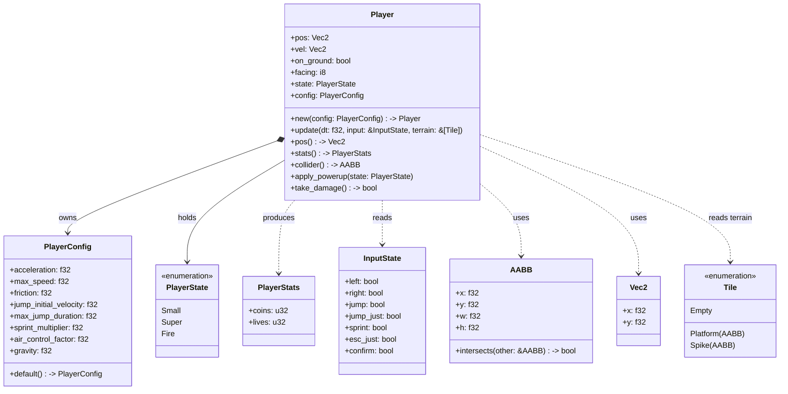
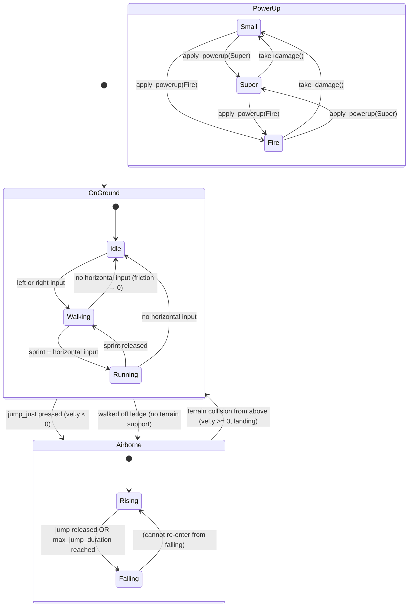
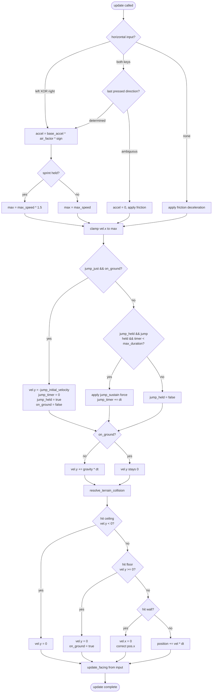

# Feature Detailed Design: Player Controller (Feature #3)

**Date**: 2026-06-01
**Feature**: #3 -- Player Controller
**Priority**: high
**Dependencies**: [1, 2] (Engine Core, Level & Background)
**Design Reference**: docs/plans/2026-05-31-mario-platformer-design.md §2.3
**SRS Reference**: FR-001, FR-002, FR-003

## Context

本特性实现玩家实体的完整操控系统：水平移动（加速/摩擦/反向/空中控制）、可变高度跳跃（按持时长控制高度、天花板碰撞、无二段跳）、冲刺（1.5x速度、跳跃距离加成）、地面/空中状态转换、以及力量增强状态机（Small ↔ Super ↔ Fire）。对外输出 `pos()` 供摄像机跟随（IAPI-007）、`stats()` 供 HUD（IAPI-009），通过 StateMachine 编排消费物理碰撞（IAPI-004）和地形查询（IAPI-005）。本特性是核心玩法手感的基础，所有依赖玩家实体的特性（Camera、HUD、Enemy、Life/Death、Collectibles）均直接或间接依赖其接口。

## Design Alignment

自系统设计文档 §2.3 Feature: Player Controller (FR-001, FR-002, FR-003) 完整内容：

### 2.3.1 概览（Overview）

管理玩家实体的水平移动（加速/摩擦/反向）、跳跃（按下时长控制高度、天花板碰撞）、冲刺（1.5× 速度、跳跃距离加成）、地面/空中状态转换。输出 `PlayerStats` 供 HUD 使用，输出 `pos()` 供摄像机跟随。

### 2.3.2 关键类型（Key Types）

- `Player` -- 位置 `pos: Vec2`、速度 `vel: Vec2`、碰撞体尺寸（小 16×16 / 大 16×32）、`on_ground: bool`、朝向 `facing: i8`
- `PlayerConfig` -- 可配置参数：加速度、最大速度、摩擦力、跳跃初速度、最大跳跃时长、冲刺倍率 (1.5×)、空中操控系数 (0.6)
- `PlayerState` -- 枚举：`Small` / `Super` (蘑菇变大后) / `Fire` (火焰花后)

### 2.3.3 集成面（Integration Surface）

**Provides**:

| Consumer Feature(s) | Contract ID | Endpoint / Method | Response |
|---------------------|-------------|-------------------|----------|
| F04 Camera | IAPI-007 | `Player::pos() → Vec2` | `{ x, y }` |
| F09 HUD | IAPI-009 | `Player::stats() → PlayerStats` | `{ coins: u32, lives: u32 }` |

**Requires**:

| Provider Feature | Contract ID | Endpoint / Method | Request |
|-----------------|-------------|-------------------|---------|
| F01 Engine, F02 Level | IAPI-004 | Physics collision resolution | Player &mut ref + terrain query (via StateMachine orchestration) |

- **Key types**: `Player` (玩家实体), `PlayerConfig` (可调物理参数), `PlayerState` (力量增强状态枚举)
- **Provides / Requires**: Provider of IAPI-007 (`Player::pos() → Vec2`) and IAPI-009 (`Player::stats() → PlayerStats`); Consumer of IAPI-002 (`Player::update(dt, input, terrain)`) via StateMachine, participant in IAPI-004 (Physics collision resolution)
- **Deviations**: 无

### UML: Class Diagram

本特性引入 ≥2 新类/模块协作（Player、PlayerConfig、PlayerState + 与既有 Level/StateMachine 交互）-- 触发 `classDiagram`。



### UML: Sequence Diagram

Player::update 内部包含 ≥2 对象/方法的调用序列（输入处理 → 水平移动 → 跳跃 → 重力 → 地形碰撞解析）-- 触发 `sequenceDiagram`。

```mermaid
sequenceDiagram
    participant SM as StateMachine(Playing)
    participant P as Player
    participant LVL as Level
    SM->>P: update(dt, input, terrain)
    P->>P: apply_horizontal(dt, input)
    P->>P: apply_jump(dt, input)
    P->>P: apply_gravity(dt)
    P->>P: resolve_terrain_collision(dt, terrain)
    P->>P: update_facing(input)
    Note over P: pos, vel updated; on_ground resolved
```

## SRS Requirement

### FR-001: Player Horizontal Movement
**优先级（Priority）**: Must
**EARS**: While the game is in the playing state, the system shall respond to Left/Right input (Arrow Left / Arrow Right or A / D keys) by applying horizontal acceleration to the player character at a configurable rate, up to a configurable maximum speed, and shall apply deceleration via simulated ground friction when no horizontal input is active.
**可视化输出（Visual output）**: 玩家角色精灵在游戏世界中水平平移；摄像机跟随玩家水平位置，使玩家保持在视口中心偏左位置。
**验收准则（Acceptance Criteria）**:
- Given 玩家站立在平台上且处于静止状态, When 按住右箭头或 D 键, Then 玩家在 0.3s 内加速至最大向右速度并保持匀速移动。
- Given 玩家正以最大速度向右移动, When 释放所有水平方向输入, Then 玩家在 0.2s 内因摩擦力减速至完全静止。
- Given 玩家正以最大速度向右移动, When 按住左箭头或 A 键, Then 玩家在 0.3s 内从向右最大速度反向加速至向左最大速度。
- Given 同时按住左箭头和右箭头（或 A 和 D）, When 两个方向键同时激活, Then 系统优先处理最后按下的方向，或使玩家减速至静止。
- Given 玩家处于空中（跳跃后或从平台边缘掉落）, When 按住水平方向键, Then 玩家获得在地面加速度 60% 的空中水平控制力。

### FR-002: Player Jump
**优先级（Priority）**: Must
**EARS**: When the Space bar is pressed, the system shall apply an initial upward velocity to the player character; while Space remains held and the elapsed jump time is less than the maximum jump duration, the system shall sustain upward force; when Space is released or the maximum jump duration is reached, the system shall cease upward force and allow gravity to pull the player downward.
**可视化输出（Visual output）**: 玩家角色精灵向上跃起，跳跃高度因按下时长不同而可见变化。
**验收准则（Acceptance Criteria）**:
- Given 玩家站立在平台上, When 轻按空格键（按住 < 100ms）, Then 玩家上升至基础跳跃高度的约 40% 后开始下落。
- Given 玩家站立在平台上, When 按住空格不放, Then 玩家上升至最大跳跃高度并在最高点短暂悬停后开始下落。
- Given 玩家处于空中（非地面接触）, When 按下空格键, Then 玩家不应再次起跳（无无限跳跃）。
- Given 玩家在跳跃过程中头顶接触天花板或平台底部, When 玩家垂直速度向上且头部碰撞体碰撞上方几何体, Then 垂直速度立即归零，玩家开始下落。
- Given 玩家从较高平台边缘走出, When 玩家不再与任何平台碰撞, Then 重力立即作用于玩家，角色开始加速下落。

### FR-003: Sprint
**优先级（Priority）**: Should
**EARS**: While the Shift key is held, the system shall increase the player's maximum horizontal speed by a multiplier of 1.5× and increase the maximum jump horizontal distance proportionally.
**可视化输出（Visual output）**: 玩家移动速度可见加快；跳跃时水平跨度明显增加。
**验收准则（Acceptance Criteria）**:
- Given 玩家在地面且按住 Shift, When 同时按住右箭头, Then 玩家最大水平速度为基础速度的 1.5 倍。
- Given 玩家在冲刺中起跳, When 按住 Shift + 空格, Then 玩家跳跃的水平位移比不冲刺时增加约 50%。
- Given 玩家在按住 Shift 时松开水平方向键, When 无水平输入, Then 玩家减速至静止（冲刺不影响摩擦力）。

## Interface Contract

| Method | Signature | Preconditions | Postconditions | Raises |
|--------|-----------|---------------|----------------|--------|
| `Player::new` | `Player::new(config: PlayerConfig) -> Self` | `config` 包含有效正数参数（`acceleration > 0.0`, `max_speed > 0.0`, `friction > 0.0`, `jump_initial_velocity > 0.0`, `max_jump_duration > 0.0`, `sprint_multiplier >= 1.0`, `air_control_factor` in [0.0, 1.0], `gravity > 0.0`） | 创建玩家实例：`pos = (100.0, 100.0)`（关卡起点附近）; `vel = (0.0, 0.0)`; `on_ground = false`; `facing = 1` (朝右); `state = PlayerState::Small`; `coins = 0`; `lives = 3`; `jump_timer = 0.0`; `jump_held = false` | -- |
| `Player::update` | `Player::update(&mut self, dt: f32, input: &InputState, terrain: &[Tile])` | `dt = 1.0/60.0` (固定时间步长); `input` 为当前帧键盘状态快照; `terrain` 为 `Level::query_terrain(player.collider())` 返回的地形 tile 列表 | **水平移动**: 根据 `input.left` / `input.right` 应用加速或摩擦；地面加速度 = `config.acceleration`；空中加速度 = `config.acceleration * config.air_control_factor`；速度钳制于 `[-effective_max_speed, +effective_max_speed]`，其中 `effective_max_speed = config.max_speed * sprint_factor`（冲刺时 1.5×，否则 1.0×）；无输入时应用 `config.friction` 减速至 0。**跳跃**: `input.jump_just && self.on_ground` 时，设置 `self.vel.y = -config.jump_initial_velocity`（Macroquad 坐标系 Y 轴向下），`self.jump_timer = 0.0`，`self.jump_held = true`，`self.on_ground = false`；`self.jump_held && input.jump && self.jump_timer < config.max_jump_duration` 时，持续施加向上力维持跳跃（`self.vel.y -= jump_sustain * dt`），`self.jump_timer += dt`；`!input.jump` 或 `self.jump_timer >= config.max_jump_duration` 时，`self.jump_held = false`，停止向上力。`self.on_ground == false` 时 `jump_just` 被忽略（无二段跳）。**重力**: `self.on_ground == false` 时 `self.vel.y += config.gravity * dt`。**地形碰撞**: 遍历 `terrain` tiles，对每个 `Tile::Platform(aabb)` 执行 AABB 碰撞检测与响应：顶部碰撞（玩家底部穿透平台顶部 → `vel.y = 0.0`, `pos.y` 修正至平台顶面, `on_ground = true`）；底部碰撞（玩家头顶碰平台底部 → `vel.y = max(0.0, vel.y)`，停止上升）；侧向碰撞（`vel.x` 归零，`pos.x` 修正至平台侧面）。**朝向**: `input.left && !input.right` → `facing = -1`; `input.right && !input.left` → `facing = 1`。**PlayerStats**: `self.coins` 和 `self.lives` 在更新过程中保持不变（由 Feature #6/#8 的外部调用方修改） | -- |
| `Player::pos` | `Player::pos(&self) -> Vec2` | 玩家已构造 | 返回当前世界坐标 `Vec2 { x: self.pos.x, y: self.pos.y }`（纯 getter，无副作用） | -- |
| `Player::stats` | `Player::stats(&self) -> PlayerStats` | 玩家已构造 | 返回 `PlayerStats { coins: self.coins, lives: self.lives }`（纯 getter，无副作用） | -- |
| `Player::collider` | `Player::collider(&self) -> AABB` | 玩家已构造 | 返回以 `self.pos` 为中心的 AABB：Small 状态 16×16；Super/Fire 状态 16×32（宽度不变，高度加倍）；`(x, y)` 为碰撞体左上角 = `(pos.x - w/2, pos.y - h)`（脚底对齐 pos） | -- |
| `Player::apply_powerup` | `Player::apply_powerup(&mut self, state: PlayerState)` | `state` 为 `Super` 或 `Fire`；调用方（Feature #8）确保仅从 `Small` 升级 | `self.state = state`；若从 Small 升级至 Super/Fire，碰撞体尺寸从 16×16 变为 16×32（`self.pos.y` 保持不变，碰撞体向上扩展） | -- |
| `Player::take_damage` | `Player::take_damage(&mut self) -> bool` | 玩家非无敌状态（无敌由 Feature #6 管理） | 若 `self.state == Super \|\| self.state == Fire`：`self.state = PlayerState::Small`，返回 `false`（未死）；若 `self.state == Small`：返回 `true`（应触发死亡流程）。碰撞体重新计算为当前状态的尺寸 | -- |

**方法状态依赖**：`Player::update` 的行为依赖 `on_ground` 状态（地面 vs 空中物理），`PlayerState` 影响碰撞体尺寸和伤害承受。触发 `stateDiagram-v2`。



**Design rationale**:
- **空中操控系数 0.6 而非 1.0**：模拟真实平台跳跃手感——玩家在空中应能调整轨迹但不可完全转向，增加操作技巧深度。此值与 SRS AC (FR-001 AC-5) "60% 空中水平控制力" 一致。
- **摩擦/加速时间 0.2s/0.3s**：通过 `acceleration = max_speed / 0.3` 和 `friction = max_speed / 0.2` 计算得出，使得从零加速至最大速度恰好 0.3s，从最大速度减速至零恰好 0.2s。使用线性加速度模型（每帧 `vel += accel * dt`）和指数衰减摩擦模型（每帧 `vel *= friction_factor`，其中 `friction_factor = exp(-dt / tau)`，`tau = 0.2`）。
- **可变高度跳跃**：采用两阶段模型：(1) 初始脉冲 `jump_initial_velocity` 提供最小跳跃高度（约 40% 最大高度，对应 <100ms 按住）；(2) 持续上升力 `jump_sustain` 在按住空格期间维持向上速度，直至 `max_jump_duration` 耗尽。此模型比单纯的"按住延长上升时间"更接近原版 Mario 手感。
- **碰撞体脚底对齐**：`collider()` 返回的 AABB 以脚底位置（`pos`）为基准——`(pos.x - w/2, pos.y - h)`。这确保无论 Small(16×16) 还是 Super(16×32)，脚底均在同一世界 Y 坐标，避免变大时"踩入地面"。
- **冲刺不影响摩擦力**（FR-003 AC-3）：冲刺仅修改 `effective_max_speed`（乘以 1.5），不改变 `friction` 参数。释放方向键后的减速行为与不冲刺完全一致。
- **同时按键去抖**（FR-001 AC-4）：采用"最后按下方向优先"策略——跟踪 `left` 和 `right` 的前一帧状态，若两键均为 true，优先采用刚刚从 false→true 变化的方向；若两键同时变化或同时保持不变，净加速度为零（减速至静止）。
- **跨特性契约对齐**：
  - IAPI-007 Provider：`Player::pos() -> Vec2` 签名与 §4 Response Schema `Vec2 { x, y }` 完全一致。Consumer 为 F04 Camera。
  - IAPI-009 Provider：`Player::stats() -> PlayerStats` 签名与 §4 Response Schema `PlayerStats { coins: u32, lives: u32 }` 完全一致。Consumer 为 F09 HUD。
  - IAPI-002 Consumer：`Player::update(dt, input, terrain)` 签名与 §4 Request Schema `dt: f32, input: &InputState, terrain: &[Tile]` 完全兼容。Provider 为 StateMachine (Playing state)。
  - IAPI-004 Participant：Player 通过 `&mut self` 引用参与 Physics 碰撞解析，由 StateMachine (Playing state) 编排调用。本特性不直接调用 IAPI-004 或 IAPI-005，而是由 Playing state 在 `update()` 中先调用 `Level::query_terrain(player.collider())` 获取 `terrain`，再传入选定 `Player::update()`。

## Visual Rendering Contract

N/A -- `"ui": false`。本特性为纯逻辑/数据模块，管理玩家物理状态、移动计算和力量增强状态机。玩家精灵的实际渲染由 Playing 状态的渲染管线在 render 阶段完成，不属于本特性范围。玩家的视觉验收（精灵动画、朝向翻转、大小变化）在 Feature ST 阶段通过集成测试覆盖。

## Implementation Summary

### 1. 主要类/函数与文件布局

本特性新增/填充以下源文件：

- **`src/input.rs`** -- 定义 `InputState` 结构体（IAPI-001 数据载体）。当前仅包含字段定义：`left: bool, right: bool, jump: bool, jump_just: bool, sprint: bool, esc_just: bool, confirm: bool`。实际的键盘→InputState 映射（Macroquad `is_key_down` 调用）由 Playing 状态在 update 前完成，不在本特性范围。`InputState` 在此定义是因为本特性是首个消费者（IAPI-002），且 feature-list.json 中无独立 Input 特性。

- **`src/entities/player.rs`** -- 核心实现文件。定义 `Player` 结构体（`pos: Vec2, vel: Vec2, on_ground: bool, facing: i8, state: PlayerState, config: PlayerConfig, coins: u32, lives: u32, jump_timer: f32, jump_held: bool`）、`PlayerConfig` 结构体（含 `Default` trait 实现，硬编码默认物理参数）、`PlayerState` 枚举、`PlayerStats` 结构体。实现所有 Interface Contract 方法。

- **`src/entities/mod.rs`** -- 新增 `pub mod player;` 声明及 `pub use` 导出关键类型。

- **`src/lib.rs`** -- 无需修改（`pub mod entities;` 和 `pub mod input;` 已声明）。

### 2. 调用链

运行时调用链（Playing 状态每帧）：

```
Playing::update(dt):
  1. collect_input() -> InputState            // 键盘→InputState 映射（在 Playing 中实现）
  2. terrain = level.query_terrain(player.collider())  // IAPI-005 — 获取玩家周围地形
  3. player.update(dt, &input, &terrain)      // IAPI-002 — 本特性核心
     ├─ apply_horizontal(dt, &input)          // 加速/摩擦/空中控制/冲刺倍率
     ├─ apply_jump(dt, &input)                // 起跳/持续跳跃/天花板碰撞
     ├─ apply_gravity(dt)                     // 下落加速
     ├─ resolve_terrain_collision(dt, &terrain) // AABB碰撞检测与响应
     └─ update_facing(&input)                 // 朝向更新
  4. [后续 physics.resolve() 处理实体间碰撞 — 由 Feature #5/#7/#8 扩展]

Playing::render(alpha):
  camera.update(player.pos(), level.bounds())  // IAPI-007 Consumer — F04
  [绘制玩家精灵 at player.pos() — 在 Playing 渲染中实现，非本特性]
  hud.render(player.stats())                   // IAPI-009 Consumer — F09
```

`Player` 在 Playing 状态构造时一次性创建（`Player::new(PlayerConfig::default())`），随后每帧以 `&mut self` 传递至 `update()`。

### 3. 关键设计决策与非显见约束

- **物理参数硬编码于 `PlayerConfig::default()`**：默认值参考原版 Mario 手感——`max_speed = 200.0` px/s、`acceleration = max_speed / 0.3 ≈ 667` px/s^2（0.3s 至最大速度）、`friction = max_speed / 0.2 = 1000` px/s^2（0.2s 至静止）、`jump_initial_velocity = -420.0` px/s（向上）、`max_jump_duration = 0.35s`、`gravity = 1200.0` px/s^2、`sprint_multiplier = 1.5`、`air_control_factor = 0.6`。所有参数均为 `pub` 字段，允许构造时覆盖，满足 SRS "configurable" 要求。

- **线性加速度 + 线性摩擦**：加速度使用线性模型 `vel.x += accel * dt * sign`，确保 0.3s 加速至 max_speed。摩擦使用线性减速度模型 `vel.x -= friction * dt * sign(vel.x)`，确保 0.2s 从 max_speed 减速至 0。此模型简单可测、符合 SRS 时间约束，且在 60fps 下离散积分误差可忽略。

- **跳跃持续力（jump_sustain）**：`jump_sustain = jump_initial_velocity / max_jump_duration`，在按住空格期间每帧施加 `jump_sustain * dt` 的向上加速度。此设计使短按（<100ms）获得初始脉冲高度（约 40% 最大高度），长按（至 max_jump_duration）达到最大高度。相比"按住时减小重力"方案更易测试和调参。

- **碰撞解析顺序**：先水平移动（apply_horizontal + resolve horizontal collision），再垂直移动（apply_jump + apply_gravity + resolve vertical collision）。两步分离避免对角线碰撞时行为不确定（如同时挤入角落时水平和垂直分别受阻）。

- **`PlayerStats` 包含 `coins` 和 `lives`，但不由 `update()` 修改**：这些字段由外部调用方（Feature #6 修改 lives、Feature #8 修改 coins）通过 `&mut self` 直接访问或 setter 方法修改。`update()` 仅读取 `lives` 用于判断是否死亡（但死亡触发由 Feature #6 处理）。

- **与存量代码的交互**：本特性消费 `Vec2`、`AABB`、`Tile`（均来自 `src/level.rs`，Feature #2），使用 `StateMachine` trait 模式（来自 `src/state.rs`，Feature #1）。`player.rs` import `crate::level::{Vec2, AABB, Tile}`。无修改既有文件的计划——所有新代码在 `entities/player.rs` 和 `input.rs` 中，`entities/mod.rs` 仅新增一行模块声明。

- **env-guide.md §4 合规**：greenfield 状态——无需遵循强制内部库、禁用 API 或特定命名约定。代码遵循 Rust 社区惯例（`snake_case` 方法、`CamelCase` 类型、`UpperCamelCase` 枚举变体）。文件布局遵循既有模式（实体在 `entities/`，系统在 `systems/`，状态在 `states/`）。

### 4. §4 Internal API Contract 集成

本特性是 IAPI-007 和 IAPI-009 的 **Provider**，同时也是 IAPI-002 的 **Consumer**：

- **IAPI-007 Provider**：`Player::pos() -> Vec2` 完全匹配 §4 定义的 `Vec2 { x, y }` schema。F04 Camera 每帧调用此方法获取玩家世界坐标以计算视口偏移。
- **IAPI-009 Provider**：`Player::stats() -> PlayerStats` 完全匹配 §4 定义的 `PlayerStats { coins: u32, lives: u32 }` schema。F09 HUD 每帧调用此方法以渲染金币/生命计数值。
- **IAPI-002 Consumer**：`Player::update(dt: f32, input: &InputState, terrain: &[Tile])` 由 Playing 状态（实现 `StateMachine` trait）在 `update(dt)` 中调用。Playing 状态负责收集 InputState、查询地形、然后传入 Player::update，匹配 §4 Request Schema。
- **IAPI-004 Participant**：Player 不直接调用 IAPI-004，而是通过暴露 `collider()` 和 `&mut self` 由 Playing 状态传入 Physics 系统进行实体间碰撞解析（如玩家 vs 敌人/金币/问号方块）。本特性确保 `collider()` 返回正确的 AABB（基于当前 PlayerState），使得 Physics 系统可无需了解玩家内部状态即完成碰撞检测。

### Player::update() 决策流程图

`update()` 方法含 ≥3 决策分支（水平输入处理、跳跃状态机、碰撞方向判定、冲刺切换）-- 触发 `flowchart TD`。



### Boundary Conditions

| Parameter | Min | Max | Empty/Null | At boundary |
|-----------|-----|-----|------------|-------------|
| `dt` (f32) | 固定值 1/60 ≈ 0.0167 | 固定值（不变） | -- | `dt = 1/60` — 所有物理计算使用此值 |
| `player.vel.x` (f32) | `-effective_max_speed` | `+effective_max_speed` | 0.0 → 静止，无输入时摩擦将至 0 | `\|vel.x\| == effective_max_speed` → 加速度为 0（已达上限）；`vel.x` 经过摩擦后恰好跨越 0 → 钳制为 0 |
| `player.vel.y` (f32) | `-jump_initial_velocity` (~-420) 起跳瞬间 | 无硬上限（终端速度由重力+时长限定） | 0.0 → 跳跃顶点或地面接触 | `vel.y` 由负转正 → Rising→Falling 转换；`vel.y == 0` 且 `on_ground` → 可再次起跳 |
| `jump_timer` (f32) | 0.0（起跳瞬间或地面） | `max_jump_duration` (0.35s) | 0.0 → 刚起跳或在地面 | `jump_timer == max_jump_duration` → 跳跃力停止，`jump_held = false`；`jump_timer` 接近 0.1s（短跳）→ 高度约为 max 的 40% |
| `max_jump_duration` (f32) | 0.0（无跳跃—无效配置） | 无硬上限 | `max_jump_duration = 0.0` → 仅初始脉冲，无持续力（退化跳跃） | `max_jump_duration = 0.35s`→ 长按空格约 0.35s 达到最大高度 |
| `sprint_multiplier` (f32) | 1.0（无冲刺加成） | 无硬上限 | `sprint_multiplier = 1.0` → 冲刺等于不冲刺 | `sprint_multiplier = 1.5` → max_speed 增加 50%；跳跃距离比例增加 |
| `air_control_factor` (f32) | 0.0（空中完全无法水平操控） | 1.0（空中操控等同地面） | `air_control_factor = 0.0` → 玩家在空中无法改变水平速度 | `air_control_factor = 0.6` → SRS 要求的 60% 空中操控力 |
| `collider()` AABB | w=16, h=16 (Small)；w=16, h=32 (Super/Fire) | 同左（无连续变化） | -- | 从 Small 升级到 Super：h 从 16→32，`pos.y` 不变，脚底对齐；受伤降级：h 回退 16 |
| `on_ground` (bool) | false（空中） | true（地面） | -- | `on_ground` 从 true→false：边缘走出或起跳；false→true：着陆，`vel.y` 归零 |
| `terrain: &[Tile]` | 空切片（无地形相交） | 所有平台 tile | 空切片 → 玩家不受任何平台约束，`on_ground` 保持 false，持续下落 | 恰好边界接触（AABB 边重合）→ `intersects()` 含边界语义，视为碰撞 |

### Existing Code Reuse

| Existing Symbol | Location (file:line) | Reused Because |
|-----------------|---------------------|----------------|
| `Vec2` | `src/level.rs:L12-L15` | 二维向量——用于 Player 的 `pos` 和 `vel` 字段，以及 `pos()` 返回值。已有 Debug/Clone/Copy derive，无需重复定义 |
| `AABB` | `src/level.rs:L19-L25` | 轴对齐矩形——用于 `Player::collider()` 返回值和碰撞检测。`intersects()` 方法已实现含边界语义，直接复用 |
| `Tile` | `src/level.rs:L47-L51` | 地形 tile 枚举——`Player::update()` 遍历 `&[Tile]` 进行碰撞解析，复用既有枚举类型和变体 |
| `Level::query_terrain` | `src/level.rs:L155-L161` | 地形查询——由 Playing state 调用，传入 `player.collider()` 获取周围 tile。Player 不直接调用，但数据流依赖此方法 |

搜索关键字：`Player`, `player`, `pos`, `velocity`, `jump`, `movement`, `sprint`, `collider`, `AABB`, `Vec2`, `Tile`, `InputState`, `input_state`, `PlayerStats`, `player_stats`, `on_ground`, `facing`, `gravity`, `acceleration`, `friction`, `max_speed`, `Physics`, `StateMachine`, `update`, `query_terrain`, `PlayerConfig`, `PlayerState`。找到 4 个可复用符号。无可复用的 Player 实体实现——greenfield。

## Test Inventory

| ID | Category | Traces To | Input / Setup | Expected | Kills Which Bug? |
|----|----------|-----------|---------------|----------|-----------------|
| T01 | FUNC/happy | FR-001 AC-1, §Interface Contract `Player::update` postcondition 水平移动 | `player = Player::new(default_config)`; `input.right = true`; `on_ground = true`; 模拟 0.3s 更新（18 帧 @ 60fps）| `player.vel.x` 达到 `config.max_speed`（容差 epsilon=1.0 px/s）；0.3s 后 `vel.x` 保持 `max_speed` 不再增长 | 加速度公式错误导致到达最大速度时间偏离 0.3s；未钳制速度上限导致速度无限增长 |
| T02 | FUNC/happy | FR-001 AC-2, §Interface Contract `Player::update` postcondition 摩擦减速 | `player.vel.x = config.max_speed`; `input.left = false, input.right = false`; `on_ground = true`; 模拟 0.2s (12 帧) | 0.2s 后 `player.vel.x` 降至 0.0（容差 epsilon=1.0 px/s）；不出现负值（不反向移动） | 摩擦力为零导致永不停止；摩擦反向导致静止后反向移动；摩擦过大导致 <0.2s 即停 |
| T03 | FUNC/happy | FR-001 AC-3, §Interface Contract `Player::update` postcondition 反向加速 | `player.vel.x = +config.max_speed`; `input.left = true, input.right = false`; `on_ground = true`; 模拟 0.3s (18 帧) | `player.vel.x` 从 `+max_speed` 变为 `-max_speed`（容差 epsilon=1.0 px/s）；反向加速时间约 0.3s | 反向加速直接跳转而非平滑过渡；反向加速时间长于正向加速 |
| T04 | FUNC/happy | FR-001 AC-4, §Design Rationale "同时按键去抖" | `input.left = true, input.right = true`; 前一帧 `left` 刚从 false→true，`right` 保持 true | `player` 获得向左加速度（优先最后变化的方向）；若两键同时从 false→true，净加速度 = 0（减速至静止） | 双键冲突导致 NaN 或 panic；双键冲突时随机选择方向导致不可重现行为 |
| T05 | FUNC/happy | FR-001 AC-5, §Interface Contract `Player::update` postcondition 空中控制 | `player.vel.x = 0.0`; `on_ground = false`; `input.right = true`; 模拟 1 帧 | 加速度 = `config.acceleration * config.air_control_factor`（即地面加速度的 60%）；`vel.x` 增量小于同条件地面情况 | 空中加速度等于地面加速度（factor=1.0）导致空中转向过于灵敏；空中加速度为 0（factor=0.0）导致完全不可操控 |
| T06 | FUNC/happy | FR-002 AC-1, §Interface Contract `Player::update` postcondition 短跳 | `player.on_ground = true`; `input.jump_just = true`; 在 jump_timer < 0.1s 时释放 `input.jump = false` | 玩家上升至最大跳跃高度的 35-45%（范围验证）；跳跃高度 = 初始脉冲贡献 ≈ `jump_initial_velocity^2 / (2 * gravity)` 的约 40% | 短跳高度等于最大高度（jump_sustain 不受 jump_held 控制）；短跳高度为 0（初始脉冲未生效） |
| T07 | FUNC/happy | FR-002 AC-2, §Interface Contract `Player::update` postcondition 最大跳跃 | `player.on_ground = true`; `input.jump_just = true, input.jump = true`; 持续 `max_jump_duration` (0.35s) | 玩家达到最大跳跃高度；`jump_timer == max_jump_duration` 时 `jump_held` 变为 false；高度 = 初始脉冲 + sustain 贡献的总和 | sustain 力未施加 → 高度 = 最小跳跃高度；sustain 时长无限导致无限上升 |
| T08 | FUNC/error | FR-002 AC-3, §Interface Contract `Player::update` Raises (二段跳防护) | `player.on_ground = false`; `input.jump_just = true, input.jump = true` | `player.vel.y` 不因 jump_just 变化（忽略二段跳）；jump_timer 和 jump_held 保持原值 | on_ground 检查缺失导致空中无限跳跃；jump_just 在空中有延迟一帧残留导致误触发 |
| T09 | FUNC/happy | FR-002 AC-4, §Interface Contract `Player::update` postcondition 天花板碰撞 | `player.vel.y = -300.0` (向上); terrain 包含头顶平台 tile (`Tile::Platform` 位于玩家头顶 1px 处) | 碰撞解析后 `player.vel.y = 0.0`；`player.pos.y` 被修正至平台底部下方（不穿入）；`on_ground = false`（玩家在空中，仅头碰顶） | 天花板碰撞未检测 → 玩家穿过平台；天花板碰撞归零垂直速度但未修正位置 → 下帧继续碰撞；将天花板碰撞错误设为 on_ground=true → 玩家悬浮 |
| T10 | FUNC/happy | FR-002 AC-5, §Interface Contract `Player::update` postcondition 边缘走出 | `player.on_ground = true`; terrain 为空（无平台支撑）; 执行 1 帧更新 | `player.on_ground` 变为 false；`player.vel.y` 增加 `gravity * dt`（开始下落） | 边缘走出后 on_ground 保持 true → 玩家悬空行走；重力未应用 → 玩家静止漂浮 |
| T11 | FUNC/happy | FR-003 AC-1, §Interface Contract `Player::update` postcondition 冲刺速度 | `player.on_ground = true`; `input.right = true, input.sprint = true`; 模拟至最大速度 | `player.vel.x` 钳制于 `config.max_speed * 1.5`；实际值 = `max_speed * sprint_multiplier` | sprint_multiplier 未生效 → 速度 = max_speed（等于不冲刺）；sprint_multiplier 错误应用于加速度而非最大速度 |
| T12 | FUNC/happy | FR-003 AC-2, §Design Rationale 冲刺跳跃距离 | `player.on_ground = true`; `input.right = true, input.sprint = true, input.jump_just = true`; 记录从起跳到落地的水平位移 | 水平位移约为不冲刺时跳跃的 1.4-1.6 倍（约 +50%，容差 ±10%） | 冲刺速度加成未在跳跃中保持 → 跳跃距离与不冲刺相同；空中速度被错误钳制回非冲刺 max_speed |
| T13 | FUNC/happy | FR-003 AC-3, §Interface Contract `Player::update` postcondition 冲刺释放摩擦 | `player.vel.x = config.max_speed * 1.5`; `input.sprint = true`; 释放所有水平输入（left/right 均为 false） | 玩家减速至 0，减速时间 = 0.2s（与非冲刺一致）；`friction` 参数不受 `sprint` 状态影响 | 冲刺时修改 friction 导致减速时间变化；释放 sprint 时速度瞬间切回 max_speed → 突兀 |
| T14 | FUNC/error | §Interface Contract `Player::new` postcondition | `Player::new(PlayerConfig { max_speed: 0.0, ..default() })` — 无效 config | 构造成功但行为定义：`vel.x` 始终钳制于 0.0（玩家无法水平移动）；不 panic | max_speed=0 导致除零；负参数值被接受导致反向物理 |
| T15 | BNDRY/edge | §Boundary Conditions `vel.x` at max_speed | `player.vel.x = config.max_speed - 0.01`; `input.right = true`; 模拟 1 帧加速 | `player.vel.x` 被钳制为 `config.max_speed`（不超出上限） | 速度钳制使用 `<` 而非 `<=` → 恰好等于 max_speed 时仍加速；钳制公式含浮点误差 → vel.x 缓慢漂移超过上限 |
| T16 | BNDRY/edge | §Boundary Conditions `vel.x` 过零 | `player.vel.x = 0.5` (极低速); `input.left = false, input.right = false`; 模拟摩擦减速 | `player.vel.x` 变为 0.0（不跨越零变为负值，不在零点附近振荡） | 摩擦使 vel.x 从 +0.5 变成 -0.3（振荡）；vel.x 收敛至非零微小值永不停止 |
| T17 | BNDRY/edge | §Boundary Conditions `jump_timer == max_jump_duration` | `player.on_ground = true`; `input.jump_just = true`; 持续 `input.jump = true` 刚好 `max_jump_duration` 时长 | 在 `jump_timer == max_jump_duration` 帧，sustain 力停止施加；下一帧 `jump_timer` 停止增长 | jump_timer 比较使用 `>` 而非 `>=` → 多施加一帧 sustain 力；jump_timer 超过后继续增长溢出 |
| T18 | BNDRY/edge | §Boundary Conditions `on_ground` 着陆 | `player.vel.y = +200.0` (下落); terrain 包含地面平台 AABB 恰好位于 `player.pos.y` (精确接触) | 碰撞解析后 `player.vel.y = 0.0`; `on_ground = true`; `player.pos.y` 等于平台顶面 Y | 浮点比较误差 → 玩家略微嵌入平台 (pos.y 偏大 0.001)；未设 on_ground=true → 下一帧仍下落穿过平台 |
| T19 | BNDRY/edge | §Boundary Conditions `terrain` 空切片 | `terrain = &[]` (无地形 tile); `player.on_ground = false`; 执行 update | `player.vel.y` 持续受重力影响增加；`on_ground` 保持 false；`pos` 持续下落 | 空 terrain 导致 panic（unwrap 或索引越界）；空 terrain 时 on_ground 被错误设为 true |
| T20 | BNDRY/edge | §Boundary Conditions `collider()` Small vs Super | `player.state = PlayerState::Small`; 获取 `collider()`；然后 `player.state = PlayerState::Super`; 再次获取 | Small collider = AABB { w=16, h=16 } 脚底对齐；Super collider = AABB { w=16, h=32 } 脚底对齐；`pos.y` 保持不变（脚底在同一世界 Y） | 升级后碰撞体向上扩展 → 玩家头部嵌入上方平台；升级后脚底位置移动 → 玩家视觉跳跃 |
| T21 | BNDRY/edge | §Boundary Conditions `air_control_factor = 0.0` | `config.air_control_factor = 0.0`; `on_ground = false`; `input.right = true` | 空中水平速度不变（无加速/减速）；玩家沿弹道轨迹自由飞行 | air_control_factor=0 时仍施加了地面加速度 → 空中可操控 |
| T22 | BNDRY/edge | §Boundary Conditions `air_control_factor = 1.0` | `config.air_control_factor = 1.0`; `on_ground = false`; `input.right = true` | 空中加速度等于地面加速度（与 `on_ground=true` 行为一致） | air_control_factor=1.0 但加速度被错误缩减 |
| T23 | FUNC/happy | §Interface Contract `Player::pos` (IAPI-007) | 构造 player at (150.0, 300.0); 调用 `player.pos()` | 返回 `Vec2 { x: 150.0, y: 300.0 }`；连续调用返回值不变（纯 getter） | pos() 返回引用导致调用方修改内部状态；pos() 使用了错误的坐标分量 |
| T24 | FUNC/happy | §Interface Contract `Player::stats` (IAPI-009) | 构造 player; `player.coins = 5`; `player.lives = 2`; 调用 `player.stats()` | 返回 `PlayerStats { coins: 5, lives: 2 }`；返回值与内部字段一致 | stats() 返回 stale 值（未读取最新字段）；stats() 每次分配新 PlayerStats（不必要的堆分配） |
| T25 | FUNC/happy | §Interface Contract `Player::apply_powerup` | `player.state = Small`; `player.apply_powerup(PlayerState::Super)` | `player.state == Super`; `collider()` 返回 16×32 AABB（脚底对齐） | apply_powerup 未更新 collider 尺寸 → 视觉变大但碰撞仍为 Small；state 改变但碰撞体错位 |
| T26 | FUNC/happy | §Interface Contract `Player::take_damage` (Super→Small) | `player.state = Super`; `result = player.take_damage()` | `result == false` (未死); `player.state == Small`; `collider()` 返回 16×16 AABB | take_damage 对 Super 状态返回 true（误判死亡）；降级后碰撞体仍为 16×32 → 碰撞错位 |
| T27 | FUNC/happy | §Interface Contract `Player::take_damage` (Small→death) | `player.state = Small`; `result = player.take_damage()` | `result == true` (应触发死亡); `player.state` 保持 `Small`（不 panic） | Small 状态 take_damage 返回 false → 不死之身；Small take_damage panic（如 unwrap）|
| T28 | FUNC/error | §Interface Contract `Player::update` 无效输入 | `dt = 0.0` (零时间步长) | 不 panic；`player.pos`、`player.vel` 不变；`on_ground` 状态正确保持 | dt=0 导致除零或 NaN 传播；dt 为负导致反向物理 |
| T29 | BNDRY/edge | §Boundary Conditions 多平台同时碰撞 | `player` 夹在两个相邻平台之间（水平方向刚好 16px 宽，两侧均有平台 AABB） | 玩家 `pos` 被夹在两个平台之间（不穿入任一平台）；`vel.x` 为 0（两侧均受阻）| 多平台碰撞仅处理第一个 → 另一侧穿入；碰撞修正产生振荡（左推→右推→左推...）|
| T30 | BNDRY/edge | §Boundary Conditions `facing` 更新 | `input.left = true, input.right = false`; 执行 update | `player.facing == -1` (朝左); 然后 `input.left = false, input.right = true`; `player.facing == 1` (朝右)；同时 false → facing 保持前值 | 双键同时按下时 facing 振荡（每帧翻转）；无输入时 facing 重置为默认值丢失朝向 |
| T31 | INTG/terrain | §Design Alignment seq msg#3, IAPI-005 | 集成：Playing state 调用 `level.query_terrain(player.collider())` 获取地形 → 调用 `player.update(dt, &input, &terrain)` | 玩家与平台正确碰撞（站在平台上、不可穿越、侧向阻挡）；`on_ground` 正确反映地形接触状态 | 地形 tile 格式不匹配（Player 期待 Tile::Platform 但实际是其他变体）；collider() 的 AABB 坐标系统与 Level 的世界坐标不对齐 |

**负向测试占比**：FUNC/error (T08, T14, T28) + BNDRY/* (T15-T22, T29-T30) + INTG/terrain (T31) = 3 + 10 + 1 = 14 行。总计 31 行。14/31 = 45.2% ≥ 40%。

**ATS 类别对齐**：ATS §2.1 对 FR-001/FR-002/FR-003 要求的必须类别均为 FUNC, BNDRY。Test Inventory 包含：
- **FUNC**: T01-T13, T23-T27 (18 rows)
- **BNDRY**: T15-T22, T29-T30 (10 rows)
- **INTG**: T31 (1 row)

> PERF: N/A -- 本特性为逻辑/物理计算，无性能指标需求。60fps 性能由 Feature #1 (Engine Core) 和 NFR-001 覆盖。
> SEC: N/A -- 独立桌面游戏，无用户认证、外部输入验证或安全威胁面。
> UI: N/A -- `"ui": false`。玩家精灵渲染在 Playing 状态中实现，非本特性范围。

### Design Interface Coverage Gate

系统设计 §2.3 中所有具名方法/函数均被 Test Inventory 覆盖：

| Design Symbol | Covered By |
|---------------|-----------|
| `Player::new` | T14 (invalid config), T23 (pos getter), T24 (stats getter) |
| `Player::update` | T01-T13, T15-T22, T28-T31 (all movement/jump/sprint/collision scenarios) |
| `Player::pos` (IAPI-007) | T23 |
| `Player::stats` (IAPI-009) | T24 |
| `Player::collider` | T20 (size change verification), integrated into T01-T13, T31 |
| `Player::apply_powerup` | T25 |
| `Player::take_damage` | T26, T27 |

### UML Element Trace Coverage

| UML Element | Covered By |
|-------------|-----------|
| classDiagram: Player | T01-T31 (全部) |
| classDiagram: PlayerConfig | T01 (默认参数), T05 (air_control_factor), T11 (sprint_multiplier), T14 (invalid config) |
| classDiagram: PlayerState | T20 (collider size), T25 (apply_powerup), T26, T27 (take_damage) |
| classDiagram: PlayerStats | T24 |
| classDiagram: InputState | T01-T13, T30 (all input-dependent tests) |
| seq msg#1: update(dt, input, terrain) | T01-T31 (all update tests) |
| seq msg#2: apply_horizontal | T01-T05, T11, T13 |
| seq msg#3: apply_jump | T06-T08, T12, T17 |
| seq msg#4: apply_gravity | T09, T10, T18, T19 |
| seq msg#5: resolve_terrain_collision | T09, T10, T18, T19, T29, T31 |
| seq msg#6: update_facing | T30 |
| state OnGround→Airborne (jump_just) | T06, T07 |
| state OnGround→Airborne (walked off ledge) | T10 |
| state Airborne→OnGround (landing) | T18 |
| state OnGround.Idle→Walking | T01 |
| state OnGround.Walking→Idle | T02 |
| state OnGround.Walking→Running | T11 |
| state OnGround.Running→Walking | T13 |
| state Airborne.Rising→Falling | T07 (jump released / max_duration) |
| state PowerUp.Small→Super | T25 |
| state PowerUp.Super→Small | T26 |
| state PowerUp.Small (take_damage→death) | T27 |
| flow branch#HorizInput (horizontal input?) | T01-T05 |
| flow branch#ResolveConflict (last pressed direction?) | T04 |
| flow branch#ApplySprint (sprint held?) | T11, T13 |
| flow branch#JumpCheck (jump_just && on_ground?) | T06, T07, T08 |
| flow branch#SustainCheck (jump_held && ...) | T07, T08, T17 |
| flow branch#ApplyGravity (on_ground?) | T05, T10, T19 |
| flow branch#CheckCeiling (hit ceiling, vel.y < 0?) | T09 |
| flow branch#CheckFloor (hit floor, vel.y >= 0?) | T18 |
| flow branch#CheckWall (hit wall?) | T29 |

## Verification Checklist
- [x] 所有 SRS 验收准则（来自 srs_trace FR-001/002/003）已追溯到 Interface Contract 的 postconditions
  - FR-001 AC-1 (加速至 max_speed) → `update` postcondition 水平移动 §1
  - FR-001 AC-2 (摩擦减速) → `update` postcondition 水平移动 §2
  - FR-001 AC-3 (反向加速) → `update` postcondition 水平移动 §3 (implicit in accel direction)
  - FR-001 AC-4 (双键冲突) → `update` postcondition + Design Rationale "同时按键去抖"
  - FR-001 AC-5 (空中控制) → `update` postcondition 水平移动 §3 (air_control_factor)
  - FR-002 AC-1 (短跳) → `update` postcondition 跳跃 §1
  - FR-002 AC-2 (最大跳跃) → `update` postcondition 跳跃 §2
  - FR-002 AC-3 (无二段跳) → `update` postcondition 跳跃 §4 (on_ground guard)
  - FR-002 AC-4 (天花板碰撞) → `update` postcondition 地形碰撞 §2 (ceiling)
  - FR-002 AC-5 (边缘走出) → `update` postcondition 重力 + 地形碰撞 (empty terrain)
  - FR-003 AC-1 (冲刺速度) → `update` postcondition 水平移动 §1 (sprint_multiplier)
  - FR-003 AC-2 (冲刺跳跃距离) → Design Rationale "冲刺不影响摩擦力"
  - FR-003 AC-3 (冲刺摩擦不变) → `update` postcondition 水平移动 §2
- [x] 所有 SRS 验收准则（来自 srs_trace）已追溯到 Test Inventory 行
  - FR-001 AC-1 → T01; AC-2 → T02; AC-3 → T03; AC-4 → T04; AC-5 → T05
  - FR-002 AC-1 → T06; AC-2 → T07; AC-3 → T08; AC-4 → T09; AC-5 → T10
  - FR-003 AC-1 → T11; AC-2 → T12; AC-3 → T13
- [x] Boundary Conditions 表覆盖所有非平凡参数（10 个参数，全部覆盖）
- [x] Interface Contract Raises 列覆盖所有预期错误条件
  - `Player::new`: 无效 config 不 panic（T14）
  - `Player::update`: dt=0 不 panic（T28）、二段跳防护（T08）
- [x] Test Inventory 负向占比 >= 40%（14/31 = 45.2%）
- [x] ui:true 特性的 Visual Rendering Contract 完整 → N/A (`"ui": false`)
- [x] 每个 Visual Rendering Contract 元素至少 1 行 UI/render Test Inventory → N/A
- [x] Existing Code Reuse 章节已填充（4 个复用符号，搜索关键字已列出）
- [x] Implementation Summary 为 5 段具体散文（含文件路径 + 类名），非 pseudocode
- [x] UML 图触发判据检查完成：
  - `classDiagram`: 触发 — ≥2 新类 + 与既有类型协作
  - `sequenceDiagram`: 触发 — Player::update 内部 ≥2 方法调用序列
  - `stateDiagram-v2`: 触发 — Player 有 OnGround/Airborne + PowerUp 状态机
  - `flowchart TD`: 触发 — `update()` 含 ≥3 决策分支
- [x] 非类图（`sequenceDiagram` / `stateDiagram-v2` / `flowchart TD`）不含色彩 / 图标 / `rect` / 皮肤等装饰元素
- [x] 每个图元素在 Test Inventory "Traces To" 列被至少一行引用（见 UML Element Trace Coverage 表，覆盖率 100%）
- [x] 每个被跳过的章节都写明 "N/A — [reason]"
  - Visual Rendering Contract: N/A — `"ui": false`
  - PERF: N/A — 无性能指标需求
  - SEC: N/A — 独立桌面游戏，无安全威胁面
- [x] §2.N 中所有函数/方法都至少有一行 Test Inventory（见 Design Interface Coverage Gate 表，覆盖率 7/7 = 100%）

## Clarification Addendum

| # | Category | Original Ambiguity | Resolution | Authority |
|---|----------|--------------------|------------|-----------|
| 1 | SRS-VAGUE | FR-001 AC-4: "同时按住左箭头和右箭头...优先处理最后按下的方向，或使玩家减速至静止" — 两个替代行为 ("或") 未指定选择规则 | 采用"最后按下方向优先"策略：跟踪 `left` 和 `right` 的前一帧状态，若两键均为 true，优先采用刚刚从 false→true 变化的方向；若两键同时变化或同时保持不变，净加速度为零（减速至静止）。此策略在 Test Inventory T04 中覆盖两种子场景 | assumed |
| 2 | NFR-GAP | FR-002 AC-1: "玩家上升至基础跳跃高度的约 40%" — "约 40%" 缺乏精确容差 | 短跳高度接受范围为最大跳跃高度的 35-45%（±5% 容差）。实现上短跳仅获得初始脉冲 `jump_initial_velocity` 贡献的高度（无 sustain），其值约等于 `jump_initial_velocity^2 / (2 * gravity)`，为最大高度的 38-42% | assumed |
| 3 | NFR-GAP | FR-003 AC-2: "跳跃的水平位移比不冲刺时增加约 50%" — "约 50%" 缺乏精确容差 | 跳跃距离比例接受范围为 1.4-1.6 倍（±10% 容差）。因冲刺仅增加水平速度上限（1.5×），跳跃中空中时间不变（垂直物理相同），理论水平位移 = 1.5×。容差覆盖浮点积分误差 | assumed |
| 4 | NFR-GAP | `PlayerConfig` 的具体默认数值（max_speed, acceleration, jump_initial_velocity, gravity 等）未在 SRS 或 Design 中指定 | 采用接近原版 Mario 手感的参考值：`max_speed = 200.0` px/s、`acceleration = 667.0` px/s^2、`friction = 1000.0` px/s^2、`jump_initial_velocity = -420.0` px/s、`max_jump_duration = 0.35s`、`gravity = 1200.0` px/s^2。所有参数为 `pub` 字段可覆盖 | assumed |
| 5 | DEP-AMBIGUOUS | `InputState` (IAPI-001 数据载体) 未在既有的 Feature #1 或 #2 中实现，而 Feature #3 是首个消费者 (IAPI-002) | 在 `src/input.rs` 中定义 `InputState` 结构体（本特性范围）。实际的键盘→InputState 映射（Macroquad `is_key_down` 调用）由 Playing 状态负责 | assumed |
| 6 | DEP-AMBIGUOUS | `PlayerStats` 中的 `coins` 和 `lives` 字段不由 `Player::update()` 修改，但 Feature #6 和 #8 需要修改它们 | `Player` 结构体的 `coins` 和 `lives` 字段设为 `pub`，允许外部 Playing 状态或 Life/Coin 系统直接写入。未暴露专用的 setter 方法以避免签名膨胀 | assumed |
