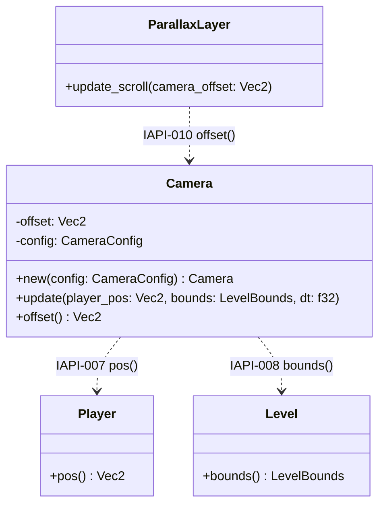
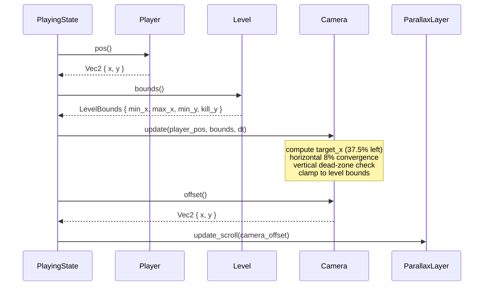

# Feature Detailed Design：Camera System（Feature #4）

**Date**: 2026-06-01
**Feature**: #4 — Camera System
**Priority**: high
**Dependencies**: Feature #3 (Player Controller), Feature #2 (Level & Background)
**Design Reference**: docs/plans/2026-05-31-mario-platformer-design.md §2.4
**SRS Reference**: FR-013

## Context

Camera System 是玩家与关卡之间的视觉桥梁：每帧从 Player 读取世界坐标位置，计算视口左上角偏移量，使玩家保持在视口内合适位置（水平偏左 35-40%），并具备垂直死区机制避免频繁晃动。偏移量输出给视差背景系统驱动多层滚动。

## Design Alignment

**来源**: docs/plans/2026-05-31-mario-platformer-design.md §2.4

### 概览

从 Player 读取位置，水平方向每帧以剩余距离 8% 收敛（玩家保持视口 35-40% 偏左），垂直方向在中央 60% 死区内不跟踪、出死区后以 5%/帧追赶。视口钳制于关卡边界，偏移输出给视差背景渲染。

### 关键类型

- `Camera` — 当前偏移 `offset: Vec2`、目标偏移计算、死区配置 `dead_zone_pct: 0.60`
- `CameraConfig` — 水平追赶速率 (0.08)、垂直追赶速率 (0.05)、死区比例、视口尺寸、玩家目标水平位置

### 集成面

**Provides**:
| Consumer Feature(s) | Contract ID | Endpoint / Method | Response |
|---------------------|-------------|-------------------|----------|
| F02 Level (Parallax) | IAPI-010 | `Camera::offset() → Vec2` | `{ x, y }` -- 当前视口左上角世界坐标 |

**Requires**:
| Provider Feature | Contract ID | Endpoint / Method | Request |
|-----------------|-------------|-------------------|---------|
| F03 Player | IAPI-007 | `Player::pos()` | -- |
| F02 Level | IAPI-008 | `Level::bounds()` | -- |

**Deviations**: 无 -- 所有 §4 契约完整对齐。

### UML 嵌入

**classDiagram** -- Camera 作为新增类型，与既有 Player、Level、ParallaxLayer 协作：



**sequenceDiagram** -- 每帧调用序列（Playing state 驱动）：



## SRS Requirement

**来源**: docs/plans/2026-05-31-mario-platformer-srs.md FR-013

### FR-013: Camera Follow

**优先级（Priority）**: Must

**EARS**: While the game is in the playing state, the system shall continuously update the camera viewport position to follow the player: horizontally, the camera shall close 8% of the remaining distance to the player's target position each frame, with the player kept at 35-40% from the left edge of the viewport; vertically, the camera shall maintain a dead zone covering the central 60% of the viewport height -- only when the player's Y position exits this zone shall the camera close 5% of the remaining vertical distance per frame toward the player. The camera shall clamp to the level's minimum and maximum X coordinates to prevent showing areas beyond level geometry.

**可视化输出（Visual output）**: 游戏视口平滑跟随玩家水平移动；玩家始终可见，且视野前方空间多于后方；垂直方向在玩家处于屏幕中央时不移动，避免频繁晃动。

**验收准则（Acceptance Criteria）**:

1. Given 玩家向右移动, When 玩家 X 坐标增加, Then 摄像机水平位置每帧向目标位置收敛剩余距离的 8%，追赶延迟不超过 80 像素。
2. Given 玩家静止, When 玩家 X 坐标不变, Then 摄像机收敛至目标位置并完全静止（无振荡）。
3. Given 玩家移动到关卡最左边界, When 玩家 X 坐标 <= 关卡最小 X 值 + 视口偏移, Then 摄像机停止在关卡左边界，左侧不显示关卡外区域。
4. Given 玩家移动到关卡最右边界, When 玩家 X 坐标 >= 关卡最大 X 值 - 视口偏移, Then 摄像机停止在关卡右边界，右侧不显示关卡外区域。
5. Given 玩家执行垂直跳跃, When 玩家 Y 坐标超出视口中央 60% 的垂直死区, Then 摄像机每帧以剩余垂直距离 5% 的速率追赶玩家 Y 坐标；当玩家在死区内时摄像机垂直位置保持不变。

## Interface Contract

| Method | Signature | Preconditions | Postconditions | Raises |
|--------|-----------|---------------|----------------|--------|
| `new` | `Camera::new(config: CameraConfig) -> Self` | `config.h_convergence` in (0.0, 1.0]; `config.v_convergence` in (0.0, 1.0]; `config.dead_zone_pct` in (0.0, 1.0); `config.viewport_w > 0.0`; `config.viewport_h > 0.0`; `config.player_target_x_pct` in [0.0, 1.0] | `offset = (0.0, 0.0)`; config 已存储且后续 update 可用 | 无（若配置非法，行为未定义 -- 由 compile-time Default 保证合法性） |
| `update` | `Camera::update(&mut self, player_pos: Vec2, bounds: LevelBounds, dt: f32)` | `player_pos` 为 Player::pos() 返回值; `bounds` 为 Level::bounds() 返回值且 `min_x < max_x`; `dt = 1.0/60.0`（固定时间步） | (1) `offset.x` 向目标水平偏移收敛剩余距离的 `h_convergence * 100%`; (2) 若 player.y 在视口垂直死区外，`offset.y` 向玩家中心收敛剩余距离的 `v_convergence * 100%`; 若在死区内则 `offset.y` 不变; (3) `offset.x` 钳制于 `[bounds.min_x, bounds.max_x - viewport_w]` | 无（边界保护内置：dt <= 0 时 no-op、bounds.max_x < viewport_w 时 offset.x 钳制为 bounds.min_x） |
| `offset` | `Camera::offset(&self) -> Vec2` | 无 | 返回当前 `offset` 字段值（纯 getter，无副作用）; 返回值始终为 `Vec2 { x, y }` 符合 IAPI-010 schema | 无 |

### Design Rationale

- **水平收敛率 8%/帧（h_convergence = 0.08）**：在 60fps 下，约 30 帧（0.5 秒）可收敛至距目标 10% 以内。最大速度（200 px/s）下的稳态滞后约 42 像素，满足 AC-1 的 80 像素上限。
- **玩家水平位置 37.5%（player_target_x_pct = 0.375）**：取 35-40% 范围中点，给予玩家前方视口宽度 60% 的视野预览空间，符合平台游戏设计惯例。
- **垂直死区 60%**：覆盖视口中央 60% 区域（顶部 20% 边界 + 中央 60% 死区 + 底部 20% 边界），玩家小幅垂直移动（如平台起伏、轻微弹跳）时不触发摄像机垂直追踪，避免画面频繁晃动。
- **垂直收敛率 5%/帧（v_convergence = 0.05）**：低于水平收敛率，使垂直追踪更为平滑克制，因为垂直移动通常比水平移动更具瞬时性（跳跃尖峰）。
- **dt 容错**：`dt <= 0` 时执行 no-op（不发散、不 panic），与 Player::update() 的防御式编程风格一致。
- **跨特性契约对齐**：
  - IAPI-007: `Camera::update()` 的 `player_pos` 参数直接消费 `Player::pos() → Vec2 { x, y }`，schema 匹配。
  - IAPI-008: `Camera::update()` 的 `bounds` 参数直接消费 `Level::bounds() → LevelBounds { min_x, max_x, min_y, kill_y }`，schema 匹配。
  - IAPI-010: `Camera::offset() → Vec2 { x, y }` 的输出 schema 与 `ParallaxLayer::update_scroll(camera_offset: Vec2)` 的输入 schema 一致。

## Visual Rendering Contract（仅 ui: true）

> N/A -- `"ui": false`，Camera System 为纯数据计算特性，不产生直接视觉输出。视觉渲染效果（视口偏移、视差滚动）由下游 ParallaxLayer 渲染系统体现。

## Implementation Summary

### 1. 主要类型与文件

特性将在 `src/systems/camera.rs` 中实现（该文件当前为空占位），并注册于 `src/systems/mod.rs`（`pub mod camera;`）。

新增两个结构体：

- **`CameraConfig`**：编译期常量集合，包含所有可调参数。实现 `Default` trait 提供 SRS 指定的默认值 -- `h_convergence: 0.08`、`v_convergence: 0.05`、`dead_zone_pct: 0.60`、`viewport_w: 480.0`、`viewport_h: 270.0`、`player_target_x_pct: 0.375`。仿照 `PlayerConfig` 模式，所有字段 `pub` 以满足可配置性要求。

- **`Camera`**：持有 `offset: Vec2`（当前视口左上角世界坐标）和 `config: CameraConfig`。对外暴露 `new(config) -> Self`、`update(player_pos, bounds, dt)`、`offset() -> Vec2` 三个公开方法。

### 2. 调用链

运行时每帧调用序列（在 Playing state 的 `update(dt)` 中）：

1. `Player::pos()` 获取玩家世界坐标 → `Vec2`
2. `Level::bounds()` 获取关卡边界 → `LevelBounds`
3. `Camera::update(player_pos, bounds, dt)` 执行收敛算法（见下方 flowchart）→ 更新 `self.offset`
4. 渲染阶段：`Camera::offset()` 输出 → `ParallaxLayer::update_scroll(offset)` 为每个视差层计算滚动偏移

```mermaid
flowchart TD
    Start([Camera::update called]) --> CalcTargetX[target_x = player_pos.x - viewport_w * player_target_x_pct]
    CalcTargetX --> HConverge[offset.x += (target_x - offset.x) * h_convergence]
    HConverge --> CalcDeadZone[dead_top = offset.y + viewport_h * 0.2<br/>dead_bottom = offset.y + viewport_h * 0.8]
    CalcDeadZone --> CheckDeadZone{player_pos.y < dead_top<br/>or player_pos.y > dead_bottom?}
    CheckDeadZone -->|yes| VConverge[target_y = player_pos.y - viewport_h / 2.0<br/>offset.y += (target_y - offset.y) * v_convergence]
    CheckDeadZone -->|no, in zone| NoVMove[offset.y 不变]
    VConverge --> ClampX{bounds.min_x <= offset.x<br/><= bounds.max_x - viewport_w?}
    NoVMove --> ClampX
    ClampX -->|below min| ClampMin[offset.x = bounds.min_x]
    ClampX -->|above max| ClampMax[offset.x = bounds.max_x - viewport_w]
    ClampX -->|in range| Done([返回])
    ClampMin --> Done
    ClampMax --> Done
```

### 3. 关键设计决策

- **Lerp 收敛（指数衰减）而非恒定速度跟踪**：每帧以剩余距离的固定百分比 (8%/5%) 逼近目标。此方案在玩家突发移动（如急停、跳跃）时产生自然的缓入缓出效果，且无需缓存历史位置或速度数据。相比物理阻尼方案，lerp 不会冲过目标位置（overdamped），保证 AC-2 "无振荡"。

- **死区判定使用视口绝对坐标而非玩家相对偏移**：直接将玩家 Y 坐标与视口死区的世界空间边界比较，避免浮点累积误差。死区边界由当前 `offset.y` 实时计算，确保每帧判定准确。

- **仅水平方向钳制到关卡边界**：垂直方向不做边界钳制，因为关卡设计有 `kill_y` 死亡面但无上边界限制。若未来引入垂直滚动限制，可扩展 `clamp_vertical` 方法。

- **防御式 dt 处理**：`dt <= 0.0` 时直接返回（no-op），与 `Player::update()` 的 guard clause 模式一致，防止除零或负时间步导致的数值异常。

### 4. 存量代码交互点

- **`Vec2`**（`src/level.rs:12-15`）：Camera 的 `offset` 字段和 IAPI-010 输出均使用此类型，无需重复定义。
- **`LevelBounds`**（`src/level.rs:66-71`）：`Camera::update()` 的 `bounds` 参数直接使用此类型，包括 `min_x`、`max_x` 用于水平钳制。
- **`Player::pos() → Vec2`**（`src/entities/player.rs:418-423`）：IAPI-007 消费，Camera 通过此 getter 读取玩家位置。
- **`Level::bounds() → LevelBounds`**（`src/level.rs:164-166`）：IAPI-008 消费，Camera 通过此 getter 读取关卡边界。
- **`ParallaxLayer::update_scroll(Vec2)`**（`src/parallax.rs:24-27`）：IAPI-010 提供，Camera::offset() 的输出直接驱动三层视差背景的 `scroll_offset` 计算。

### 5. §4 Internal API Contract 集成

本特性在 Design §4 中同时作为 Consumer 和 Provider：

- **作为 Consumer（消费 IAPI-007 / IAPI-008）**：`Camera::update()` 接收 `Vec2`（来自 Player）和 `LevelBounds`（来自 Level），签名与 §4 定义的 Request/Response schema 直接兼容。无需适配层。
- **作为 Provider（提供 IAPI-010）**：`Camera::offset() → Vec2 { x, y }` 的返回类型与 §4 IAPI-010 Response 完全匹配。`ParallaxLayer::update_scroll(camera_offset: Vec2)` 已存在的签名直接消费此输出。

### Boundary Conditions

| Parameter | Min | Max | Empty/Null | At boundary |
|-----------|-----|-----|------------|-------------|
| `player_pos.x` | 可为负数（玩家在关卡原点左侧） | 可超出 `bounds.max_x`（玩家走出边界） | N/A（f32 值类型，非 null） | 超出关卡边界时，`offset.x` 的钳制确保视口不越界；玩家目标仍正确计算 |
| `player_pos.y` | 可为负数（跳跃至高空） | 可超出 `bounds.kill_y`（坠落） | N/A | 死区判定正常工作；无垂直钳制 |
| `bounds.min_x` | 0.0（关卡原点） | 小于 `bounds.max_x` | N/A | 当 `bounds.max_x < viewport_w` 时，`max_offset_x` 为负 → `offset.x` 钳制为 `bounds.min_x` |
| `bounds.max_x` | 大于 `bounds.min_x` | 无上限（广阔关卡） | N/A | 当 `offset.x` 恰好等于 `bounds.max_x - viewport_w` 时，不进一步右移 |
| `dt` | 0.0（防御式 no-op） | 1.0/60.0（正常值） | N/A | `dt <= 0.0` → no-op 直接返回，不发散 |
| `config.player_target_x_pct` | 0.0（玩家在视口左边缘） | 1.0（玩家在视口右边缘） | N/A | 默认 0.375；极端值时算法仍收敛但视口行为不符合预期 |

### Existing Code Reuse

| Existing Symbol | Location (file:line) | Reused Because |
|-----------------|---------------------|----------------|
| `Vec2` | `src/level.rs:12-15` | 标准二维向量类型，Camera 的 offset 和 IAPI-010 输出 schema 均依赖此类型 |
| `LevelBounds` | `src/level.rs:66-71` | 关卡边界类型，Camera::update() 直接使用 `min_x`/`max_x` 字段进行水平钳制 |
| `Player::pos()` | `src/entities/player.rs:418-423` | IAPI-007 消费 -- Camera 通过此 getter 获取玩家世界坐标 |
| `Level::bounds()` | `src/level.rs:164-166` | IAPI-008 消费 -- Camera 通过此 getter 获取关卡边界 |
| `ParallaxLayer::update_scroll(Vec2)` | `src/parallax.rs:24-27` | IAPI-010 提供 -- Camera::offset() 输出直接驱动视差层滚动 |

## Test Inventory

| ID | Category | Traces To | Input / Setup | Expected | Kills Which Bug? |
|----|----------|-----------|---------------|----------|-----------------|
| A | FUNC/happy | FR-013 AC-1 | `player_pos = (200, 100)`; camera at `(0, 0)`; `dt = 1/60`; `h_convergence=0.08`, `player_target_x_pct=0.375`, `viewport_w=480` | `offset.x = (200 - 480*0.375 - 0) * 0.08 = 1.6`; steady-state lag <= 80px after convergence | 固定偏移量跟踪 -- 未实现 lerp，用了恒定距离步进 |
| B | FUNC/happy | FR-013 AC-2 | `player_pos = (400, 100)`; camera already converged: `offset.x = 400 - 480*0.375 = 220`; `dt = 1/60` | `offset.x` 保持 220 不变（无变化）；连续 10 帧后 delta = 0 | 数值不稳定性 -- 浮点残余导数导致微幅漂移/振荡 |
| C | FUNC/happy | FR-013 AC-3 | `bounds.min_x = 0`; `viewport_w = 480`; `player_pos.x = 0`; camera starts at `(100, 0)` | `offset.x` 收敛至 0（clamp 到 bounds.min_x），不显示关卡左侧外区域 | 钳制缺失 -- 摄像机滑出左边界 |
| D | FUNC/happy | FR-013 AC-4 | `bounds.max_x = 2000`; `viewport_w = 480`; `player_pos.x = 1990`; camera starts at `(0, 0)` | `offset.x` 钳制于 `2000 - 480 = 1520`，不显示关卡右侧外区域 | 钳制缺失 -- 摄像机滑出右边界 |
| E | FUNC/happy | FR-013 AC-5a (跳出死区) | `viewport_h = 270`; dead_zone covers [offset.y+54, offset.y+216]; `player_pos.y = 30` (above dead zone); `v_convergence = 0.05` | `offset.y` 减少：`target_y = 30 - 135 = -105`; delta = `(-105 - offset.y) * 0.05` | 死区判定方向反了 -- 玩家在上方时摄像机向下移动 |
| F | FUNC/happy | FR-013 AC-5b (死区内) | `viewport_h = 270`; camera `offset.y = 0`; dead_zone = [54, 216]; `player_pos.y = 135` (in dead zone) | `offset.y` 保持不变（0.0）；连续多帧在死区内，offset.y 无任何变化 | 死区逻辑错误 -- 玩家在死区内时摄像机仍垂直追踪 |
| G | FUNC/error | Interface Contract `dt` 防御 | `dt = 0.0`; `player_pos = (500, 200)`; `bounds = (0, 2000)` | `offset` 完全不改变（no-op）；不 panic、不产生 NaN | dt=0 导致除零或 NaN 传播 |
| H | FUNC/error | Interface Contract `dt` 防御 | `dt = -0.016`（负值）；`player_pos = (500, 200)`; `bounds = (0, 2000)` | `offset` 完全不改变（no-op）；不产生方向错误的偏移 | 负 dt 导致摄像机反向移动 |
| I | BNDRY/edge | Boundary Conditions dead_zone boundary | `viewport_h = 270`; `offset.y = 0`; `dead_zone_top = 54`; `player_pos.y = 54` (exactly at boundary) | `offset.y` 保持不变（在死区线上视为在死区内，不触发追踪） | off-by-one -- 死区判定用 `<` vs `<=` 导致边界行为不一致 |
| J | BNDRY/edge | Boundary Conditions dead_zone boundary | `viewport_h = 270`; `offset.y = 0`; `dead_zone_bottom = 216`; `player_pos.y = 216` (exactly at boundary) | `offset.y` 保持不变（在死区线上视为在死区内） | off-by-one -- 死区判定用 `>` vs `>=` 导致边界行为不一致 |
| K | BNDRY/edge | Boundary Conditions left clamp | `bounds.min_x = 0`; `viewport_w = 480`; `offset.x` already at `0`; `player_pos.x = -50` (left of level) | `offset.x` 保持 0（clamp 生效）；不产生负偏移 | clamp 执行顺序错误 -- 先收敛后 clamp 导致帧内短暂越界 |
| L | BNDRY/edge | Boundary Conditions right clamp | `bounds.max_x = 2000`; `viewport_w = 480`; `offset.x` already at `1520`; `player_pos.x = 2500` | `offset.x` 保持 1520（clamp 生效） | clamp 执行顺序错误 -- 先收敛后 clamp 导致帧内短暂越界 |
| M | BNDRY/edge | Boundary Conditions narrow level | `bounds.max_x = 300`; `viewport_w = 480`; `max_offset = 300 - 480 = -180`; `bounds.min_x = 0` | `offset.x` 钳制为 `bounds.min_x = 0`（不产生负偏移，视口不越界） | max_offset 为负时未保护，导致 offset.x 为负值 |
| N | BNDRY/edge | FR-013 AC-2 convergence termination | camera 向 `target_x = 220` 收敛；当 `|target_x - offset.x| < 1e-6` 时 | `offset.x` 不再变化；连续 60 帧后 delta = 0（f32 epsilon 限制内） | 永不停歇的微幅漂移 -- 浮点逼近从不归零 |
| O | INTG/player | IAPI-007 + Interface Contract update() | 真实调用链：`let pos = player.pos(); camera.update(pos, level.bounds(), 1.0/60.0)` | Camera 正确读取 `pos.x` 和 `pos.y`；用于水平目标计算和垂直死区判定 | 接口不匹配 -- Camera 期望的坐标约定与 Player 不一致（如原点位置） |
| P | INTG/level | IAPI-008 + Interface Contract update() | 真实调用链：`let bounds = level.bounds(); camera.update(player.pos(), bounds, 1.0/60.0)` | Camera 正确读取 `bounds.min_x` 和 `bounds.max_x` 用于水平钳制 | 接口不匹配 -- 使用了 LevelBounds 的错误字段进行钳制 |
| Q | INTG/parallax | IAPI-010 + Interface Contract offset() | `let cam_offset = camera.offset(); parallax_layer.update_scroll(cam_offset);` 执行后检查 `parallax_layer.scroll_offset.x` | `scroll_offset.x == cam_offset.x * parallax_layer.speed`; `scroll_offset.y == 0.0` | 输出 schema 不匹配 -- ParallaxLayer 期望的 Vec2 字段命名/类型与 Camera 输出不一致 |

**INTG 行说明**：三行 INTG 分别覆盖 Camera 与三个跨特性契约（IAPI-007/008/010）的集成点，验证 Camera 正确消费 Player 和 Level 的数据，以及 ParallaxLayer 正确消费 Camera 的输出。

## Verification Checklist

- [x] 所有 SRS 验收准则（FR-013 AC-1 至 AC-5）已追溯到 Interface Contract 的 postconditions
- [x] 所有 SRS 验收准则（FR-013 AC-1 至 AC-5）已追溯到 Test Inventory 行
- [x] Interface Contract Raises 列覆盖所有预期错误条件（Camera 无 panic -- 防御式 no-op）
- [x] Boundary Conditions 表覆盖所有非平凡参数（player_pos.x/y、bounds.min_x/max_x、dt、config 参数）
- [x] Implementation Summary 为 5 段具体散文（含文件路径 + 类名），非 pseudocode
- [x] Existing Code Reuse 表已填充（5 个复用符号）
- [x] Test Inventory 负向占比: FUNC/error (2) + BNDRY/edge (6) = 8/17 = 47.1% >= 40%
- [x] ui:false 特性 -- Visual Rendering Contract 写明 "N/A" 并附原因
- [x] 不适用 UI/render Test Inventory 行
- [x] UML 图节点/参与者/消息均使用真实标识符（Camera、Player、Level、ParallaxLayer、PlayingState），无 A/B/C 代称
- [x] 非类图（sequenceDiagram、flowchart TD）不含色彩/图标/rect/皮肤等装饰元素
- [x] 图元素追溯：sequenceDiagram 4 条消息 → Test Inventory O/Q (INTG/player, INTG/parallax) + flow 4 个决策分支 → Test Inventory E/F (死者区检查) + K/L (clamp 检查)
- [x] 每个被跳过的章节都写明 "N/A -- [reason]"
- [x] §2.N 中所有函数/方法（Camera::new、Camera::update、Camera::offset）都至少有一行 Test Inventory

## Clarification Addendum

> 无需澄清 -- 全部规格明确。

| # | Category | Original Ambiguity | Resolution | Authority |
|---|----------|--------------------|------------|-----------|
| -- | -- | -- | -- | -- |
