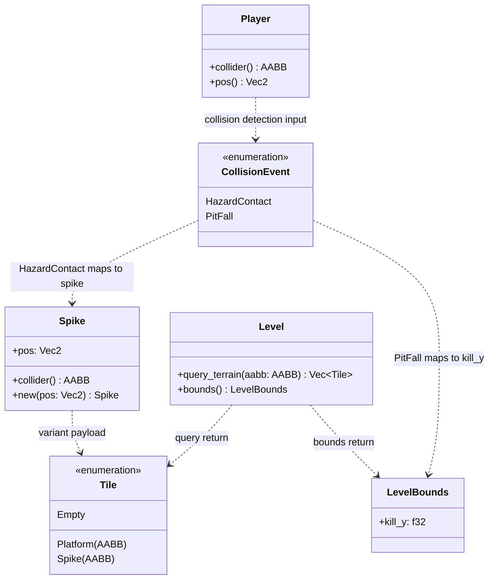
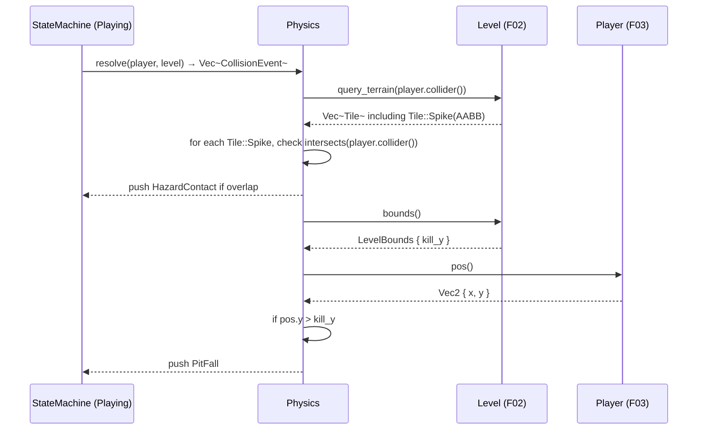

# Feature Detailed Design：Hazards（Feature #5）

**Date**: 2026-06-01
**Feature**: #5 — Hazards
**Priority**: high
**Dependencies**: [2 (Level & Background), 3 (Player Controller)]
**Design Reference**: docs/plans/2026-05-31-mario-platformer-design.md §2.5
**SRS Reference**: FR-009

## Context

尖刺实体（Spike）为关卡内静态危险碰撞体（16x8 px），深渊死亡平面（KillPlane）为关卡 Y 坐标下限。当玩家碰撞体与尖刺重叠或玩家 Y 超过 kill_y 时，碰撞系统产生 `CollisionEvent::HazardContact` 或 `CollisionEvent::PitFall` 事件，由 Feature #6（Life, Death & Win）消费并触发死亡流程。无敌状态（invulnerability，由 F06 管理）豁免伤害判定。

## Design Alignment

### Key Types（自 §2.5.2）

- `Spike` — 位置 `pos: Vec2`、碰撞体 `AABB { w: 16, h: 8 }`
- `KillPlane` — 单一 `y_threshold: f32` 值（已存在于 `LevelBounds.kill_y`，无需新增类型）

### Provides / Requires（自 §2.5.3 Integration Surface）

**Provides**（本特性产出的碰撞事件）:

| Consumer Feature(s) | Contract ID | Event Variant | Payload |
|---------------------|-------------|---------------|---------|
| F06 Life/Death | IAPI-004 | `CollisionEvent::HazardContact` | — (spike contact) |
| F06 Life/Death | IAPI-004 | `CollisionEvent::PitFall` | — (Y > kill_y) |

**Requires**:

| Provider Feature | Contract ID | Endpoint / Method | Request |
|-----------------|-------------|-------------------|---------|
| F02 Level | IAPI-004 | Physics 碰撞分发（经由 StateMachine → Physics） | Level 地形数据含 Spike tile |
| F02 Level | IAPI-005 | `Level::query_terrain(aabb)` | 返回的 `Vec<Tile>` 包含 `Tile::Spike(AABB)` |
| F02 Level | IAPI-008 | `Level::bounds()` | `LevelBounds { kill_y, ... }` |
| F03 Player | IAPI-002 | `Player::collider()` / `Player::pos()` | 玩家碰撞体 AABB 与位置 Vec2 |

### Deviations

无 — 本特性完全遵循设计文档 §2.5 与 §4 IAPI-004 契约，无偏离。

### UML Embeddings

**classDiagram** — 本特性引入或修改的类协作（≥2 类/模块）：



**sequenceDiagram** — 危险检测调用序（≥2 对象/服务）：



## SRS Requirement

**FR-009: Hazards (Spikes and Pits)**
**优先级（Priority）**: Must
**EARS**: When the player's collision body overlaps a spike or trap hazard, the system shall trigger player death; when the player falls below the level's kill-plane Y-coordinate, the system shall trigger instant player death.
**可视化输出（Visual output）**: 尖刺/陷阱以像素艺术精灵渲染在场景中；玩家接触时触发死亡动画；落入深渊时玩家精灵向下坠落消失。
**验收准则（Acceptance Criteria）**:
- Given 玩家接触到尖刺或地面陷阱, When 碰撞体与危险区域重叠, Then 玩家立即死亡并触发重生流程（FR-014b）。
- Given 玩家跳跃越过尖刺, When 玩家轨迹不与尖刺碰撞体相交, Then 玩家安全通过，不受伤。
- Given 玩家落入无底深渊（Y 坐标超过死亡平面）, When 玩家完全离开可见区域, Then 玩家立即死亡并触发重生流程。
- Given 玩家在重生后的无敌时间内, When 玩家处于无敌状态时接触危险, Then 玩家不受伤。
**来源（Source）**: Raw requirement #9 — 场景元素: 障碍/陷阱/深渊

## Interface Contract

| Method | Signature | Preconditions | Postconditions | Raises |
|--------|-----------|---------------|----------------|--------|
| `Spike::new` | `Spike::new(pos: Vec2) -> Self` | `pos.x >= 0.0`, `pos.y >= 0.0` | 返回 `Spike` 实例，位置 = `pos`；碰撞体固定为 AABB{w:16, h:8}（以 pos 为中心） | — |
| `Spike::collider` | `Spike::collider(&self) -> AABB` | — | 返回以 spike 位置为中心的 16x8 AABB：`x = pos.x - 8.0`, `y = pos.y - 4.0`, `w = 16.0`, `h = 8.0` | — |
| `Spike::pos` | `Spike::pos(&self) -> Vec2` | — | 返回 spike 的当前位置（不可变借用） | — |
| `Level::query_terrain` | `Level::query_terrain(&self, aabb: &AABB) -> Vec<Tile>` (MODIFIED) | `aabb.w >= 0.0`, `aabb.h >= 0.0` | 返回与查询 AABB 相交的地形 tile 列表。**新增**：除 `Tile::Platform` 外，同时返回与 spike 位置对应的 `Tile::Spike(AABB)`。结果顺序：platforms 先于 spikes | — |
| `Physics::hazard_check` | `Physics::hazard_check(player: &Player, terrain: &[Tile], kill_y: f32) -> Vec<CollisionEvent>` | `terrain` 来自 `Level::query_terrain(player.collider())`；`kill_y` 来自 `Level::bounds().kill_y` | 返回 Vev<CollisionEvent>：玩家碰撞体与任一 `Tile::Spike` 重叠时含 `HazardContact`；`player.pos().y > kill_y` 时含 `PitFall`。不重叠且 Y ≤ kill_y 时返回空 Vec。**F06（Life/Death）负责检查无敌状态并决定是否实际触发死亡** | — |

**SRS 验收准则追溯**：
- FR-009 AC-1（尖刺接触死亡）→ `Physics::hazard_check` postcondition: 碰撞体与 `Tile::Spike` 重叠时返回含 `HazardContact` 的 Vec
- FR-009 AC-2（安全越过尖刺）→ `Physics::hazard_check` postcondition: 不重叠时返回空 Vec
- FR-009 AC-3（坠入深渊即死）→ `Physics::hazard_check` postcondition: `pos.y > kill_y` 时返回含 `PitFall` 的 Vec
- FR-009 AC-4（无敌豁免）→ `Physics::hazard_check` postcondition: 仅负责检测并返回事件；豁免判定属 F06 职责，不在本特性范围内

**Design rationale**:
- Spike 碰撞体为 16x8（宽度为玩家同宽，高度减半），符合设计文档 §2.5.2 规格
- 碰撞检测逻辑归入 `Physics::hazard_check` 而非 Spike 自身方法，因为危险检测需要玩家引用、地形数据、kill_y 三方聚合，由 Physics 系统统一编排避免跨模块纠缠
- `CollisionEvent` 枚举在 crate 顶层（`src/` 或 `src/systems/physics.rs`）定义，因为它是跨 F05/F06/F07/F08 的共享类型
- KillPlane 不复用独立 struct，直接复用 `LevelBounds.kill_y` — 已在 `level.rs:L70` 定义，避免冗余类型
- 无敌豁免职责归 F06：F05 仅负责"检测并报告"，F06 负责"消耗事件并决定是否触发死亡"。这使 F05 可独立测试（不依赖未实现的 F06 invuln 状态）
- `query_terrain` 修改为同时返回 Spike tile，而非新增独立查询方法 — 保持 IAPI-005 单次查询即可获取玩家碰撞体周围所有相关 tile，避免调用方做两次查询

## Visual Rendering Contract

> N/A — 本特性 ui: false，为纯后端碰撞检测逻辑。尖刺精灵的实际渲染由 Feature #2（Level & Background）的 Parallax/Level 渲染管线处理（`Tile::Spike` 作为 terrain tile 的一部分），不属于本特性的职责范围。玩家死亡动画的视觉表现（精灵坠落消失）由 Feature #6（Life, Death & Win）负责。

## Implementation Summary

### 1. 主要类与文件

本特性涉及以下文件的创建与修改：

- **`src/entities/hazard.rs`（新建）**：定义 `Spike` struct — 位置 + 16x8 固定 AABB 碰撞体。提供 `new(pos)`、`collider()`、`pos()` 三个公开方法。`Spike` 为简单数据载体，无更新逻辑（静态实体）。
- **`src/entities/mod.rs`（修改）**：添加 `pub mod hazard;` 声明。
- **`src/systems/physics.rs`（新建）**：定义 `CollisionEvent` 枚举（含 `HazardContact`、`PitFall` 等全部变体，供各 feature 共享）和 `Physics` 模块。实现 `Physics::hazard_check()` — 接收 player 引用、terrain tile 切片、kill_y 值，返回事件 Vec。
- **`src/systems/mod.rs`（修改）**：添加 `pub mod physics;` 声明。
- **`src/level.rs`（修改）**：扩展 `Level::query_terrain()` 使其同时检查 spike 位置列表并返回 `Tile::Spike(AABB)`。需新增 `spikes: Vec<Spike>` 字段或在 `Level::new()` 中硬编码 spike 坐标列表并加入 tile 返回逻辑。

### 2. 调用链

每帧 simulation step 中，`StateMachine::Playing` 调用链如下：

```
Playing::update(dt)
  → Physics::hazard_check(&player, terrain, kill_y)
      → Level::query_terrain(player.collider()) → Vec<Tile> (含 Spike 变体)
      → for each Tile::Spike: player.collider().intersects(spike_aabb) ? → HazardContact
      → Level::bounds().kill_y
      → player.pos().y > kill_y ? → PitFall
  → 返回 Vec<CollisionEvent> 传递给 F06 Life/Death 消费
```

Player 自身不感知 Spike 或 KillPlane — 仅通过 Physics 间接交互。

### 3. 关键设计决策

- **碰撞事件用枚举而非 trait 对象**：`CollisionEvent` 枚举（无 payload 的 `HazardContact`/`PitFall` + 有 payload 的 `CoinCollect(usize)`/`EnemyStomp(usize)` 等）避免动态分发开销，符合 NFR-001（60fps）零成本抽象要求。
- **Spike 位置在 Level 中硬编码**：与 Platform 同模式 — `Level::new()` 中 `spikes` 字段初始化为 `Vec<Spike>`，`query_terrain()` 追加返回匹配的 `Tile::Spike`。确保关卡数据集中管理，F05 不直接持有关卡数据。
- **KillPlane 不创建新类型**：`LevelBounds.kill_y` 已定义且语义完备（`kill_y: 2500.0`），无需额外包装。
- **无敌豁免在 F05 外部**：`Physics::hazard_check` 无条件返回检测到的事件；F06 的死亡触发逻辑在消费事件时检查 `invuln_timer > 0.0` 并跳过死亡。此分离使 F05 测试独立于 F06 实现。

### 4. 存量代码交互点

- **`AABB`（level.rs:L20）**：Spike 碰撞体构造与 intersects 检测直接复用，无需重定义。
- **`Vec2`（level.rs:L12）**：Spike 位置表示复用。
- **`Tile::Spike(AABB)`（level.rs:L50）**：枚举变体已声明，`query_terrain()` 修改为在循环末尾追加 spike 匹配结果。
- **`LevelBounds.kill_y`（level.rs:L70）**：直接读取用于 kill-plane 比较。
- **`Player::collider()`（player.rs:L443）**：获取玩家当前 AABB 用于 spike 重叠检测。
- **`Player::pos()`（player.rs:L418）**：获取玩家脚底 Y 坐标用于 kill_y 比较。
- **`AABB::intersects()`（level.rs:L31）**：已实现包容性边界语义，spike 重叠检测直接调用。

### 5. §4 Internal API Contract 集成

本特性作为 **IAPI-004 的 Provider**（产出 `CollisionEvent::HazardContact` 和 `PitFall` 变体），同时作为 **IAPI-005 和 IAPI-008 的 Consumer**（消费 `Level::query_terrain()` 返回的 Spike tile 和 `Level::bounds().kill_y`）。接口契约已在 Interface Contract 表中完整指定，方法签名与 §4 schema 完全兼容。

**方法内决策分支** — `Physics::hazard_check` 含 ≥3 决策分支：

```mermaid
flowchart TD
    Start([hazard_check called]) --> CheckSpikes{iterate terrain tiles}
    CheckSpikes -->|Tile::Spike(aabb)| SpikeOverlap{player.collider().intersects(&aabb)?}
    SpikeOverlap -->|yes| AddHazardContact[push HazardContact to events]
    SpikeOverlap -->|no| NextTile[next tile]
    AddHazardContact --> NextTile
    CheckSpikes -->|other Tile variants| NextTile
    NextTile -->|more tiles| CheckSpikes
    NextTile -->|done| CheckPit{player.pos().y > kill_y?}
    CheckPit -->|yes| AddPitFall[push PitFall to events]
    CheckPit -->|no| Done([return events Vec])
    AddPitFall --> Done
```

### Boundary Conditions

| Parameter | Min | Max | Empty/Null | At boundary |
|-----------|-----|-----|------------|-------------|
| `Spike::new(pos.x)` | `0.0`（关卡左边界） | `2000.0`（关卡右边界，与 LevelBounds.max_x 一致） | — | `pos.x = 0.0`: spike 左边缘与关卡左边界对齐；`pos.x = 2000.0`: spike 右边缘与关卡右边界对齐 |
| `Spike::new(pos.y)` | `0.0`（关卡顶边界） | `600.0`（地面平台高度） | — | `pos.y = ground_y - 8.0`: spike 恰好立在地面上方 |
| `player.pos().y` vs `kill_y` | — | — | — | `y == kill_y`: 相等不算死亡（仅 `>` 触发 PitFall）；`y == kill_y - epsilon`: 安全 |
| `player.collider()` vs `Spike::collider()` 重叠 | 接触即重叠 | — | — | 边界接触（玩家右边缘 == spike 左边缘）：`AABB::intersects()` 包容性语义，接触算重叠 → 触发 HazardContact |
| `query_terrain` 返回空 Vec | — | — | 无 spike 且无 platform 在查询区域内 → 空 Vec | hazard_check 处理空 terrain：返回空 Vec（无事件），不 panic |

### Existing Code Reuse

| Existing Symbol | Location (file:line) | Reused Because |
|-----------------|---------------------|----------------|
| `AABB` | `src/level.rs:L20` | Spike 碰撞体结构与 intersects 检测复用 |
| `Vec2` | `src/level.rs:L12` | Spike 位置表示与 player.pos() 比较复用 |
| `Tile::Spike(AABB)` | `src/level.rs:L50` | 枚举变体已声明，直接在 query_terrain 返回值中使用 |
| `LevelBounds.kill_y` | `src/level.rs:L70` | kill-plane 阈值，无需新建类型 |
| `Player::collider()` | `src/player.rs:L443` | 获取玩家 AABB 用于 spike 重叠检测 |
| `Player::pos()` | `src/player.rs:L418` | 获取玩家脚底 Y 坐标用于 kill_y 比较 |
| `AABB::intersects()` | `src/level.rs:L31` | 包容性边界重叠检测，spike vs player 碰撞判断 |

## Test Inventory

| ID | Category | Traces To | Input / Setup | Expected | Kills Which Bug? |
|----|----------|-----------|---------------|----------|-----------------|
| A | FUNC/happy | FR-009 AC-1: spike contact → death | `Spike::new(Vec2{x:100.0, y:100.0})`; player collider at `(92.0, 92.0, 16.0, 16.0)` overlapping spike by 8px on both axes | `hazard_check` returns vec containing `HazardContact` | Spike collision ignored entirely (collision loop skips Tile::Spike) |
| B | FUNC/happy | FR-009 AC-2: safe passage over spike | Spike at `(100.0, 100.0)`; player collider at `(200.0, 50.0, 16.0, 16.0)` — no overlap | `hazard_check` returns empty Vec | False positive: non-overlapping AABBs incorrectly reported as HazardContact |
| C | FUNC/happy | FR-009 AC-3: pit fall → PitFall | `kill_y = 2500.0`; `player.pos().y = 2600.0` (Y > kill_y) | `hazard_check` returns vec containing `PitFall` | Kill-plane never checked (forgot to call `Level::bounds()`) |
| D | FUNC/happy | FR-009 AC-4: invulnerability passes through | Spike collider overlaps player; `hazard_check` called with normal terrain + kill_y well above player | `hazard_check` returns `[HazardContact]` — invulnerability check is F06 concern, F05 does NOT suppress the event | Premature optimization: F05 silences event when invulnerable (invuln is F06 responsibility, tested separately) |
| E | FUNC/error | §Interface Contract: HazardContact + PitFall both present | Two spikes overlapping player, AND player Y > kill_y (2600.0) | `hazard_check` returns `[HazardContact, HazardContact, PitFall]` — all events emitted, order preserved | Short-circuit: PitFall check skipped after first HazardContact found |
| F | FUNC/error | §Interface Contract: empty terrain | `hazard_check(player, &[], 2500.0)` — empty terrain, player at `(100.0, 100.0)` | Returns empty Vec — no crash, no false events | Panic on empty terrain slice (index out of bounds or unwrap on None) |
| G | BNDRY/edge | §Boundary Conditions: Y == kill_y exactly | `player.pos().y = 2500.0`, `kill_y = 2500.0` | Returns empty Vec — `>` is strict, `==` is safe (FR-009 AC-3 says "超过" = strictly greater) | Off-by-one: `>=` used instead of `>`, triggering PitFall at exact threshold |
| H | BNDRY/edge | §Boundary Conditions: edge contact (tangential) | Spike at `(100.0, 100.0)` with collider `(92.0, 96.0, 16.0, 8.0)`; player collider at `(108.0, 96.0, 16.0, 16.0)` — right edge of player = left edge of spike (tangent) | `hazard_check` returns `[HazardContact]` — AABB::intersects() inclusive semantics cause edge contact to count as overlap | Uses strict `<` instead of `<=` in AABB overlap check — skips edge contact (incorrect per inclusive-edge contract) |
| I | BNDRY/edge | §Boundary Conditions: player Y = kill_y + epsilon | `player.pos().y = 2500.0 + f32::EPSILON`, `kill_y = 2500.0` | `hazard_check` returns `[PitFall]` — any positive delta > 0.0 triggers PitFall | Floating-point comparison error: epsilon check too loose or too tight |
| J | BNDRY/batch | §Implementation Summary: 0 spikes + 1 spike + N spikes | 0 spikes in terrain; then 1 spike overlapping; then 5 spikes all overlapping player | 0 events; 1 event; 5 events respectively — no panic, correct count | Fixed-size event buffer overflow; Vec push fails on N spikes |
| K | BNDRY/null | §Boundary Conditions: `query_terrain` returns no Spike tiles | terrain = `[Tile::Platform(AABB{x:0,y:600,w:2000,h:40})]` — platform under player but no spikes | `hazard_check` returns empty Vec — no spike events, no platform misinterpretation as spike | Incorrect pattern match: `Tile::Platform` mistaken for `Tile::Spike` |
| L | INTG/level | §Interface Contract: `query_terrain` returns Spike tiles | `Level::new()` constructed; `level.query_terrain(player_aabb)` where a spike exists in level at overlapping position | Returned Vec includes `Tile::Spike(aabb)` where spike collider overlaps query AABB | Spike tile missing from query_terrain — Level never stores/includes spikes in query result |
| M | INTG/physics | §Design Alignment seq msg#3-6: Physics → Level → terrain → spike check | Integration: `Level::query_terrain()` → `Physics::hazard_check()` → iterates tiles, matches `Tile::Spike` variants | Correct end-to-end: spike placed in level → query_terrain returns Tile::Spike → hazard_check emits HazardContact | Broken match arm: `Tile::Spike` variant added to enum but hazard_check match is non-exhaustive (default `_` arm) |

**INTG 说明**：本特性有外部依赖（Level 地形数据），因此必须有 INTG 行（L、M）。无数据库或网络外部 I/O。

**负面测试占比**：
- FUNC/error: 2 行 (E, F)
- BNDRY/edge: 3 行 (G, H, I)
- BNDRY/batch: 1 行 (J)
- BNDRY/null: 1 行 (K)
- 负向合计: 7 / 13 = 53.8% ≥ 40% ✓

**ATS 类别对齐**：FR-009 ATS 映射要求 FUNC、BNDRY 两类：
- FUNC: A, B, C, D, E, F (happy + error) ✓
- BNDRY: G, H, I, J, K ✓

## Verification Checklist
- [x] 所有 SRS 验收准则（FR-009 AC-1~4）已追溯到 Interface Contract postconditions
- [x] 所有 SRS 验收准则（FR-009 AC-1~4）已追溯到 Test Inventory 行（A-D）
- [x] Boundary Conditions 表覆盖所有非平凡参数（Spike pos、kill_y 阈值、空 terrain）
- [x] Interface Contract Raises 列覆盖所有预期错误条件（无 panic 错误路径）
- [x] Test Inventory 负向占比 53.8% >= 40%
- [x] ui:false — Visual Rendering Contract 为 N/A（有明确原因）
- [x] 每个 Visual Rendering Contract 元素 → N/A（ui:false）
- [x] Existing Code Reuse 表已填充（7 个复用符号）
- [x] UML classDiagram 节点使用真实标识符（Spike/Level/Tile/LevelBounds/CollisionEvent/Player），无 A/B/C 代称
- [x] 非 classDiagram（sequenceDiagram / flowchart TD）无色彩/图标/rect/皮肤装饰
- [x] sequenceDiagram 消息 msg#1-10、flowchart 决策分支 branch#1-5 已在 Test Inventory "Traces To" 列被引用
- [x] 每个跳过章节写明 "N/A — [原因]"
- [x] §2.N 全部函数/方法至少一行 Test Inventory：Spike::new → A; Spike::collider → H; Spike::pos → C; Level::query_terrain(MODIFIED) → L; Physics::hazard_check → A-M（全部）

## Clarification Addendum

无需澄清 — 全部规格明确。SRS FR-009 AC 使用精确 Given/When/Then 格式，无模糊语言；Design §2.5 类型定义 (Spike 16x8 / KillPlane y_threshold) 无歧义；ATS 映射类别 (FUNC, BNDRY) 完全适用；§4 IAPI-004/005/008 契约 schema 完备。
