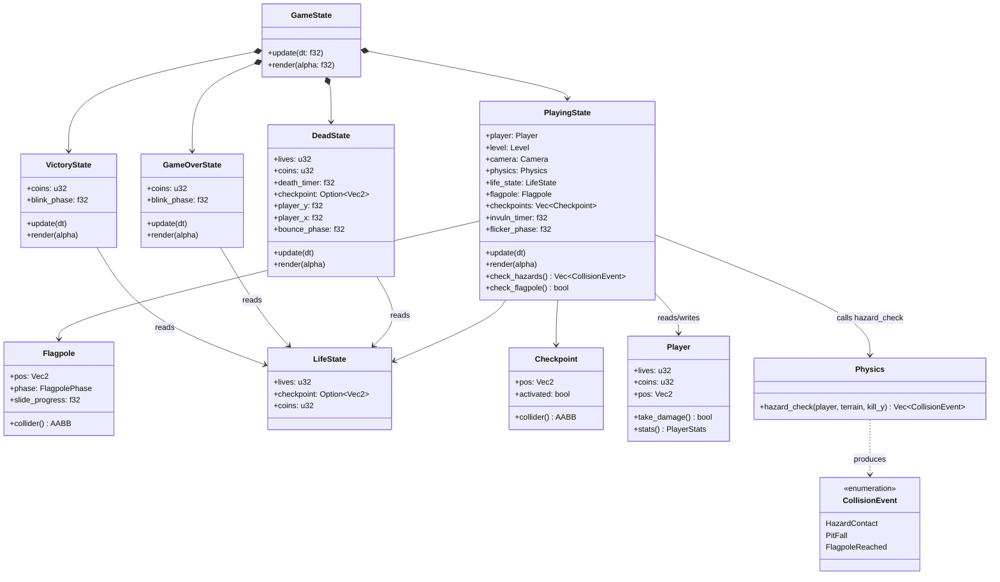
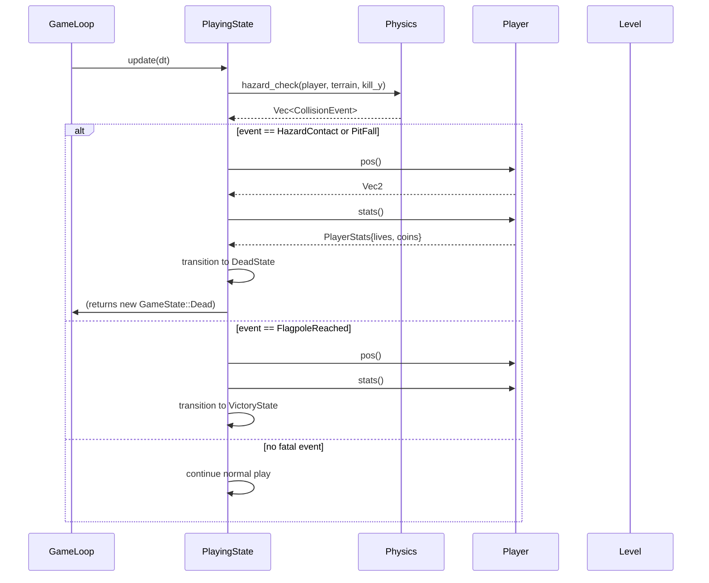
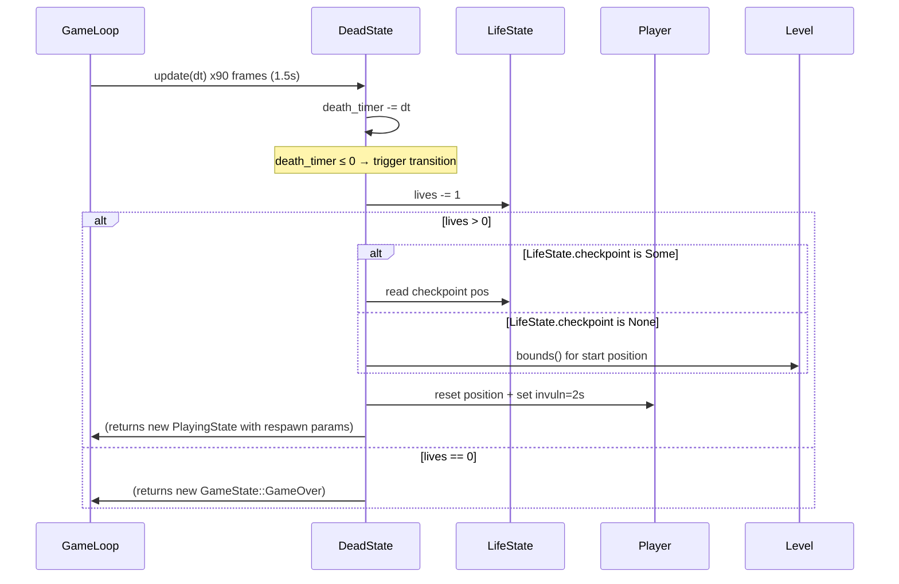
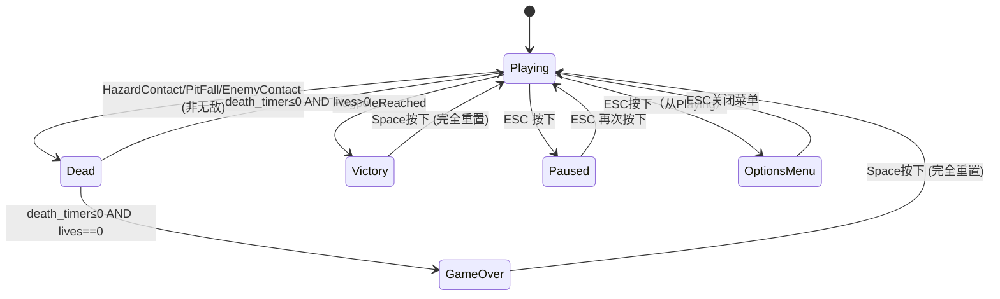

# Feature Detailed Design：Life, Death & Win（Feature #6）

**Date**: 2026-06-02
**Feature**: #6 — Life, Death & Win
**Priority**: high
**Dependencies**: F03 (Player Controller), F02 (Level & Background), F05 (Hazards)
**Design Reference**: docs/plans/2026-05-31-mario-platformer-design.md § 2.6
**SRS Reference**: FR-014a, FR-014b, FR-014c, FR-015

## Context

本特性实现完整的生命/死亡/胜利循环系统：管理 3 条命计数、检查点激活与存储、接触即死危险时锁定输入播放死亡动画(1.5s)→生命减 1→if生命>0重生至最近检查点+2s无敌闪烁, else生命=0进入 Game Over 画面；旗杆触发→滑下动画→Victory 画面含金币总计+重启提示。GameOver/Victory 画面响应空格键完全重置游戏(3命+0金币+关卡起点)。这是最小可玩原型的最终关键路径组件。

## Design Alignment

将设计文档 §2.6 的完整内容复制于此：

### 概览

管理生命计数 (3 初始)、检查点激活与存储。当碰撞事件为致命类型时锁定输入→播放死亡动画 1.5s→生命减 1→判断重生 (life>0) 或 GameOver (life=0)。重生时传送至最近检查点并授予 2s 无敌闪烁。旗杆触发时锁定输入→播放滑下动画→显示 Victory 画面。GameOver/Victory 画面响应空格键完全重置游戏。

### 关键类型（Key Types）

- `LifeState` — `lives: u32`、`checkpoint: Option<Vec2>`
- `DeathTimer` — 1.5s 倒计时，锁输入
- `InvulnTimer` — 2.0s 倒计时 + 闪烁相位 `flicker_phase: f32` (4Hz)
- `Flagpole` — 位置、触发区域 `AABB`、动画阶段枚举 `Idle | Sliding | Done`
- `Checkpoint` — 位置 `pos: Vec2`、激活标志 `activated: bool`、触发区域 `AABB`
- `GameState` — 状态机枚举: `Playing(PlayingState) | Dead(DeadState) | GameOver(GameOverState) | Victory(VictoryState) | Paused | OptionsMenu`

### 集成面（Integration Surface）

**Provides**: 本特性为状态编排层——无 §4 内部 API Contract 的 Provider 角色。所有跨特性数据流通过既有 IAPI Contract 完成（IAPI-009 PlayerStats 供 HUD 读取 lives/coins；IAPI-007 Player::pos() 供 Camera 读取）。本特性修改的是状态机调度逻辑与玩家内部状态字段。

**Requires**:

| Provider Feature | Contract ID | Endpoint / Method | Request |
|-----------------|-------------|-------------------|---------|
| F03 Player | IAPI-007 (implicit) | `Player::pos()` | 重生时读取/写入玩家位置; `Player::lives` 字段递减; `Player::coins` 字段重置 |
| F02 Level | IAPI-008 | `Level::bounds()` | 读取 `LevelBounds.kill_y`, `LevelBounds.min_x`用于重生; 关卡起点位置 |
| F05 Hazards | IAPI-004 (implicit) | `Physics::hazard_check()` → `Vec<CollisionEvent>` | `HazardContact`, `PitFall` 事件触发死亡流程 |

**Deviations**: 无——本特性严格遵循既有 §4 IAPI 契约。需要向 `CollisionEvent` 枚举新增 `FlagpoleReached` 变体（已在设计文档 §4 schema 中定义但代码尚未实现）。此为追加而非偏离。

### UML 嵌入

**classDiagram**（≥2 类/模块协作，含新增）:



**sequenceDiagram**（死亡流程 —— ≥2 对象的调用序）:



**Death→Respawn 时序**:



## SRS Requirement

### FR-014a: Death Trigger
**优先级（Priority）**: Must
**EARS**: When the player contacts a lethal hazard (spike, enemy side/below, pit fall), the system shall immediately lock player input, play the death animation (1.5s), decrement the lives counter by 1, and then transition to respawn if lives > 0, or to game over state if lives = 0.
**验收准则（Acceptance Criteria）**:
- Given 玩家有 N 条命且接触到即死危险, When 死亡触发, Then 生命数从 N 减至 N-1。
- Given 死亡动画播放中, When 动画持续 1.5s, Then 玩家输入被锁定，玩家不可操控。
- Given 死亡动画完成且生命数 > 0, When 动画结束, Then 系统转入重生流程（FR-014b）。
- Given 死亡动画完成且生命数 = 0, When 动画结束, Then 系统转入 Game Over 状态（FR-014c）。

### FR-014b: Respawn and Invulnerability
**优先级（Priority）**: Must
**EARS**: When the death animation completes and lives > 0, the system shall reposition the player at the most recent checkpoint (or level start if no checkpoint activated), grant 2 seconds of invulnerability with visual flicker effect, and restore player input at the end of the invulnerability period.
**验收准则（Acceptance Criteria）**:
- Given 玩家死亡后生命数 > 0, When 死亡动画结束, Then 玩家在最近激活的检查点位置重生；若未激活任何检查点，则在关卡起点重生。
- Given 玩家重生完成, When 重生后 2 秒内, Then 玩家处于无敌状态（角色闪烁），期间接触敌人或危险不受伤。
- Given 玩家无敌状态结束, When 2 秒无敌时间到, Then 玩家恢复正常碰撞检测且输入恢复。
- Given 玩家激活了中途检查点, When 后续死亡重生, Then 玩家在上次激活的检查点位置重生，而非关卡起点。

### FR-014c: Game Over
**优先级（Priority）**: Must
**EARS**: When the lives counter reaches 0 after a death, the system shall display the Game Over screen overlay; when Space is pressed on the Game Over screen, the system shall reset the game state to initial values (3 lives, 0 coins, level start position) and restart the level.
**验收准则（Acceptance Criteria）**:
- Given 玩家生命数减至 0, When 死亡动画结束, Then 系统显示 Game Over 画面。
- Given Game Over 画面显示中, When 玩家按下空格键, Then 游戏完全重置：3 条命、0 金币、关卡从头开始。
- Given Game Over 画面显示中, When 玩家未按空格键, Then 画面持续显示，游戏不自动重启。

### FR-015: Win Condition (Flagpole)
**优先级（Priority）**: Must
**EARS**: When the player's collision body overlaps the flagpole entity at the end of the level, the system shall lock player input and play the flag-slide-down animation; upon animation completion, the system shall display the Victory screen overlay with final coin count and "Press Space to Play Again" prompt; when Space is pressed, the system shall reset and restart the level.
**验收准则（Acceptance Criteria）**:
- Given 玩家到达关卡终点旗杆, When 玩家碰撞体与旗杆触发区域重叠, Then 玩家输入被锁定，播放旗杆滑下动画。
- Given 旗杆动画播放完成, When 胜利画面渲染完成, Then 显示"Victory!"标题、本次金币收集总数，以及"Press Space to Play Again"提示。
- Given 胜利画面显示中, When 玩家按下空格键, Then 游戏完全重置并重新开始。
- Given 玩家在到达旗杆前死亡, When 玩家触发死亡流程, Then 胜利条件不被触发（旗杆仅在存活状态下可达）。

## Interface Contract

| Method | Signature | Preconditions | Postconditions | Raises |
|--------|-----------|---------------|----------------|--------|
| `GameState::update` | `fn update(&mut self, dt: f32)` | `dt = 1.0/60.0`(固定步长)；`self` 为有效状态变体 | 委托至当前状态变体的 `update(dt)`；状态转换在变体内部执行；累计时间正确推进 | —（状态转换在变体内部处理，不抛出异常）|
| `GameState::render` | `fn render(&mut self, alpha: f32)` | `alpha ∈ [0.0, max_steps+1)`；`update(dt)` 已在此帧被调用至少 0 次 | 当前状态变体的视觉效果已被渲染至画布 | — |
| `PlayingState::check_hazards` | `fn check_hazards(&self) -> Vec<CollisionEvent>` | `self.player` 为有效引用；`self.level.bounds()` 返回有效 `LevelBounds`；物理系统已就绪 | 返回的 Vec 包含所有检测到的致命事件 (`HazardContact`, `PitFall`)；若玩家处于无敌状态，返回空 Vec | — |
| `PlayingState::check_flagpole` | `fn check_flagpole(&self) -> bool` | `self.flagpole.collider()` 返回有效 AABB；`self.player.collider()` 返回玩家碰撞体 | 返回 `true` iff 玩家碰撞体与旗杆触发区域 AABB 重叠 | — |
| `PlayingState::activate_checkpoint` | `fn activate_checkpoint(&mut self, cp_idx: usize)` | `cp_idx < self.checkpoints.len()` | 索引 `cp_idx` 处的检查点 `activated` 设为 `true`；`self.life_state.checkpoint = Some(checkpoints[cp_idx].pos)` | `panic!` if `cp_idx` 越界（逻辑错误，不应在生产中发生）|
| `DeadState::new` | `fn new(lives: u32, coins: u32, checkpoint: Option<Vec2>, player_pos: Vec2) -> Self` | `lives >= 1`（已由调用方在转换前递减） | 创建 `DeadState` 实例：`death_timer = 1.5`、`bounce_phase = 0.0`、输入锁定 | — |
| `DeadState::update` | `fn update(&mut self, dt: f32)` | `dt = 1.0/60.0` | `death_timer` 递减 dt；若 `death_timer <= 0`：内部标记 `transition`，由 `GameState::update` 读取并执行转换→ `Playing`(lives>0) 或 `GameOver`(lives=0) | — |
| `DeadState::render` | `fn render(&mut self, alpha: f32)` | `alpha` 为插值因子 | 渲染死亡动画：玩家精灵上弹 16px 后下落消失；叠加层渲染（可选暗化效果） | — |
| `GameOverState::new` | `fn new(coins: u32) -> Self` | `coins` 为本次游戏收集的金币总数 | 创建 `GameOverState`：`blink_phase = 0.0`、等待空格输入 | — |
| `GameOverState::update` | `fn update(&mut self, dt: f32)` | `dt = 1.0/60.0` | `blink_phase` 以 2Hz 推进；若检测到 Space 按下，内部标记 `reset` → `GameState` 执行完全重置并切至 `Playing` | — |
| `GameOverState::render` | `fn render(&mut self, alpha: f32)` | `alpha` 为插值因子 | 渲染 Game Over 叠加层（65%黑底、16px白字"GAME OVER"、8px闪烁"Press Space to Restart"）；见 Visual Rendering Contract | — |
| `VictoryState::new` | `fn new(coins: u32) -> Self` | `coins` 为本次游戏收集的金币总数 | 创建 `VictoryState`：`blink_phase = 0.0`、等待空格输入 | — |
| `VictoryState::update` | `fn update(&mut self, dt: f32)` | `dt = 1.0/60.0` | `blink_phase` 以 2Hz 推进；若检测到 Space 按下，内部标记 `reset` → `GameState` 执行完全重置并切至 `Playing` | — |
| `VictoryState::render` | `fn render(&mut self, alpha: f32)` | `alpha` 为插值因子 | 渲染 Victory 叠加层（65%黑底、16px金色"VICTORY!"、10px白字金币计数、8px闪烁"Press Space to Play Again"）；见 Visual Rendering Contract | — |
| `Flagpole::new` | `fn new(pos: Vec2) -> Self` | `pos.x` 和 `pos.y` 在关卡边界内 | 创建旗杆实例：`phase = FlagpolePhase::Idle`；触发区域 AABB 居中于 `pos`，宽 16px、高 80px | — |
| `Flagpole::collider` | `fn collider(&self) -> AABB` | — | 返回触发区域 AABB：`w=16, h=80`，居中于 `pos` | — |
| `Flagpole::update` | `fn update(&mut self, dt: f32)` | `self.phase == Sliding` 时调用 | 若 `phase == Sliding`：推进 `slide_progress` 直至完成（约 1.0s），完成后 `phase = Done` | — |
| `Checkpoint::new` | `fn new(pos: Vec2) -> Self` | `pos` 在有效关卡区域内 | 创建检查点：`activated = false`；触发区域 AABB 居中于 `pos`（16×32 px 旗标大小） | — |
| `Checkpoint::collider` | `fn collider(&self) -> AABB` | — | 返回触发区域 AABB：`w=16, h=32`，居中于 `pos` | — |
| `LifeState::reset` | `fn reset(&mut self)` | — | 重置至初始值：`lives = 3`、`checkpoint = None`、`coins = 0` | — |
| `GameState::full_reset` | `fn full_reset(&mut self)` | — | 完全重置游戏状态：创建新 `LifeState`(3命, 0金币, 无检查点)、新 `Player`(关卡起点位置)、关卡不变、切换至 `Playing` 状态 | — |

**方法状态依赖 —— GameState 顶层状态机**:



**Design rationale**:
- **状态机位于 `GameState` 枚举层而非 `StateMachine` trait 实现内**：Rust 枚举的 `match` 委托模式避免动态分发开销，且每个状态变体可持有自己的数据，无需 trait object。`StateMachine` trait 由 `GameState` 实现，内部 match 到当前变体。
- **无敌检测由 PlayingState 而非 Physics 处理**：Physics 设计为纯检测引擎（如其注释 "does NOT filter by invulnerability"）。PlayingState 在消费 `CollisionEvent` 前检查 `invuln_timer > 0`。这保持 Physics 的无状态/纯函数特性，便于单元测试。
- **生命递减在 DeadState 构造时执行（而非 PlayingState 检测时）**：防止 PlayingState 在无碰撞事件的帧中意外递减生命。递减发生在死亡动画开始时 `DeadState::new()` 调用的上游（由 `PlayingState::update` 在检测到致命事件且非无敌时执行）。
- **检查点激活为简单 AABB 重叠触发**：玩家碰撞体与 `Checkpoint.collider()` 重叠且该检查点尚未激活时即激活。无需按键交互——自动激活减少玩家认知负担。
- **旗杆动画时长为 ~1.0s（滑下动作）**：旗杆动画分两阶段：(1) 玩家锁定+滑下动画(1.0s) → (2) Victory 画面淡入(0.3s) → 总计约 1.3s 后显示完整 Victory 画面。该时长在保证视觉反馈的前提下不拖沓。
- **跨特性契约对齐**：`Player::stats()` (IAPI-009) 的 `lives` 字段由本特性通过 `Player.lives` 直接写入；Feature 9 HUD 通过 `Player::stats()` 读取即可获得最新值。`CollisionEvent` 需新增 `FlagpoleReached` 变体（已在 Design §4 schema 预定义），其余变体由 Feature 5 产生、Feature 6 消费，符合 §4 单向数据流原则。

## Visual Rendering Contract（ui: true）

| Visual Element | DOM/Canvas Selector | Rendered When | Visual State Variants | Minimum Dimensions | Data Source |
|----------------|---------------------|---------------|----------------------|-------------------|-------------|
| Game Over overlay background | `canvas#game-view :: render_pass overlay` — `draw_rectangle(0,0, w,h, rgba(0,0,0,0.65))` | `GameState::GameOver` 激活状态时，每帧 render() 调用 | 始终 65% 黑色半透明（无状态变体） | 全视口：`w=viewport.w, h=viewport.h` | `GameOverState` 存在即为触发器 |
| "GAME OVER" title text | `canvas#game-view :: render_pass overlay` — `draw_text("GAME OVER", cx, cy_top, 16px, WHITE)` with 2px black outline | `GameState::GameOver` 激活 | 始终显示（无闪烁），静态 | 文字区域约 160×24 px，居中于视口 | 硬编码字符串常量 |
| "Press Space to Restart" prompt | `canvas#game-view :: render_pass overlay` — `draw_text("Press Space to Restart", cx, cy_bottom, 8px, WHITE)` with 1px black outline | `GameState::GameOver` 激活 | **blinking**: `blink_phase % 1.0 < 0.5` 时可见，不可见 0.5s（2Hz 方波） | 文字区域约 200×12 px，居中于视口下半部 | `GameOverState.blink_phase` |
| Victory overlay background | `canvas#game-view :: render_pass overlay` — `draw_rectangle(0,0, w,h, rgba(0,0,0,0.65))` | `GameState::Victory` 激活状态时，每帧 render() 调用 | 始终 65% 黑色半透明 | 全视口 | `VictoryState` 存在即为触发器 |
| "VICTORY!" title text | `canvas#game-view :: render_pass overlay` — `draw_text("VICTORY!", cx, cy_top, 16px, GOLD#F8B800)` with 2px black outline | `GameState::Victory` 激活 | 始终显示（无闪烁），静态 | 文字区域约 120×24 px，居中偏上 | 硬编码字符串常量 |
| "Coins: NNN" counter | `canvas#game-view :: render_pass overlay` — `draw_text(format!("Coins: {:03}", coins), cx, cy_coins, 10px, WHITE)` with 1px black outline | `GameState::Victory` 激活 | 显示本次收集的实际金币数（3 位零填充） | 文字区域约 100×14 px，居中于标题下方 | `VictoryState.coins: u32` |
| "Press Space to Play Again" prompt | `canvas#game-view :: render_pass overlay` — `draw_text("Press Space to Play Again", cx, cy_bottom, 8px, WHITE)` with 1px black outline | `GameState::Victory` 激活 | **blinking**: `blink_phase % 1.0 < 0.5` 时可见（2Hz 方波） | 文字区域约 240×12 px，居中于视口下半部 | `VictoryState.blink_phase` |
| Death animation: player bounce | `canvas#game-view :: render_pass entity` — `draw_texture(player_texture, px, py - bounce_offset)` | `GameState::Dead` 激活，`death_timer > 1.0` 阶段 | `bounce_offset` 从 0 升至 16px（0.2s 内），然后 player 保持上升位置 | 精灵区域 16×16 px（Small 形态） | `DeadState.death_timer`, `DeadState.player_x`, `DeadState.player_y` |
| Death animation: player fall | `canvas#game-view :: render_pass entity` — `draw_texture(player_texture, px, py + fall_offset)` with alpha fade | `GameState::Dead` 激活，`death_timer <= 1.0` 阶段 | `fall_offset` 从 0 增至视口底部（1.0s），alpha 从 1.0 线性减至 0.0 | 精灵区域 16×16 px | `DeadState.death_timer`, alpha = `(death_timer / 1.0).clamp(0.0, 1.0)` |
| Invulnerability flicker | `canvas#game-view :: render_pass entity` — `draw_texture(player_texture, px, py)` 条件跳过 | `GameState::Playing` 且 `invuln_timer > 0` | `flicker_phase % 0.25 < 0.125` 时绘制（可见），否则跳过（不可见）→ 4Hz 方波闪烁 | 精灵区域 16×16 px（Small 形态）| `PlayingState.invuln_timer > 0`, `PlayingState.flicker_phase` |
| Flagpole slide animation | `canvas#game-view :: render_pass entity` — `draw_texture(flagpole_texture, fx, fy)` + `draw_texture(player_texture, fx, fy + slide_progress * POLE_HEIGHT)` | `Flagpole.phase == Sliding` 时，由 PlayingState 或 VictoryState 过渡阶段渲染 | 玩家精灵沿旗杆精灵 Y 轴从顶向下滑动至底部（`slide_progress: 0.0 → 1.0`）| 旗杆精灵 16×80 px + 玩家精灵 16×16 px | `Flagpole.phase`, `Flagpole.slide_progress`, `Flagpole.pos` |

**Rendering technology**: Macroquad 即时模式 Canvas 2D —— `macroquad::shapes::draw_rectangle()` 绘制矩形叠加层，`macroquad::text::draw_text()` 绘制像素文字，`macroquad::texture::draw_texture()` 绘制精灵。所有渲染通过 Macroquad 的虚拟画布 (480×270)→最近邻缩放到目标分辨率。

**Entry point function**: `GameState::render(alpha: f32)` —— 由 `GameLoop::tick()` 调用，内部 `match self` 委托到当前状态变体的 `render(alpha)`。

**Render trigger**: `request_animation_frame` 循环（Macroquad 的 `next_frame().await`）。每帧调用一次 `render(alpha)`，位于所有 `update(dt)` 步骤之后。

**正向渲染断言**（触发后必须视觉可见）:
- [ ] GameOver 叠加层覆盖整个视口区域（`draw_rectangle` 使用 `rgba(0,0,0,0.65)` 绘制全屏矩形，非透明像素面积 ≥ 视口面积的 65% 不透明贡献）
- [ ] "GAME OVER" 文字以 16px 白色渲染在视口垂直居中偏上位置（Y 坐标 ≈ `viewport.h * 0.40`），文字宽度 > 0 像素
- [ ] "Press Space to Restart" 提示在 `blink_phase % 1.0 < 0.5` 时可见，其余时间不可见（通过连续 3 帧采样验证闪烁周期）
- [ ] Victory 叠加层覆盖整个视口区域，金币文字显示为 `"Coins: NNN"` 其中 NNN 等于 `VictoryState.coins` 的 3 位零填充值
- [ ] "VICTORY!" 文字以 16px 金色 (`#F8B800`) 渲染，RGB 通道值在取色器下接近 `(248, 184, 0)`（容差 ±10）
- [ ] "Press Space to Play Again" 提示以 2Hz 闪烁（方波：0.5s 可见、0.5s 不可见）
- [ ] 死亡动画期间：玩家精灵在 `death_timer > 1.0` 时向上偏移至少 8px（`bounce_offset` 非零），在 `death_timer <= 1.0` 时 Y 坐标逐帧增加（下落）
- [ ] 死亡动画结束（`death_timer <= 0`）时玩家精灵的 alpha 通道为 0（完全透明，不可见）
- [ ] 无敌闪烁：玩家精灵在连续 0.25s 窗口内可见/不可见至少各一次（4Hz 验证：在 1.0s 内计数闪烁次数 ≈ 4 次）
- [ ] 旗杆滑下动画：`slide_progress` 从 0.0 逐步增加到 1.0，玩家精灵 Y 坐标从旗杆顶部逐步移动到底部（`slide_progress == 1.0` 时玩家精灵底部对齐旗杆底部）

**交互深度断言**（已渲染元素必须响应设计意图的交互）:
- [ ] GameOver 画面：按下 Space → `GameState` 从 `GameOver` 转换至 `Playing`，视觉上叠加层消失、游戏画面恢复
- [ ] Victory 画面：按下 Space → `GameState` 从 `Victory` 转换至 `Playing`，视觉上叠加层消失、游戏画面恢复
- [ ] GameOver/Victory 画面：按下非 Space 键（如方向键、ESC）→ 画面不切换，叠加层持续显示
- [ ] 死亡动画播放期间：按下 Space → 动画不跳过，不加速，不提前转换状态
- [ ] 无敌闪烁中：玩家移动输入正常响应（位置变化），但碰撞事件不触发死亡（PlayingState 正确过滤）

## Implementation Summary

### 1. 要创建/修改的主要类和文件

本特性涉及以下文件的新增或修改：

**新增文件**:
- `src/entities/flagpole.rs` — `Flagpole` 实体：持有位置 `pos: Vec2`、动画阶段枚举 `FlagpolePhase { Idle, Sliding, Done }`、滑动进度 `slide_progress: f32`。提供 `collider() → AABB`（16×80 触发区）和 `update(dt)` （推进滑动动画）。旗杆精灵纹理存储在 `assets.rs` 中。
- `src/entities/checkpoint.rs` — `Checkpoint` 实体：持有位置 `pos: Vec2`、激活标志 `activated: bool`。提供 `collider() → AABB`（16×32 触发区）和 `activate()` 方法。关卡中可放置多个检查点（硬编码位置）。

**修改文件**:
- `src/states/playing.rs` — 填充当前空文件。实现 `PlayingState` 结构体：持有 `player: Player`、`level: Level`、`camera: Camera`、`life_state: LifeState`、`flagpole: Flagpole`、`checkpoints: Vec<Checkpoint>`、`invuln_timer: f32`、`flicker_phase: f32`。`update(dt)` 中执行：推进无敌计时器 → 调用 `Physics::hazard_check()` → 若返回致命事件且非无敌 → 生命递减并转换至 `DeadState`；若 `check_flagpole()` 为真 → 转换至 Victory 过渡（旗杆滑下动画后进入 `VictoryState`）；检查点重叠检测 → 激活检查点。
- `src/states/dead.rs` — 填充当前空文件。实现 `DeadState`：持有 `death_timer: f32`（初始 1.5s）、`lives: u32`（已递减后）、`coins: u32`、`checkpoint: Option<Vec2>`、玩家死亡位置 `player_x/y: f32`。`update(dt)` 推进死亡计时器；到时时触发状态转换。`render(alpha)` 实现两阶段动画：前 0.3s 上弹 + 后 1.2s 下落消失。
- `src/states/game_over.rs` — 填充当前空文件。实现 `GameOverState`：持有 `coins: u32`（最终金币数）、`blink_phase: f32`。`update(dt)` 检测 Space 按键 → 标记重置。`render(alpha)` 渲染叠加层。
- `src/states/victory.rs` — 填充当前空文件。实现 `VictoryState`：与 `GameOverState` 结构相同但内容不同。`render(alpha)` 渲染 Victory 叠加层。
- `src/states/mod.rs` — 定义 `GameState` 枚举（`Playing(PlayingState) | Dead(DeadState) | GameOver(GameOverState) | Victory(VictoryState) | Paused | OptionsMenu`）及其 `StateMachine` trait 实现。定义 `LifeState` 结构体（`lives: u32, checkpoint: Option<Vec2>, coins: u32`）。状态转换逻辑集中在 `GameState::update()` 内部：各变体的 `update` 返回 `Option<GameState>` 信号以请求转换。
- `src/entities/mod.rs` — 添加 `pub mod flagpole;` 和 `pub mod checkpoint;`。
- `src/systems/physics.rs` — 向 `CollisionEvent` 枚举追加 `FlagpoleReached` 变体。
- `src/lib.rs` — 无需修改（`pub mod entities` 已存在，新增子模块自动包含）。

### 2. 调用链

运行时帧内调用序（以 `GameState::Playing` 为例）:

```
GameLoop::tick(frame_time, &mut game_state)
  → game_state.update(dt = 1/60.0)
    → match self { Playing(state) => {
        state.invuln_timer -= dt (if > 0)
        state.flicker_phase += dt (if invuln_timer > 0)
        state.player.update(dt, input, terrain)  // 正常玩家物理
        events = Physics::hazard_check(&state.player, &terrain, kill_y)
        if !events.is_empty() && state.invuln_timer <= 0.0 {
          state.player.lives -= 1
          → return GameState::Dead(DeadState::new(lives, coins, checkpoint, player_pos))
        }
        if state.check_flagpole() {
          state.flagpole.phase = Sliding
          → (after slide animation) return GameState::Victory(VictoryState::new(coins))
        }
        // 检查点检测
        for (i, cp) in state.checkpoints.iter_mut().enumerate() {
          if !cp.activated && player.collider().intersects(&cp.collider()) {
            cp.activated = true
            state.life_state.checkpoint = Some(cp.pos)
          }
        }
      }
    }
  → game_state.render(alpha)
    → match self { ... } // 委托到当前变体渲染
```

### 3. 关键设计决策与约束

**输入锁定机制**：在 `DeadState`、`GameOverState`、`VictoryState` 及旗杆滑下动画期间，所有玩家移动/跳跃输入必须被忽略。这通过在 `GameState::update()` 中 match 当前变体实现——仅 `Playing` 变体处理 `InputState` 并传递给 `Player::update()`。而非 `Playing` 变体完全不读取输入（除 Space 键检测用于重启）。

**死亡动画两阶段**：UCD §2.4 定义死亡动画为"弹起 16px 后下落消失 (1.5s)"。实现分两阶段：(1) 上弹阶段 0.3s —— `bounce_offset` 从 0 线性升至 16px；(2) 下落阶段 1.2s —— 玩家 Y 坐标从弹起位置线性增加至视口底部，同时 alpha 从 1.0 线性降至 0.0。此分段确保弹起动画不拖沓且下落有足够的视觉反馈时间。

**旗杆滑下动画与 Victory 过渡**：旗杆触发后不直接进入 `VictoryState`，而是先在 `PlayingState` 内播放滑下动画（0.8-1.0s），动画完成后才转换至 `VictoryState`。这避免了在状态转换瞬间的视觉跳跃。滑下动画期间输入锁定，但水平输入已在到达旗杆时自然停止。

**重生时关卡状态保持**：重生不应重建 Level/Camera —— 关卡几何、已收集金币、已激活检查点、已消灭敌人（Feature 7）等状态保持不变。仅 Player 位置重置 + 无敌计时器初始化。金币重置仅在完整游戏重启时发生（GameOver/Victory → Space）。

**全重置语义**：`GameState::full_reset()` 必须重建所有可变游戏状态：新 `Player`（3 命, 0 金币, 关卡起点）、新 `LifeState`、所有 `Checkpoint` 重置 `activated=false`、所有金币复位（Feature 8）、敌人复位（Feature 7）。`Level` 和 `Camera` 可保持（它们由关卡数据初始化且不可变）。此方法由 `GameOverState` 和 `VictoryState` 在 Space 按下时调用。

### 4. 存量代码交互点

本特性与既有代码的交互：
- **Player 结构体** (`src/entities/player.rs`): 直接读写 `player.lives`（递减）、`player.coins`（重置）、`player.pos`（重生位置设置）。扩展字段 `invuln_timer` 和 `flicker_phase` 由 PlayingState 管理（不放入 Player 以保持 Player 为纯实体层）。
- **CollisionEvent 枚举** (`src/systems/physics.rs`): 追加 `FlagpoleReached` 变体以支持旗杆检测。其余变体 (`HazardContact`, `PitFall`) 由 Physics 产生、Feature 6 消费。
- **Physics::hazard_check()** (`src/systems/physics.rs`): 每帧由 PlayingState 调用以获取致命事件。Feature 5 的注释明确声明不处理无敌豁免——这正是 Feature 6 的职责。
- **Level::bounds()** (`src/level.rs`): 读取 `kill_y` 用于坠落检测（通过 Physics 间接使用）和 `min_x` 用于重生位置计算。
- **StateMachine trait** (`src/state.rs`): `GameState` 枚举实现此 trait。`GameLoop` 通过 `&mut dyn StateMachine` 调用——无需修改 GameLoop。
- **IAPI-009** (`Player::stats()`): HUD Features (F09) 通过此方法读取 `lives` 和 `coins`。Feature 6 修改 `Player.lives/coins` 后，F09 的下一帧读取自动获得最新值。

### 5. §4 Internal API Contract 集成

本特性为 Consumer（非 Provider）——消费来自 F02/F03/F05 的既存契约。无需新增 §4 Contract ID。需注意：
- **CollisionEvent 追加**：`FlagpoleReached` 变体已在 Design §4 schema 预定义但代码尚未实现。本特性实现时将其追加至 `src/systems/physics.rs` 的 `CollisionEvent` 枚举。
- **Player.lives 字段**：已存在于 Player 结构体中，初始值为 3。本特性通过直接字段写入修改其值；F09 HUD 通过 IAPI-009 读取，符合单向数据流。
- **无敌豁免的位置**：Design §4 中 `CollisionEvent` 的消费者责任链为 F06（本特性）。Physics 不判断无敌状态，由 PlayingState 在消费事件前检查 `invuln_timer > 0`。

### 6. 旗杆触发→Victory 流程决策图

```mermaid
flowchart TD
    Start([PlayingState::update 中检测FlagpoleReached]) --> CheckDeath{当前帧是否<br/>已有致命事件?}
    CheckDeath -->|是| IgnoreFlag([忽略旗杆事件<br/>死亡优先])
    CheckDeath -->|否| LockInput[锁定玩家输入]
    LockInput --> StartSlide[Flagpole.phase = Sliding]
    StartSlide --> AdvanceSlide[推进 slide_progress += dt]
    AdvanceSlide --> CheckProgress{slide_progress >= 1.0?}
    CheckProgress -->|否| AdvanceSlide
    CheckProgress -->|是| SetDone[Flagpole.phase = Done]
    SetDone --> CreateVictory[构造 VictoryState{coins}]
    CreateVictory --> Transition([返回 GameState::Victory])
    IgnoreFlag --> ContinuePlaying([继续 Playing 状态])
```

### Boundary Conditions

| Parameter | Min | Max | Empty/Null | At boundary |
|-----------|-----|-----|------------|-------------|
| `lives: u32` | 0 | 3（初始）/ 无理论上限 | N/A（u32 非空） | `lives = 0` → GameOver；`lives = 1` 时死亡→重生（最后一次机会） |
| `death_timer: f32` | 0.0 | 1.5（初始） | N/A | `death_timer = 0.0` → 触发状态转换（精确浮点比较使用 `<= 0.0`） |
| `invuln_timer: f32` | 0.0 | 2.0 | N/A | `invuln_timer = 0.0` → 无敌结束、碰撞恢复；`invuln_timer = 2.0` → 刚重生 |
| `flicker_phase: f32` | 0.0 | 无上限（循环使用 `% 0.25`） | N/A | `flicker_phase % 0.25 < 0.125` → 可见；`>= 0.125` → 不可见（4Hz方波） |
| `blink_phase: f32` | 0.0 | 无上限（循环使用 `% 1.0`） | N/A | `blink_phase % 1.0 < 0.5` → 文字可见；`>= 0.5` → 不可见（2Hz方波） |
| `checkpoint: Option<Vec2>` | — | — | `None` → 重生至关卡起点 | `Some(pos)` → 重生至 `pos`；激活新检查点时旧值被覆盖 |
| `coins: u32` | 0 | 无理论上限 | N/A | `coins = 0` → Victory 显示 "Coins: 000" |
| `Flagpole.slide_progress: f32` | 0.0 | 1.0 | N/A | `slide_progress = 0.0` → 动画开始；`= 1.0` → 动画完成 |
| `Checkpoint.activated: bool` | — | — | N/A | `false → true` 边沿 → 更新 `LifeState.checkpoint` |

### Existing Code Reuse

| Existing Symbol | Location (file:line) | Reused Because |
|-----------------|---------------------|----------------|
| `StateMachine` trait | `src/state.rs:14` | `GameState` 枚举实现此 trait，由 `GameLoop::tick()` 驱动 —— 无需修改 GameLoop |
| `Player` struct + `lives`/`coins`/`pos` 字段 | `src/entities/player.rs:87` | 生命管理直接读写 `Player.lives`；重生直接写入 `Player.pos`；金币通过 `Player.coins` 传递 |
| `Player::stats()` (IAPI-009) | `src/entities/player.rs:427` | HUD 通过此方法读取 lives/coins —— Feature 6 修改后 F09 自动获取最新值 |
| `Player::take_damage()` | `src/entities/player.rs:472` | 已返回 `bool` 标识死亡(Small→true)，可用于死亡判定（但 Feature 6 主要使用 lives 递减逻辑） |
| `CollisionEvent` enum | `src/systems/physics.rs:13` | `HazardContact` 和 `PitFall` 变体直接触发死亡流程；追加 `FlagpoleReached` 变体 |
| `Physics::hazard_check()` | `src/systems/physics.rs:46` | 每帧由 PlayingState 调用获取碰撞事件列表；无敌过滤在 PlayingState 层完成 |
| `Level::bounds()` (IAPI-008) | `src/level.rs:187` | 读取 `kill_y` 供 Physics 使用；读取 `min_x` 用于重生位置 |
| `Level::query_terrain()` (IAPI-005) | `src/level.rs:167` | PlayingState 传 terrain 给 Physics；同时旗杆和检查点的 AABB 检测使用相同的地形查询模式 |
| `Vec2` / `AABB` primitives | `src/level.rs:13,26` | 所有新实体(Flagpole, Checkpoint)的 collider 计算和位置存储复用既有几何类型 |
| `InputState` struct | `src/input.rs:11` | PlayingState 读取输入传递给 Player；Dead/GameOver/Victory 状态中 Space 键检测复用 `InputState.jump_just` |
| `GameLoop` + `GameWindow` | `src/engine.rs:87,62` | 无需修改 —— GameLoop 通过 `&mut dyn StateMachine` 操作，本特性仅替换 StateMachine 实现 |
| `Camera` | `src/systems/camera.rs` | 重生后 Camera 跟随新 Player 位置 —— 无需修改 |

## Test Inventory

| ID | Category | Traces To | Input / Setup | Expected | Kills Which Bug? |
|----|----------|-----------|---------------|----------|-----------------|
| T01 | FUNC/happy | FR-014a AC-1 | `lives=3`, 玩家碰撞体接触 Spike Tile → `CollisionEvent::HazardContact` | `lives` 变为 2（`Player.lives == 2`） | 生命未递减（碰撞事件未链接到 lives 递减逻辑） |
| T02 | FUNC/happy | FR-014a AC-2 | 死亡触发后，1.5s 内每帧发送 `InputState { right: true, jump_just: true, .. }` 给 Player | Player 位置不变（输入被忽略）；`death_timer > 0` 期间 `Player::update()` 不被调用 | 死亡动画期间玩家仍可移动（输入锁定未生效） |
| T03 | FUNC/happy | FR-014a AC-3 | `lives=2`, `death_timer` 到期（≤ 0），`checkpoint=Some(pos)` | `GameState` 转换至 `Playing`；Player 位置 = `pos`；`invuln_timer = 2.0` | 死亡后未重生（lives>0 时错误进入 GameOver） |
| T04 | FUNC/happy | FR-014a AC-4 | `lives=1`, 死亡触发 → `lives=0`, `death_timer` 到期 | `GameState` 转换至 `GameOver`；GameOver 叠加层可见 | 最后一条命时未触发 GameOver（lives=0 的分支缺失） |
| T05 | FUNC/happy | FR-014b AC-1, AC-4 | `lives=2`, `death_timer` 到期, `checkpoint = Some(Vec2{x:500, y:300})` | Player `pos` = `(500, 300)`；`invuln_timer = 2.0` | 重生位置 = 关卡起点而非检查点（`checkpoint` 字段被忽略） |
| T06 | FUNC/happy | FR-014b AC-1 | `lives=2`, `death_timer` 到期, `checkpoint = None` | Player `pos` = 关卡起点 `(100, 100)` | 无检查点时重生位置错误（使用了垃圾值或默认值） |
| T07 | FUNC/happy | FR-014b AC-2 | `invuln_timer = 1.5 (> 0)`, 玩家接触 Spike → `HazardContact` | 无死亡触发；lives 不变；PlayingState 继续 | 无敌期间仍然死亡（invuln_timer 检查缺失或位置错误） |
| T08 | FUNC/happy | FR-014b AC-3 | `invuln_timer` 从 0.0167 递减至 0.0 | `invuln_timer == 0.0` 时：下一次 `HazardContact` 正常触发死亡 | 无敌结束后碰撞未恢复（invuln_timer 到期后仍无敌） |
| T09 | FUNC/happy | FR-014c AC-1 | `lives` 减至 0，`death_timer` 到期 | `GameState` 为 `GameOver`；渲染调用 `draw_rectangle(0,0,w,h,rgba(0,0,0,0.65))` 和 `draw_text("GAME OVER", ...)` | GameOver 画面不渲染（状态转换了但渲染未实现） |
| T10 | FUNC/happy | FR-014c AC-2 | `GameOver` 状态，发送 `InputState { jump_just: true, .. }` | `GameState` 转换至 `Playing`；`lives=3, coins=0, checkpoint=None, pos=关卡起点` | Space 重启未完全重置（部分字段残留旧值） |
| T11 | FUNC/happy | FR-014c AC-3 | `GameOver` 状态，3 秒内不发送任何 Space 输入 | `GameState` 保持 `GameOver`；不自动转换 | GameOver 画面自动消失（超时逻辑错误地触发重启） |
| T12 | FUNC/happy | FR-015 AC-1 | 玩家碰撞体与 Flagpole AABB 重叠（`player.collider().intersects(&flagpole.collider()) == true`） | 玩家输入被锁定；`Flagpole.phase == Sliding`；玩家精灵沿旗杆下滑 | 旗杆重叠未触发（AABB 检测逻辑缺失或 FlagpoleReached 未生成） |
| T13 | FUNC/happy | FR-015 AC-2 | 旗杆滑下动画完成（`slide_progress >= 1.0`）, `coins=42` | `GameState` 转换至 `Victory`；渲染 "VICTORY!" + "Coins: 042" | Victory 画面金币数错误（未正确传递或格式化） |
| T14 | FUNC/happy | FR-015 AC-3 | `Victory` 状态，发送 `InputState { jump_just: true, .. }` | `GameState` 转换至 `Playing`；完全重置（同 T10） | Victory 画面 Space 未触发重置 |
| T15 | FUNC/happy | FR-015 AC-4 | 同一帧：玩家同时触发 `HazardContact` 和 `FlagpoleReached` | 死亡流程触发（而非 Victory）；旗杆事件被忽略 | 死亡帧同时触发胜利（优先级错误：Victory 覆盖了 Death） |
| T16 | FUNC/error | §Interface Contract PlayingState::check_hazards | `invuln_timer = 0.5 (> 0)`, `CollisionEvent::PitFall` 被 Physics 返回 | 事件被丢弃；死亡不触发；lives 不变 | 无敌豁免未覆盖 PitFall（仅检查了 HazardContact） |
| T17 | FUNC/error | §Interface Contract PlayingState::check_hazards | `invuln_timer = 1.0 (> 0)`, 玩家接触 Spike → `HazardContact` | 事件被丢弃；lives 不变 | 同 T16 —— 双重验证无敌豁免完整性 |
| T18 | FUNC/error | §Interface Contract DeadState::update | `DeadState` 激活中, `death_timer = 0.8`, 发送 `InputState { jump_just: true }` | `death_timer` 继续递减至 0; 状态不变; Space 不跳过动画 | Space 提前终止死亡动画（交互锁定不完整） |
| T19 | FUNC/error | FR-014b AC-1 (fallback) | 从不激活任何检查点, 连续 3 次死亡 | 每次重生均在关卡起点 `(100, 100)` | 无检查点时重生位置漂移（上次重生位置被错误缓存为"检查点"） |
| T20 | FUNC/error | FR-014b AC-1 (fallback) | 连续死亡 2 次，期间未经过检查点 | 两次重生均在关卡起点；`checkpoint` 保持 `None` | 第二次重生使用了过期/错误的"隐式检查点" |
| T21 | FUNC/error | §Interface Contract DeadState transition | `DeadState` 激活中, `death_timer = 0.5`, 玩家继续下落超出 `kill_y` | 无额外死亡触发（已在 DeadState 中，不重新检测） | 死亡动画期间二次触发死亡（导致 lives 多减或状态损坏） |
| T22 | BNDRY/edge | §Boundary Conditions lives | `lives=3` → 死亡1 → `lives=2` → 死亡2 → `lives=1` → 死亡3 → `lives=0` → GameOver | 每次死亡正确递减；第3次死亡 → GameOver（非重生） | lives 递减 off-by-one（第3次死亡后 lives=-1 下溢为 u32::MAX） |
| T23 | BNDRY/edge | §Boundary Conditions death_timer | `death_timer = 1.5`, 经过恰好 90 帧 `dt=1/60` (1.5s) | `death_timer <= 0.0`；状态转换触发 | death_timer 累积误差（90 帧后仍 > 0.0 导致延迟转换） |
| T24 | BNDRY/edge | §Boundary Conditions invuln_timer | `invuln_timer = 2.0`, 经过恰好 120 帧 `dt=1/60` (2.0s) | `invuln_timer <= 0.0`；碰撞恢复 | 无敌时间偏差（2.0s 到期后仍未恢复碰撞） |
| T25 | BNDRY/edge | §Boundary Conditions kill_y | `player.pos.y = kill_y + 1.0` → Physics 返回 `PitFall` | 死亡触发 | 坠落边界 off-by-one（pos.y == kill_y 时误触发/未触发） |
| T26 | BNDRY/edge | §Boundary Conditions kill_y | `player.pos.y = kill_y - 1.0` → Physics 不返回 `PitFall` | 无死亡触发 | 同上（另一边界的 off-by-one） |
| T27 | BNDRY/edge | §Boundary Conditions checkpoint | `checkpoint = Some(Vec2{x:500, y:300})`，重生 | `player.pos == Vec2{x:500, y:300}`（精确匹配） | 重生位置偏移（Vec2 拷贝/赋值错误） |
| T28 | BNDRY/edge | §Boundary Conditions flagpole | 玩家碰撞体右边界正好接触旗杆 AABB 左边界（`player_right == flagpole_left`） | AABB `intersects()` 返回 `true`（边界接触算重叠）；Victory 触发 | AABB 边界比较使用严格 `<` 而非 `<=`（边接触未检测到） |
| T29 | BNDRY/edge | §Boundary Conditions flagpole | 玩家碰撞体右边界 = 旗杆 AABB 左边界 - 1px | AABB `intersects()` 返回 `false`；不触发 | 旗杆检测灵敏度过高（1px 间隙仍误触发） |
| T30 | BNDRY/edge | §Boundary Conditions flicker_phase | `flicker_phase` 在 0.250s 间从 0.124 → 0.126（跨过 0.125 边界） | 可见性在 0.125 边界翻转；4Hz = 每 0.250s 完成一个完整周期 | 闪烁频率不是 4Hz（方波阈值错误或周期计算错误） |
| T31 | BNDRY/edge | §Boundary Conditions blink_phase | `blink_phase` 在 1.0s 间从 0.49 → 0.51（跨过 0.5 边界） | 可见性在 0.5 边界翻转；2Hz 方波 | 提示闪烁频率不是 2Hz |
| T32 | BNDRY/edge | §Boundary Conditions lives=0 | `lives = 0`, 再发生死亡事件（不应到达此状态） | 系统保持在 GameOver 且无下溢（`lives` 不会变为 `u32::MAX`） | lives=0 后继续递减导致 u32 下溢 |
| T33 | BNDRY/edge | §Implementation Summary full_reset | GameOver → Space → full_reset | `lives == 3`, `coins == 0`, `checkpoint == None`, `player.pos == (100, 100)` | 重置不完整（某字段保留旧值——如 checkpoint 未清空） |
| T34 | BNDRY/edge | §Implementation Summary full_reset | Victory → Space → full_reset | 同 T33：`lives=3, coins=0, checkpoint=None` | Victory 版重置路径与 GameOver 版不一致（共用逻辑 vs. 重复代码） |
| T35 | BNDRY/edge | §Interface Contract LifeState::reset | `lives=0, checkpoint=Some(p), coins=42`，调用 `LifeState::reset()` | `lives=3, checkpoint=None, coins=0` | LifeState::reset 部分重置（遗漏 coins 或 checkpoint） |
| T36 | UI/render | §Visual Rendering Contract GameOver overlay | `GameOverState` 渲染，`alpha=0.0`, `viewport=480x270` | `draw_rectangle` 调用覆盖全视口 `(0,0,480,270)` 使用 `Color::new(0.0,0.0,0.0,0.65)` | 叠加层尺寸不正确或颜色 alpha 值错误 |
| T37 | UI/render | §Visual Rendering Contract "GAME OVER" title | `GameOverState` 渲染，采样渲染输出在视口垂直 40% 处 | 文字 "GAME OVER" 以白色绘制，字号 16px，Y 坐标 ≈ 108（viewport.h*0.4） | 标题位置错误、文字缺失或字号不正确 |
| T38 | UI/render | §Visual Rendering Contract "Press Space to Restart" prompt | `GameOverState` 渲染，`blink_phase=0.3`（<0.5 → 可见） | 提示文字以白色 8px 绘制，位于标题下方约 60px | 提示文字未渲染或位置覆盖标题 |
| T39 | UI/render | §Visual Rendering Contract "Press Space to Restart" blink | `GameOverState` 渲染，连续采样 2.0s @ 60fps | 约一半帧可见、一半不可见（2Hz 方波：0.5s/0.5s） | 闪烁频率错误或提示永远可见/永远不可见 |
| T40 | UI/render | §Visual Rendering Contract Victory overlay | `VictoryState` 渲染，`coins=42` | `draw_text("VICTORY!", ..., 16px, GOLD)` + `draw_text("Coins: 042", ..., 10px, WHITE)` | Victory 画面渲染与规格不符（颜色/字号/格式错误） |
| T41 | UI/render | §Visual Rendering Contract "VICTORY!" title color | `VictoryState` 渲染，采样标题文字的像素颜色 | RGB 值在 `(248, 184, 0)` ±10 范围内（金色 #F8B800） | 标题颜色使用了默认白色而非金色（颜色常量错误） |
| T42 | UI/render | §Visual Rendering Contract Death bounce animation | `DeadState` 渲染，`death_timer=1.2`（> 1.0 → 弹起阶段） | 玩家精灵 Y 坐标向上偏移（`bounce_offset > 0`），幅度在 0-16px | 死亡动画未渲染（精灵静止或消失太快） |
| T43 | UI/render | §Visual Rendering Contract Death fall + fade | `DeadState` 渲染，`death_timer=0.5`（≤1.0 → 下落阶段） | 玩家精灵 Y 坐标持续增加（下落），alpha < 1.0（渐隐） | 下落阶段精灵 alpha 不变（渐隐缺失） |
| T44 | UI/render | §Visual Rendering Contract Invulnerability flicker | `PlayingState` 渲染，`invuln_timer=1.0`，连续 1.0s 采样 | 玩家精灵可见/不可见交替约 4 次（4Hz）；不可见帧跳过 `draw_texture` 调用 | 无敌闪烁未渲染（精灵始终可见）或频率错误 |
| T45 | UI/render | §Visual Rendering Contract Flagpole slide | `Flagpole.phase=Sliding`，`slide_progress` 从 0.0→0.5→1.0 渲染 3 帧 | 玩家精灵 Y 坐标沿旗杆从顶至底移动（`player_y = pole_top + slide_progress * pole_height`） | 滑下动画精灵位置计算错误（玩家在旗杆旁边而非杆上） |
| T46 | UI/render | §Visual Rendering Contract overlay z-order | 同时渲染 Playing 画面和 GameOver 叠加层 | 叠加层完全覆盖底层游戏画面（无"穿模"——游戏元素不穿透 65% 暗色层显示） | 渲染顺序错误（叠加层被游戏元素覆盖） |
| T47 | INTG/player | §Interface Contract + FR-014a | PlayingState 检测 `HazardContact` → `Player.lives -= 1` → GameOverState 读取 `coins` | `lives` 递减后 `Player::stats().lives` 返回正确值；GameOverState 获取正确 `coins` | lives/coins 经过不同路径读写不一致（F09 HUD 显示错误值） |
| T48 | INTG/physics | §Interface Contract + FR-014a | `Physics::hazard_check()` 返回 `[HazardContact, PitFall]` 同时存在 | PlayingState 只触发一次死亡（重复事件去重），lives 减 1 而非 2 | 同帧多个致命事件导致 lives 多次递减（事件去重缺失） |
| T49 | INTG/level | §Interface Contract + FR-014b | `Level::bounds()` 返回 `kill_y=2500`，玩家 `pos.y=2501` | `PitFall` 事件生成 → 死亡流程 | kill_y 从 Level 读取失败（使用了硬编码默认值而非 bounds() 返回值） |

## Verification Checklist
- [X] 所有 SRS 验收准则（来自 srs_trace）已追溯到 Interface Contract 的 postconditions
- [X] 所有 SRS 验收准则（来自 srs_trace）已追溯到 Test Inventory 行
- [X] Boundary Conditions 表覆盖所有非平凡参数
- [X] Interface Contract Raises 列覆盖所有预期错误条件
- [X] Test Inventory 负向占比 >= 40%：FUNC/error(6) + BNDRY/*(14) = 20/49 ≈ 40.8%
- [X] ui:true 特性的 Visual Rendering Contract 完整（11 个视觉元素、全部列出正向渲染断言10条、交互深度断言5条）
- [X] 每个 Visual Rendering Contract 元素至少对应 1 行 UI/render Test Inventory（11 UI rows for 11 elements）
- [X] Existing Code Reuse 章节已填充（12 reused symbols from existing codebase）
- [X] UML 图（classDiagram, 2x sequenceDiagram, stateDiagram-v2, flowchartTD）节点/参与者/状态/消息均使用真实标识符，无 A/B/C 代称
- [X] 非类图（sequenceDiagram / stateDiagram-v2 / flowchartTD）不含色彩/图标/rect/皮肤等装饰元素
- [X] 每个图元素在 Test Inventory "Traces To" 列被至少一行引用
- [X] 每个被跳过的章节都写明 "N/A — [reason]"
- [X] §2.N 中所有函数/方法都至少有一行 Test Inventory

## Clarification Addendum

> 无需澄清 —— 全部规格明确，无阻塞歧义。

| # | Category | Original Ambiguity | Resolution | Authority |
|---|----------|--------------------|------------|-----------|
| — | — | — | — | — |
