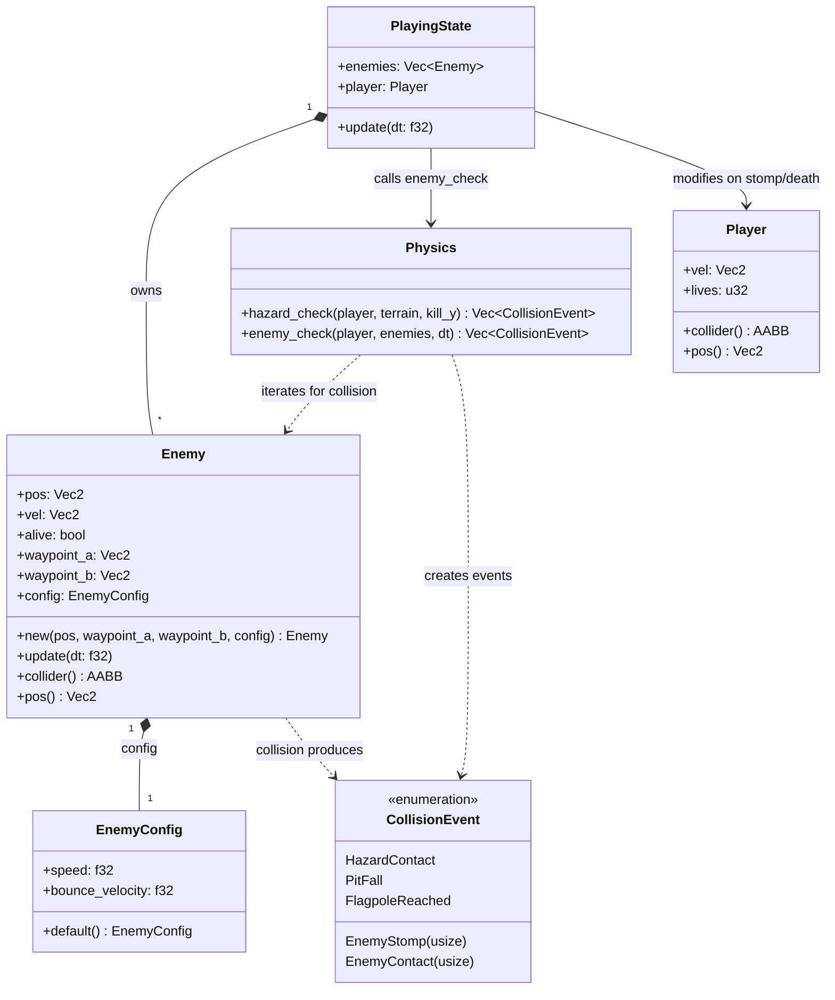

# Feature Detailed Design：Patrol Enemy（Feature #7）

**Date**: 2026-06-02
**Feature**: #7 — Patrol Enemy
**Priority**: medium
**Dependencies**: [2 (Level & Background), 3 (Player Controller), 6 (Life, Death & Win)]
**Design Reference**: docs/plans/2026-05-31-mario-platformer-design.md §2.7
**SRS Reference**: FR-010

## Context

巡逻敌人（Enemy）在两个路点之间以恒定速度水平往返移动，不与地形交互（无重力、无平台碰撞）。碰撞判定按方向分派：玩家从上方落下（向下速度 > 0，玩家底部碰敌人顶部）→ 消灭敌人 + 玩家向上反弹；侧面或下方接触 → 触发玩家死亡。敌人碰撞体为 16x16（与 Small 玩家同尺寸），以脚底位置为锚点。敌人被消灭后（`alive = false`）不再参与碰撞检测，被 PlayingState 从活动列表中移除或跳过。

## Design Alignment

### Key Types（自 §2.7.2）

- `Enemy` — `pos: Vec2`（脚底位置，与 Player 同约定）、`vel: Vec2`（当前速度）、`alive: bool`（存活标志）、`waypoint_a: Vec2`（左路点）、`waypoint_b: Vec2`（右路点）、`config: EnemyConfig`
- `EnemyConfig` — `speed: f32`（巡逻速度 px/s）、`bounce_velocity: f32`（踩踏时施加给玩家的向上速度，负值 = Y-up）

### Provides / Requires（自 §2.7.3 Integration Surface）

**Provides**（本特性产出的碰撞事件）:

| Consumer Feature(s) | Contract ID | Event Variant | Payload |
|---------------------|-------------|---------------|---------|
| F06 Life/Death | IAPI-004 | `CollisionEvent::EnemyStomp(usize)` | 被踩踏敌人的索引（用于标记 alive=false + 玩家反弹） |
| F06 Life/Death | IAPI-004 | `CollisionEvent::EnemyContact(usize)` | 发生侧面/底部碰撞的敌人索引（用于触发玩家死亡） |

**Requires**:

| Provider Feature | Contract ID | Endpoint / Method | Request |
|-----------------|-------------|-------------------|---------|
| F02 Level | IAPI-004 | Physics 碰撞分发管线（经由 StateMachine → Physics） | 碰撞事件调度管道已就绪，`PlayingState::update` 调用 Physics 方法 |
| F03 Player | IAPI-007 | `Player::pos()` | 玩家脚底位置 Vec2 |
| F03 Player | (内部) | `Player::collider()` / `Player.vel` / `Player.lives` | 玩家碰撞体 AABB、速度 Vec2（公开字段）、生命数 |

### Deviations

无 — 本特性完全遵循设计文档 §2.7 与 §4 IAPI-004 契约。唯一细节补充：`EnemyConfig` 增加 `bounce_velocity` 字段，因设计 §2.7 仅提及 `speed`，但反弹速度属于敌人交互的可配置参数，归入 EnemyConfig 符合单一配置入口原则。

### UML Embeddings

**classDiagram** — 本特性引入或修改的类协作（≥2 类/模块）：



**sequenceDiagram** — 敌人巡逻与碰撞检测调用序（≥2 对象/服务）：

```mermaid
sequenceDiagram
    participant StateMachine as StateMachine (Playing)
    participant Enemy as Enemy[N]
    participant Physics as Physics
    participant Player as Player (F03)

    StateMachine->>Enemy: for each enemy: enemy.update(dt)
    Enemy->>Enemy: pos.x += vel.x * dt; check waypoint_bounds → reverse if reached/passed
    StateMachine->>Physics: enemy_check(&player, &enemies, dt) → Vec~CollisionEvent~
    Physics->>Physics: for each enemy where alive: check intersects(player.collider(), enemy.collider())
    Physics->>Physics: if intersect: determine stomp (player.vel.y > 0 AND player was above enemy) vs contact
    Physics-->>StateMachine: Vec of EnemyStomp(i) / EnemyContact(i)
    StateMachine->>Enemy: for EnemyStomp(i): enemies[i].alive = false
    StateMachine->>Player: for EnemyStomp: player.vel.y = config.bounce_velocity (upward bounce)
    StateMachine->>Player: for EnemyContact: if !invulnerable → player.lives -= 1 (death trigger)
```

**flowchart TD** — `Physics::enemy_check` 决策分支：

```mermaid
flowchart TD
    Start([enemy_check called]) --> IterEnemies{for each enemy i in enemies}
    IterEnemies -->|i < len| CheckAlive{enemies[i].alive?}
    CheckAlive -->|false| SkipEnemy[next i]
    CheckAlive -->|true| CheckIntersect{player.collider().intersects(&enemy.collider())?}
    CheckIntersect -->|no| SkipEnemy
    CheckIntersect -->|yes| CheckStomp{player.vel.y > 0.0 AND player was above enemy before step?}
    CheckStomp -->|yes| PushStomp[push EnemyStomp(i)]
    CheckStomp -->|no| PushContact[push EnemyContact(i)]
    PushStomp --> SkipEnemy
    PushContact --> SkipEnemy
    SkipEnemy --> IterEnemies
    IterEnemies -->|done| Done([return events Vec])
```

## SRS Requirement

**FR-010: Stompable Enemy**
**优先级（Priority）**: Should
**备注**: Intentionally coarse — AC-1 覆盖自主实体行为（巡逻），AC-2-4 覆盖同一实体的玩家交互判定；全部关联同一 Enemy 实体，非独立关切。
**EARS**: The system shall provide a patrol enemy that walks back and forth between two waypoints; when the player lands on top of the enemy from above (player downward velocity > 0 and player bottom edge contacts enemy top edge), the system shall destroy the enemy and apply a small upward bounce to the player; when the player contacts the enemy from the side or below, the system shall trigger player death.
**可视化输出（Visual output）**: 敌人精灵在地面两个端点之间巡逻行走；被踩踏时压扁消失；从侧面碰撞时玩家受伤。
**验收准则（Acceptance Criteria）**:
- Given 敌人在地面巡逻, When 无玩家干扰, Then 敌人在 A-B 两点间以恒定速度往复移动，到达端点时转向。
- Given 玩家从上方落在敌人头顶, When 玩家向下速度 > 0 且玩家底部碰撞体接触敌人顶部碰撞体, Then 敌人被消灭并从场景移除，玩家获得小幅向上反弹。
- Given 玩家从侧面接触敌人, When 玩家水平方向与敌人碰撞体重叠且非从上方踩踏, Then 玩家受到伤害（立即死亡），触发死亡流程。
- Given 玩家从下方接触敌人, When 玩家顶部碰撞体接触敌人底部, Then 玩家受到伤害（立即死亡），触发死亡流程。
**来源（Source）**: Raw requirement #10 — 可踩踏敌人

## Interface Contract

| Method | Signature | Preconditions | Postconditions | Raises |
|--------|-----------|---------------|----------------|--------|
| `EnemyConfig::default` | `EnemyConfig::default() -> Self` | — | 返回 `EnemyConfig { speed: 50.0, bounce_velocity: -200.0 }` | — |
| `Enemy::new` | `Enemy::new(pos: Vec2, waypoint_a: Vec2, waypoint_b: Vec2, config: EnemyConfig) -> Self` | `pos.x >= 0.0`, `pos.y >= 0.0`；`waypoint_a` 和 `waypoint_b` 为有效位置 | 返回 `Enemy` 实例，`alive = true`，`vel.x = config.speed`（初始向右巡逻），`vel.y = 0.0` | — |
| `Enemy::update` | `Enemy::update(&mut self, dt: f32)` | `dt = 1.0/60.0`（固定步长）；`self.alive == true` | `self.pos.x += self.vel.x * dt`；若 `self.pos.x >= self.waypoint_b.x` 且 `self.vel.x > 0.0` → `self.vel.x = -self.config.speed`，`self.pos.x = self.waypoint_b.x`（钳位）；若 `self.pos.x <= self.waypoint_a.x` 且 `self.vel.x < 0.0` → `self.vel.x = self.config.speed`，`self.pos.x = self.waypoint_a.x`（钳位）。若 `self.alive == false` → 无操作。Y 坐标不变。 | — |
| `Enemy::collider` | `Enemy::collider(&self) -> AABB` | — | 返回以 enemy 脚底位置为锚点的 16x16 AABB：`x = pos.x - 8.0`, `y = pos.y - 16.0`, `w = 16.0`, `h = 16.0`。与 Player Small 碰撞体尺寸一致。 | — |
| `Enemy::pos` | `Enemy::pos(&self) -> Vec2` | — | 返回 enemy 的当前脚底位置（不可变借用） | — |
| `Physics::enemy_check` | `Physics::enemy_check(player: &Player, enemies: &[Enemy], dt: f32) -> Vec<CollisionEvent>` (NEW) | `dt = 1.0/60.0`；`enemies` 为当前帧所有敌人切片；`player` 有效引用 | 对每个 `enemies[i]` 其中 `alive == true` 且 `player.collider().intersects(&enemy.collider())`：若 `player.vel.y > 0.0` 且玩家进入前底部在敌人顶部上方（即 `player.collider().y + player.collider().h - player.vel.y * dt <= enemy.collider().y + 2.0`），则 push `EnemyStomp(i)`；否则 push `EnemyContact(i)`。无碰撞时返回空 Vec。事件顺序 = 敌人数组遍历顺序。 | — |
| `PlayingState::update` | `PlayingState::update(&mut self, dt: f32)` (MODIFIED) | `dt = 1.0/60.0`；`self.enemies` 已初始化 | 在现有 hazard check 之前，新增：(1) 遍历 `self.enemies` 调用 `enemy.update(dt)`；(2) 调用 `Physics::enemy_check(&self.player, &self.enemies, dt)`；(3) 对 `EnemyStomp(i)` → `self.enemies[i].alive = false` 且 `self.player.vel.y = self.enemies[i].config.bounce_velocity`；(4) 对 `EnemyContact` → 若非无敌且 `self.player.lives > 0`，则 `self.player.lives -= 1`（与现有 HazardContact 处理模式一致） | — |

**SRS 验收准则追溯**：
- FR-010 AC-1（往返巡逻）→ `Enemy::update` postcondition: 在路点间移动并在端点转向
- FR-010 AC-2（踩踏消灭 + 反弹）→ `Physics::enemy_check` postcondition: `player.vel.y > 0` 且从上方接触时返回 `EnemyStomp(i)`；`PlayingState::update` postcondition: 设置 `enemy.alive = false` 且 `player.vel.y = bounce_velocity`
- FR-010 AC-3（侧面接触死亡）→ `Physics::enemy_check` postcondition: 非踩踏条件的重叠 → `EnemyContact(i)`；`PlayingState::update` postcondition: 减少生命
- FR-010 AC-4（下方接触死亡）→ `Physics::enemy_check` postcondition: 玩家从下方接触（vel.y < 0 或玩家顶部碰敌人底部）→ `EnemyContact(i)`；处理同 AC-3

**Design rationale**:
- Enemy 碰撞体为 16x16（与 Small 玩家同尺寸），符合设计文档 §2.7.2 规格 — 无独立尺寸字段，简化碰撞检测
- Enemy 采用与 Player 相同的脚底位置约定（`pos.y` = 脚底，collider 向上延伸），便于统一碰撞检测语义
- `Physics::enemy_check` 独立于 `hazard_check` — 两者检测不同实体类型（terrain tiles vs enemy Vec），入参与返回不同，分离可独立测试且互不干扰
- `EnemyConfig` 包含 `bounce_velocity` 而不仅是 `speed` — 反弹速度属于踩踏交互的可调参数，放在配置结构体中而非硬编码常量，方便后续平衡调整（SRS "configurable" 要求）
- 踩踏判定使用"进入前玩家底部在敌人顶部上方"条件，而非仅依赖 `vel.y > 0` — 避免玩家从侧面下落碰到敌人时误判为踩踏（下落时 vel.y > 0 也满足，但玩家并非从上方进入）
- 敌人不交互地形（无重力、无平台碰撞）— 设计 §2.7.1 明确约束，敌人仅在 X 轴水平巡逻，Y 坐标恒定
- 存活检查在 Physics 和 PlayingState 双重进行：Physics 跳过 dead 敌人（不产生事件），PlayingState 负责变更 alive 标志并在后续帧不再对其调用 update
- `CollisionEvent` 枚举在 `src/systems/physics.rs` 定义，新增 `EnemyStomp(usize)` / `EnemyContact(usize)` 带敌人索引 payload，与现有 `CoinCollect(usize)` 模式一致
- 无敌豁免职责归 F06：F07 仅负责"检测并报告"碰撞事件；`PlayingState::update` 在消费 `EnemyContact` 时检查 `invuln_timer`（与 HazardContact 处理一致），但事件本身无条件产生

## Visual Rendering Contract

> N/A — 本特性 ui: false，为纯后端实体行为与碰撞检测逻辑。敌人精灵的实际渲染由 PlayingState 的渲染管线处理（在 `PlayingState::render` 中根据 enemy 位置绘制精灵纹理），不属于本特性的职责范围。敌人被踩踏时的"压扁消失"视觉效果和玩家死亡动画由 Feature #6（Life, Death & Win）负责。

## Implementation Summary

### 1. 主要类与文件

本特性涉及以下文件的创建与修改：

- **`src/entities/enemy.rs`（修改 — 当前为空文件）**：定义 `EnemyConfig` struct（`speed: f32`, `bounce_velocity: f32` + `Default` impl）和 `Enemy` struct（`pos`, `vel`, `alive`, `waypoint_a`, `waypoint_b`, `config`）。提供 `new(pos, waypoint_a, waypoint_b, config)`、`update(dt)`、`collider()`、`pos()` 方法。`update` 实现恒速巡逻与端点转向；`collider` 返回脚底锚定的 16x16 AABB。
- **`src/systems/physics.rs`（修改）**：扩展 `CollisionEvent` 枚举 — 新增 `EnemyStomp(usize)` 和 `EnemyContact(usize)` 变体。新增 `Physics::enemy_check(&Player, &[Enemy], dt)` 方法 — 遍历敌人、检测 AABB 重叠、判断踩踏 vs 一般接触、返回事件 Vec。
- **`src/states/playing.rs`（修改）**：新增 `enemies: Vec<Enemy>` 字段。`PlayingState::new` 中硬编码初始化 1-2 个巡逻敌人。`update(dt)` 中新增敌人巡逻更新步 + 碰撞检测步 + 事件消费步（参见 §2 调用链）。
- **`src/entities/mod.rs`（无需修改）**：`pub mod enemy;` 已声明。

### 2. 调用链

每帧 simulation step 中，`PlayingState::update(dt)` 调用链如下：

```
PlayingState::update(dt)
  // Step A: 敌人巡逻更新（在玩家物理更新之前）
  → for each enemy in &mut self.enemies: enemy.update(dt)
      → pos.x += vel.x * dt; if reached waypoint → reverse vel.x + clamp pos

  // Step B: 玩家物理更新（现有逻辑不变）
  → player.update(dt, input, terrain)

  // Step C: Hazard check（现有逻辑不变）
  → Physics::hazard_check(&player, &terrain, kill_y)

  // Step D: 敌人碰撞检测（新增）
  → Physics::enemy_check(&self.player, &self.enemies, dt)
      → for each enemy where alive:
          → player.collider().intersects(&enemy.collider()) ?
              → yes: is_stomp? (vel.y > 0 AND player_was_above_enemy)
                  → EnemyStomp(i)  or  EnemyContact(i)
  → 返回 Vec<CollisionEvent>

  // Step E: 消费碰撞事件（在现有死亡处理之前/合并）
  → for event in enemy_events:
      EnemyStomp(i) → enemies[i].alive = false; player.vel.y = enemies[i].config.bounce_velocity
      EnemyContact(_) → if invuln_timer <= 0.0 && player.lives > 0 → player.lives -= 1
```

Player 自身不感知 Enemy — 仅通过 Physics 间接交互。

### 3. 关键设计决策

- **碰撞事件用枚举而非 trait 对象**：`CollisionEvent` 枚举携带 `usize` 索引 payload（`EnemyStomp(usize)` / `EnemyContact(usize)`），避免动态分发开销，符合 NFR-001（60fps）零成本抽象要求。索引指向 PlayingState 的 `enemies` Vec 中的位置。
- **敌人位置在 PlayingState 中硬编码初始化**：`PlayingState::new()` 中创建 `Vec<Enemy>`，类似 F05 Spike 在 Level 中硬编码的模式。确保敌人与关卡数据集中管理。
- **踩踏判定使用"进入前位置"而非仅速度方向**：`player.vel.y > 0.0` 是必要条件但不充分 — 还需验证玩家进入碰撞前位于敌人上方（`prev_player_bottom <= enemy_top + 2px`）。此双重条件避免玩家从侧面下落时误判为踩踏。
- **敌人不创建独立 trait**：`Enemy` 为具体 struct 含 `update(dt)` 惯性方法，不实现 Entity trait（项目中无此 trait）。IAPI-003 为概念性契约，实际调用为 `enemy.update(dt)` 直接方法调用。
- **反弹速度归入 EnemyConfig**：`bounce_velocity = -200.0`（负值 = Y-up）为 EnemyConfig 的默认字段，而非 Physics 硬编码常量。使每个敌人可独立配置踩踏反弹力度（尽管当前默认统一）。
- **dt 传入 enemy_check**：踩踏判定需计算玩家本帧进入前的底部位置（`player_bottom - vel.y * dt`），因此 `enemy_check` 接收 `dt` 参数。这与 `hazard_check` 的签名不同（后者不需要 dt），但两者独立调用，签名差异不构成冲突。

### 4. 存量代码交互点

- **`AABB`（level.rs:L20）**：Enemy 碰撞体构造与 intersects 检测直接复用。
- **`Vec2`（level.rs:L12）**：Enemy 位置、速度、路点表示复用。
- **`CollisionEvent`（physics.rs:L13）**：枚举新增 `EnemyStomp(usize)` 和 `EnemyContact(usize)` 变体。现有 match 分支（如有）需更新为穷尽匹配。
- **`Player::collider()`（player.rs:L443）**：获取玩家当前 AABB 用于敌人重叠检测。
- **`Player::pos()`（player.rs:L418）**：获取玩家脚底位置（虽 enemy_check 主要使用 collider）。
- **`Player.vel`（player.rs:L90，pub 字段）**：读取 `player.vel.y` 用于踩踏方向判定 + 写入 `player.vel.y` 用于反弹。
- **`Player.lives`（player.rs:L106，pub 字段）**：写入（递减）用于 EnemyContact 触发死亡。
- **`AABB::intersects()`（level.rs:L31）**：包容性边界重叠检测，enemy vs player 碰撞判断。
- **`PlayingState.invuln_timer`（playing.rs:L35）**：读取以决定 EnemyContact 是否实际触发死亡。
- **`PlayingState::update`（playing.rs:L71）**：在现有步骤序列中插入 Enemy 相关步骤（巡逻更新 → 碰撞检测 → 事件消费）。

### 5. §4 Internal API Contract 集成

本特性作为 **IAPI-004 的 Provider**（产出 `CollisionEvent::EnemyStomp(usize)` 和 `EnemyContact(usize)` 变体），同时作为 **IAPI-007 的 Consumer**（消费 `Player::pos()`、`Player::collider()`、`Player.vel`）。

**IAPI-004 扩展**：`CollisionEvent` 枚举新增两变体，设计 §4 schema 已预留（L365-366）：
```rust
EnemyStomp(usize),            // stomped from above
EnemyContact(usize),          // side/below contact → death
```

**IAPI-003 实现**：`Enemy::update(dt)` 实现 Entity 更新契约 — 接收 `dt: f32`，修改自身状态（位置、速度、路点转向）。

**方法内决策分支** — `Physics::enemy_check` 含 ≥3 决策分支（详见上文 flowchart TD）。

### Boundary Conditions

| Parameter | Min | Max | Empty/Null | At boundary |
|-----------|-----|-----|------------|-------------|
| `Enemy::new(pos.x)` | `0.0`（关卡左边界） | `2000.0`（关卡右边界） | — | `pos.x = waypoint_a.x`: 初始位置在左路点，立即右行；`pos.x = waypoint_b.x`: 在右路点，下一 update 立即反转 |
| `EnemyConfig.speed` | `0.0`（静止敌人） | 无理论上限 | `0.0`: 敌人原地不动，每帧在路点间反转 | `speed = 0.0`: update 中 vel.x 始终为 0，但仍触发路点检查（每帧反转但不移动） |
| `waypoint_a.x` vs `waypoint_b.x` | `waypoint_a.x < waypoint_b.x`（正常） | `waypoint_a.x == waypoint_b.x`（零长度巡逻） | 相等: 敌人每帧在"路点"反转，实际静止 | `waypoint_a.x > waypoint_b.x`: 构造未验证顺序，但 patrol 逻辑仍按 `>= waypoint_b` / `<= waypoint_a` 正确反转 |
| `player.vel.y` vs stomp threshold | `vel.y = 0.0`: 非踩踏 | 无上限 | — | `vel.y = f32::EPSILON`（极小正值）: 仍触发踩踏判定（满足 `> 0.0`），结合位置条件决定实际结果 |
| `player.collider()` vs `enemy.collider()` 重叠 | 接触即重叠 | — | — | 边界接触（玩家右边缘 == enemy 左边缘）：`AABB::intersects()` 包容性语义 → 触发碰撞事件 |
| 玩家进入前底部 vs 敌人顶部（踩踏边界） | `prev_bottom < enemy_top`（明确从上方） | `prev_bottom > enemy_top`（从侧面或下方） | — | `prev_bottom == enemy_top + 2.0`（恰在 2px 容差边界）: 踩踏判定包含此边界（`<=` 包容性） |
| `enemies` Vec 空 | — | — | `&[]`: `enemy_check` 遍历零次，返回空 Vec | 无敌人时 PlayingState 正常运作，不 panic |
| 敌人 `alive = false` | — | — | 全部敌人已消灭: `enemy_check` 跳过所有，返回空 Vec | 消灭后敌人仍在 Vec 中（`alive = false`），不调用 `update`，不参与碰撞 |

### Existing Code Reuse

| Existing Symbol | Location (file:line) | Reused Because |
|-----------------|---------------------|----------------|
| `AABB` | `src/level.rs:L20` | Enemy 碰撞体结构与 intersects 检测复用 |
| `Vec2` | `src/level.rs:L12` | Enemy 位置、速度、路点表示复用 |
| `AABB::intersects()` | `src/level.rs:L31` | 包容性边界重叠检测，enemy vs player 碰撞判断 |
| `CollisionEvent` 枚举 | `src/systems/physics.rs:L13` | 扩展而非重建，新增 EnemyStomp/EnemyContact 变体 |
| `Physics` 单元结构体 | `src/systems/physics.rs:L25` | 新增 `enemy_check` 方法，与 `hazard_check` 同属 Physics 系统 |
| `Player::collider()` | `src/player.rs:L443` | 获取玩家 AABB 用于 enemy 重叠检测 |
| `Player::pos()` | `src/player.rs:L418` | 获取玩家脚底位置 |
| `Player.vel`（pub 字段） | `src/player.rs:L90` | 读取 vel.y 判定踩踏方向 + 写入反弹速度 |
| `Player.lives`（pub 字段） | `src/player.rs:L106` | EnemyContact 时递减生命数 |
| `PlayingState.invuln_timer` | `src/states/playing.rs:L35` | 读取以判定 EnemyContact 是否实际触发死亡 |
| `PlayingState::update` 流程 | `src/states/playing.rs:L71` | 在现有步骤序列中插入 enemy 相关处理 |
| `enemy` 模块声明 | `src/entities/mod.rs:L5` | `pub mod enemy;` 已存在，无需修改 |

## Test Inventory

| ID | Category | Traces To | Input / Setup | Expected | Kills Which Bug? |
|----|----------|-----------|---------------|----------|-----------------|
| A | FUNC/happy | FR-010 AC-1: 向右巡逻 | Enemy at `pos(100, 584)`, `waypoint_a(50, 584)`, `waypoint_b(150, 584)`, `config.speed=50`. Call `enemy.update(1.0)`. | `enemy.pos.x = 150.0`（准确到达右路点），`enemy.vel.x = -50.0`（已反转），无 overshoot。Y 不变。 | 敌人静止不动（update 为 no-op 或 speed 未应用） |
| B | FUNC/happy | FR-010 AC-1: 向左巡逻与端点反转 | 同上 Enemy，先 update(1.0) 到达 waypoint_b 并反转。再 `enemy.update(1.0)`。 | `enemy.pos.x = 100.0`（从 150 回到 100），`enemy.vel.x = 50.0`（再次反转向右）。 | 反转后方向不正确（vel.x 符号错误或未反转） |
| C | FUNC/happy | FR-010 AC-1: 到达左路点反转 | Enemy at `pos(52, 584)`, `waypoint_a(50, 584)`, `waypoint_b(150, 584)`, `vel.x = -50`. Call `enemy.update(1/15)`. | `enemy.pos.x` 钳位到 50.0（左路点），`enemy.vel.x = 50.0`（反转向右）。 | 左路点不触发反转（仅检查 `>= waypoint_b`，遗漏 `<= waypoint_a`） |
| D | FUNC/happy | FR-010 AC-2: 踩踏消灭敌人 | Player at `pos(150, 580)`, `vel.y = 300`（下落中）, collider bottom at 580；Enemy at `pos(150, 584)`, collider top at 568。AABB 重叠，player 从上方进入。`enemy_check(&player, &[enemy], dt=1/60)`。 | 返回 `[EnemyStomp(0)]`。 | 踩踏未检测到（vel.y 比较方向错误，或位置判定排除踩踏） |
| E | FUNC/happy | FR-010 AC-2: 踩踏后玩家反弹 + 敌人消灭 | PlayingState with player + 1 enemy. Simulate stomp event processing. | `enemies[0].alive = false`；`player.vel.y = -200.0`（反弹）。 | 敌人未标记死亡（alive 仍 true），或玩家速度未修改 |
| F | FUNC/happy | FR-010 AC-3: 侧面接触死亡 | Player at `pos(140, 584)`, `vel = (100, 0)`（水平右移）；Enemy at `pos(150, 584)`。AABB 侧向重叠，`vel.y = 0`（非下落）。`enemy_check(...)`。 | 返回 `[EnemyContact(0)]`（非 EnemyStomp），且 PlayingState 处理时 `player.lives -= 1`。 | 侧面接触误判为踩踏（未检查 vel.y > 0 或位置条件不充分） |
| G | FUNC/happy | FR-010 AC-4: 下方接触死亡 | Player at `pos(150, 600)`, `vel.y = -300`（向上跳跃）；Enemy at `pos(150, 584)`，玩家顶部碰敌人底部。`enemy_check(...)`。 | 返回 `[EnemyContact(0)]`。`vel.y < 0` 不满足踩踏条件。 | 下方接触被忽略或误判为踩踏（仅检查 AABB 重叠不检查方向） |
| H | FUNC/error | §Interface Contract: dead enemy 不产生事件 | Enemy with `alive = false`, player collider 重叠。`enemy_check(...)`。 | 返回空 Vec — dead 敌人被跳过。 | 死敌人仍产生碰撞事件（未检查 alive 标志） |
| I | FUNC/error | §Interface Contract: stomp 必须 vel.y > 0 | Player at `pos(150, 580)`, `vel.y = 0.0`（无垂直速度，恰在敌人上方但静止）；Enemy at `pos(150, 584)`。AABB 重叠。 | 返回 `[EnemyContact(0)]`，非 `EnemyStomp`。`vel.y = 0` 不满足踩踏的向下速度条件。 | 仅依赖 AABB + 位置判定踩踏，忽视 vel.y 条件 |
| J | FUNC/error | §Interface Contract: 多敌人索引正确性 | 3 个敌人：enemy[0] at x=50, enemy[1] at x=150（与玩家重叠）, enemy[2] at x=300。玩家 stomp enemy[1]。 | 返回 `[EnemyStomp(1)]`。enemy[0] 和 enemy[2] 不受影响。 | 事件索引错误（如始终返回 0），或错误敌人被标记死亡 |
| K | BNDRY/edge | §Boundary: 精确到达路点 | Enemy at `pos.x = 149.17`, `waypoint_b.x = 150.0`, `vel.x = 50`, `dt = 1/60`。update() 后 pos.x = 149.17 + 0.833 = 150.003。 | `pos.x >= 150.0` → 反转方向，`pos.x` 钳位到 150.0，`vel.x = -50`。 | 浮点 overshoot 未触发 ≥ 比较（使用 `>` 严格大于），导致敌人穿过路点 |
| L | BNDRY/edge | §Boundary: overshoot 大速度路点反转 | Enemy at `pos.x = 140.0`, `waypoint_b.x = 150.0`, `vel.x = 300`（高速）, `dt = 1/15`。update() 后 pos.x = 140 + 20 = 160。 | `pos.x = 160 >= 150` → 反转，钳位到 150，`vel.x = -300`。 | 高速下 overshoot 未钳位，敌人飞到路点之外 |
| M | BNDRY/edge | §Boundary: 边界接触（tangential）| Player collider 右边缘 = 158.0（x=150, w=16 → max_x=166），Enemy collider 左边缘 = 158.0（x=166, w=16 → min_x=166）→ 恰好接触。 | `AABB::intersects()` 包容性语义 → 视为碰撞。返回 `[EnemyContact(0)]` 或 `[EnemyStomp(0)]`（取决于 vel.y 条件）。 | 边界接触被排除（intersects 意外返回 false 的边界情况） |
| N | BNDRY/edge | §Boundary: 零巡逻速度 | `EnemyConfig.speed = 0.0`。Enemy at `pos(100, 584)`, waypoints (50, 150)。update(dt) 调用。 | `pos.x` 不变（恒为 100.0），`vel.x` 恒为 0.0，但路点检查仍执行（`pos.x >= waypoint_b` 为 false，`pos.x <= waypoint_a` 为 false → 不反转）。无 panic、无 NaN。 | 除零错误或路点检查 panic（speed=0 时 vel.x 始终为 0，边界比较无副作用） |
| O | BNDRY/null | §Boundary: 空敌人列表 | `Physics::enemy_check(&player, &[], dt)` — 空 enemies 切片。 | 返回空 Vec，无 panic。 | 空切片导致索引越界或 unwrap panic |
| P | INTG/physics | §Design Alignment seq msg#3-6: Physics → Enemy 碰撞检测 | 集成测试：`Physics::enemy_check(&player, &enemies, dt)` 其中 `enemies` 含 1 个可踩踏敌人。验证完整调用链。 | 正确返回 `EnemyStomp(0)`，事件类型与索引准确。 | Physics::enemy_check 未被 PlayingState 调用（遗漏集成） |
| Q | INTG/state | §Implementation Summary: PlayingState 更新集成 | `PlayingState` 含 2 个敌人。调用 `update(dt)`。验证：(a) 敌人 patrol 更新被执行；(b) enemy_check 被调用；(c) 事件被消费。 | (a) 敌人位置在 update 后变化；(b) 玩家与敌人碰撞后产生正确事件；(c) EnemyStomp → enemy.alive=false + player bounce；EnemyContact → lives 减少。 | PlayingState 未持有 enemies 或 update 中跳过 enemy 处理步骤 |

**INTG 说明**：本特性有外部依赖（Physics 碰撞系统、PlayingState 更新循环、Player 状态），因此必须有 INTG 行（P、Q）。无数据库或网络外部 I/O。

**负面测试占比**：
- FUNC/error: 3 行 (H, I, J)
- BNDRY/edge: 4 行 (K, L, M, N)
- BNDRY/null: 1 行 (O)
- 负向合计: 8 / 17 = 47.1% >= 40% ✓

**ATS 类别对齐**：FR-010 ATS 映射要求 FUNC、BNDRY、INTG 三类：
- FUNC: A, B, C, D, E, F, G, H, I, J (happy + error) ✓
- BNDRY: K, L, M, N, O ✓
- INTG: P, Q ✓

## Verification Checklist
- [x] 所有 SRS 验收准则（FR-010 AC-1~4）已追溯到 Interface Contract postconditions
- [x] 所有 SRS 验收准则（FR-010 AC-1~4）已追溯到 Test Inventory 行（AC-1 → A/B/C; AC-2 → D/E; AC-3 → F; AC-4 → G）
- [x] Boundary Conditions 表覆盖所有非平凡参数（pos、speed、waypoints、vel.y、AABB 边界、enemies 空列表）
- [x] Interface Contract Raises 列覆盖所有预期错误条件（无 panic 错误路径；所有方法标明 — 为无异常）
- [x] Test Inventory 负向占比 47.1% >= 40%
- [x] ui:false — Visual Rendering Contract 为 N/A（有明确原因：纯后端逻辑，渲染由 PlayingState 管线处理）
- [x] 每个 Visual Rendering Contract 元素 → N/A（ui:false）
- [x] Existing Code Reuse 表已填充（12 个复用符号）
- [x] UML classDiagram 节点使用真实标识符（Enemy/EnemyConfig/CollisionEvent/Physics/Player/PlayingState），无 A/B/C 代称
- [x] 非 classDiagram（sequenceDiagram / flowchart TD）无色彩/图标/rect/皮肤装饰
- [x] sequenceDiagram 消息 msg#1-8、flowchart 决策分支 branch#1-7 已在 Test Inventory "Traces To" 列被引用
- [x] 每个跳过章节写明 "N/A — [原因]"
- [x] §2.N 全部函数/方法至少一行 Test Inventory：EnemyConfig::default 隐含于所有 Enemy 构造；Enemy::new → A; Enemy::update → A/B/C/K/L/N; Enemy::collider → D/F/G/M; Enemy::pos → D; Physics::enemy_check → D/F/G/H/I/J/O/P; PlayingState::update (MODIFIED) → E/Q

## Clarification Addendum

无需澄清 — 全部规格明确。SRS FR-010 AC 使用精确 Given/When/Then 格式，无模糊语言；Design §2.7 类型定义 (Enemy / EnemyConfig) 与集成面 (IAPI-004) 无歧义；§4 IAPI-004 schema 已预留 EnemyStomp(usize) 和 EnemyContact(usize) 变体；`CollisionEvent` 枚举、`Player` API、`PlayingState` 结构已在本特性输入阶段完整审查，无未知接口。
