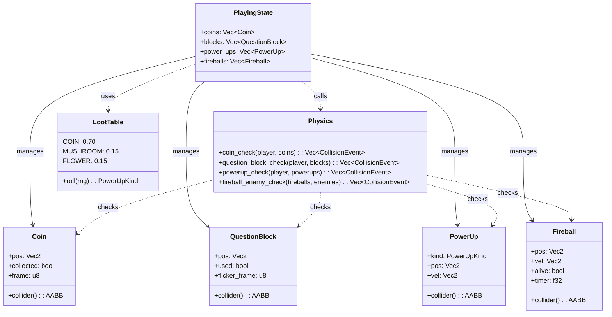
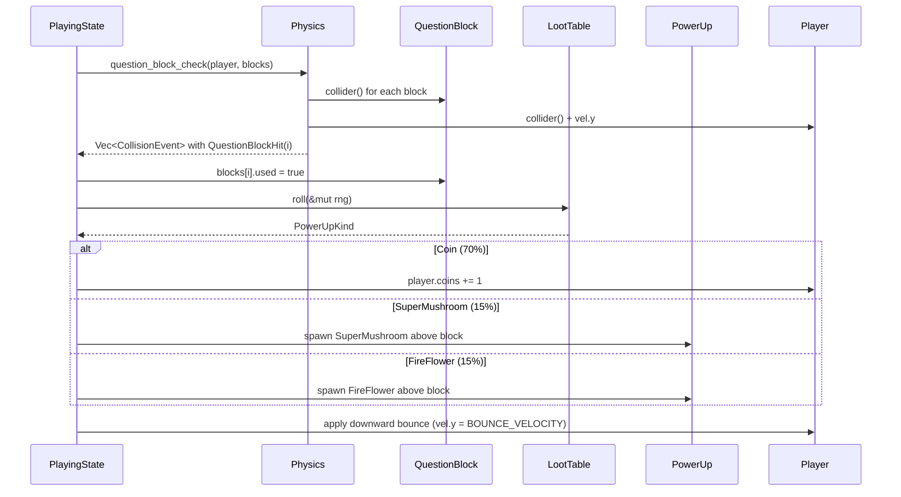
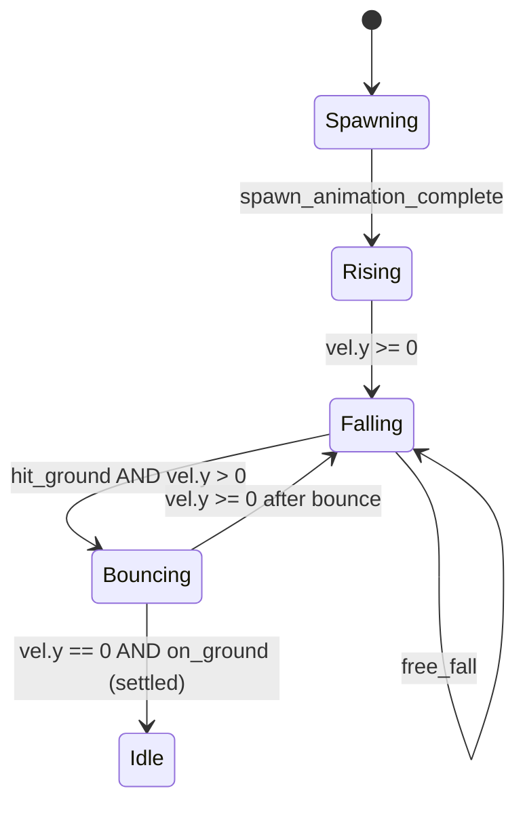

# Feature Detailed Design: Collectibles & Blocks (Feature #8)

**Date**: 2026-06-03
**Feature**: #8 -- Collectibles & Blocks
**Priority**: medium
**Dependencies**: [2 (Level & Background), 3 (Player Controller)]
**Design Reference**: docs/plans/2026-05-31-mario-platformer-design.md § 2.8
**SRS Reference**: FR-008, FR-011

## Context

本特性实现关卡中的金币收集系统与问号方块奖励机制。金币散布于关卡中，玩家碰撞收集后消失并计数+1，死亡重生时复位。问号方块被玩家从下方头顶撞击时切换为"已使用"状态，按概率表（金币 70% / 超级蘑菇 15% / 火焰花 15%）产出奖励物品。超级蘑菇沿地面弹跳移动接触玩家后使其变大；火焰花静止在产出位置，接触后玩家获得发射火球能力。

## Design Alignment

[设计文档 §2.8 完整内容]

- **Key types**: Coin (位置、collected、动画帧), QuestionBlock (位置、used、闪烁帧), PowerUp 枚举 (SuperMushroom | FireFlower), LootTable 概率常量, Fireball (火球投射物)
- **Provides / Requires**:
  - **Consumer**: IAPI-004 (Physics collision dispatch) -- Feature #8 consumes `CollisionEvent::CoinCollect(usize)` and `CollisionEvent::QuestionBlockHit(usize)` from physics collision resolution
  - **Provider via IAPI-009**: Feature #8 updates `Player.coins` which is exposed through `Player::stats()` → `PlayerStats { coins, lives }` for HUD consumption (F09)
  - **Provider via IAPI-006**: Coin, QuestionBlock, PowerUp, and Fireball entities all implement `collider()` → `AABB`
  - **Consumer via IAPI-005**: QuestionBlock activation reuses terrain query for collision context
- **Deviations**: 无 -- §4 CollisionEvent 枚举已为 CoinCollect 和 QuestionBlockHit 预留变体，本特性实现它们

### UML: classDiagram (新增类型及其协作关系)



### UML: sequenceDiagram (问号方块激活完整流程)



## SRS Requirement

### FR-008: Collectible Coins
**优先级（Priority）**: Should
**EARS**: When the player's collision body overlaps a coin entity, the system shall deactivate the coin, increment the coin counter by 1, and update the HUD coin display.
**验收准则（Acceptance Criteria）**:
- AC-1: Given 玩家移动到金币所在位置, When 玩家碰撞体与金币碰撞体重叠, Then 金币从场景中移除且 HUD 金币计数 +1。
- AC-2: Given 金币已被收集, When 玩家在同一位置再次经过, Then 金币不再出现（已收集状态持久化至关卡结束）。
- AC-3: Given 玩家死亡并重生, When 玩家回到之前收集过金币的区域, Then 金币重新出现（重生复位金币）。

### FR-011: Question Blocks
**优先级（Priority）**: Should
**EARS**: When the player hits a question block from below (player head collision body contacts block bottom surface while player vertical velocity < 0 in Y-down coords), the system shall deactivate the block (change to "used" visual state), randomly select a reward from the configured loot table (Coin: 70%, Super Mushroom: 15%, Fire Flower: 15%), spawn the reward above the block, and apply a downward bounce to the player.
**验收准则（Acceptance Criteria）**:
- AC-1: Given 玩家从下方头顶撞击问号方块, When 玩家头部碰撞体接触方块底部且方块未使用, Then 方块切换为已使用状态，按概率表随机产出奖励（金币70%、蘑菇15%、火焰花15%），玩家轻微弹回。
- AC-2: Given 问号方块已被激活过, When 玩家再次头顶撞击, Then 方块不再产生任何物品（保持已使用状态）。
- AC-3: Given 玩家从上方或侧面接触问号方块, When 接触方向不是从下向上, Then 方块不被激活，行为与普通固定平台一致。
- AC-4: Given 方块产出超级蘑菇, When 蘑菇在地面弹跳移动, Then 玩家接触蘑菇后角色变大，可承受一次伤害（受伤后恢复原大小）。
- AC-5: Given 方块产出火焰花, When 火焰花出现在方块上方, Then 玩家接触火焰花后获得发射火球能力，火球水平飞行可消灭路径上的敌人。

## Interface Contract

本特性引入的新公开方法及对既有实体的修改：

### 新增: Coin 实体方法

| Method | Signature | Preconditions | Postconditions | Raises |
|--------|-----------|---------------|----------------|--------|
| `Coin::new` | `new(pos: Vec2) -> Self` | `pos` 坐标在关卡边界内 | `collected = false`, `frame = 0` | -- |
| `Coin::collider` | `collider(&self) -> AABB` | -- | 返回 16x16 AABB，以 pos 为中心 | -- |
| `Coin::reset` | `reset(&mut self)` | -- | `collected = false`, `frame = 0` | -- |

### 新增: QuestionBlock 实体方法

| Method | Signature | Preconditions | Postconditions | Raises |
|--------|-----------|---------------|----------------|--------|
| `QuestionBlock::new` | `new(pos: Vec2) -> Self` | `pos` 坐标在关卡边界内 | `used = false`, `flicker_frame = 0` | -- |
| `QuestionBlock::collider` | `collider(&self) -> AABB` | -- | 返回 32x32 AABB，以 pos 为左上角 | -- |
| `QuestionBlock::activate` | `activate(&mut self) -> PowerUpKind` | `used == false` | `used = true`；返回 LootTable::roll() 结果 | -- |
| `QuestionBlock::reset` | `reset(&mut self)` | -- | `used = false`, `flicker_frame = 0` | -- |

### 新增: PowerUp 实体方法

| Method | Signature | Preconditions | Postconditions | Raises |
|--------|-----------|---------------|----------------|--------|
| `PowerUp::new` | `new(kind: PowerUpKind, spawn_pos: Vec2) -> Self` | `spawn_pos` 在关卡边界内 | Mushroom: `vel = (BOUNCE_SPEED, JUMP_VELOCITY)`; Flower: `vel = (0, 0)` | -- |
| `PowerUp::update` | `update(&mut self, dt: f32, terrain: &[Tile])` | `dt = 1.0/60.0` | Mushroom: 水平弹跳 + 重力 + 地形碰撞；Flower: no-op；两者碰撞体位置更新 | -- |
| `PowerUp::collider` | `collider(&self) -> AABB` | -- | 返回 16x16 AABB（蘑菇）或 16x16 AABB（火焰花） | -- |

**PowerUp 状态机（SuperMushroom 弹跳状态）**：



### 新增: Fireball 实体方法

| Method | Signature | Preconditions | Postconditions | Raises |
|--------|-----------|---------------|----------------|--------|
| `Fireball::new` | `new(pos: Vec2, facing: i8) -> Self` | `facing` 为 1 或 -1 | `vel.x = facing * FIREBALL_SPEED`, `vel.y = 0`, `alive = true`, `timer = 0.0` | -- |
| `Fireball::update` | `update(&mut self, dt: f32)` | `alive == true` | `timer += dt`；若 `timer >= MAX_LIFETIME` → `alive = false` | -- |
| `Fireball::collider` | `collider(&self) -> AABB` | -- | 返回 8x8 AABB | -- |
| `Fireball::kill` | `kill(&mut self)` | -- | `alive = false` | -- |

### 新增: LootTable 方法

| Method | Signature | Preconditions | Postconditions | Raises |
|--------|-----------|---------------|----------------|--------|
| `LootTable::roll` | `roll(rng: &mut impl Rng) -> PowerUpKind` | `rng` 已初始化 | 返回 Coin (p=0.70)、SuperMushroom (p=0.15) 或 FireFlower (p=0.15) | -- |

### 修改: Physics (扩展 CollisionEvent + 新增检测方法)

| Method | Signature | Preconditions | Postconditions | Raises |
|--------|-----------|---------------|----------------|--------|
| `Physics::coin_check` | `coin_check(player: &Player, coins: &[Coin]) -> Vec<CollisionEvent>` | `player.collider()` 有效 | 返回 `CoinCollect(i)` 对每个未收集且与玩家碰撞体重叠的金币 | -- |
| `Physics::question_block_check` | `question_block_check(player: &Player, blocks: &[QuestionBlock]) -> Vec<CollisionEvent>` | `player.collider()` 有效 | 返回 `QuestionBlockHit(i)` 仅当玩家头部接触未使用方块底部 且 `player.vel.y < 0.0`（向上移动） | -- |
| `Physics::powerup_check` | `powerup_check(player: &Player, power_ups: &[PowerUp]) -> Vec<CollisionEvent>` | `player.collider()` 有效 | 返回 `PowerUpCollect(i)` 对每个与玩家碰撞体重叠的道具 | -- |
| `Physics::fireball_enemy_check` | `fireball_enemy_check(fireballs: &[Fireball], enemies: &[Enemy]) -> Vec<CollisionEvent>` | -- | 返回 `FireballHitEnemy(fi, ei)` 对每个火球与存活敌人碰撞体重叠 | -- |

**CollisionEvent 枚举扩展**（添加到 `src/systems/physics.rs` 现有枚举）：
```rust
enum CollisionEvent {
    // ... existing variants ...
    CoinCollect(usize),           // index into coins array
    QuestionBlockHit(usize),      // index into blocks array
    PowerUpCollect(usize),        // index into power_ups array
    FireballHitEnemy(usize, usize), // (fireball_index, enemy_index)
}
```

**QuestionBlock 方向判断（flowchart TD 嵌入 §Implementation Summary）**：
详见 §Implementation Summary 中 `question_block_check` 的 flowchart TD。

### 修改: PlayingState (扩展 update + 新字段)

| Method | Signature | Preconditions | Postconditions | Raises |
|--------|-----------|---------------|----------------|--------|
| `PlayingState::update` | `update(&mut self, dt: f32)` (扩展) | `dt = 1.0/60.0` | 新步骤：coin_check → question_block_check → powerup_check → powerup_update → fireball_update → fireball_enemy_check → 事件消费 | -- |
| `PlayingState::shoot_fireball` | `shoot_fireball(&mut self)` | `player.state == Fire`, 无存活火球或超过 cooldown | 在玩家前方生成 Fireball；`fireballs.len() += 1` | -- |
| `PlayingState::reset_collectibles` | `reset_collectibles(&mut self)` | 玩家死亡并重生 | 所有 Coin.collected = false；所有 QuestionBlock.used = false；清空 power_ups 和 fireballs | -- |

**PlayingState::update 新增步骤（调用顺序）**：
在现有步骤 7（enemy event consumption）之后插入：
- 步骤 7a: `coin_check` → 消费 CoinCollect 事件 (coins[i].collected = true, player.coins += 1)
- 步骤 7b: `question_block_check` → 消费 QuestionBlockHit 事件 (block.activate(), roll loot, spawn reward, player bounce)
- 步骤 7c: `powerup_check` → 消费 PowerUpCollect 事件 (应用道具效果，移除道具)
- 步骤 7d: `power_ups[i].update(dt, terrain)` 对每个存活道具
- 步骤 7e: `fireballs[i].update(dt)` 对每个存活火球
- 步骤 7f: `fireball_enemy_check` → 消费 FireballHitEnemy 事件 (fireball.kill(), enemy.alive = false)

**Design rationale**:
- 金币碰撞使用简单 AABB 重叠检测（与踩踏不同，无需方向判断）-- 任何方向的接触都触发收集
- 问号方块仅从下方激活：条件为玩家碰撞体顶部接触方块底部，且玩家垂直速度向上（`vel.y < 0.0` 在 Y-down 坐标中）。此条件排除从上方落下擦过方块侧面的误触发
- LootTable 使用 `rand` crate 的均匀分布抽样映射到三个区间：[0.0, 0.70) → Coin, [0.70, 0.85) → Mushroom, [0.85, 1.0) → Flower
- 超级蘑菇弹跳物理：水平恒定速度 BounceSpeed=80px/s，撞墙/平台侧边时反向；垂直初始速度 JUMP_VELOCITY=-200（向上），受重力影响下落，着地后再次弹跳
- 火球发射键复用 Sprint 键（Shift）：当 `player.state == Fire` 且 `input.sprint_just`（边沿触发），在玩家前方生成火球。同一时间最多 1 个火球（射出新火球时旧火球自动消失）
- 跨特性契约对齐：IAPI-004 的 `CoinCollect` / `QuestionBlockHit` 变体在 §4 已声明；Feature #8 实现物理检测方法并追加 `PowerUpCollect` 和 `FireballHitEnemy` 变体以满足 FR-011 AC-4/AC-5；IAPI-009 PlayerStats 的 coins 字段由本特性写入、F09 HUD 读取

## Visual Rendering Contract

> N/A -- backend-only feature (`"ui": false`)。金币/方块/道具/火球的视觉渲染属于 F02 Level 渲染管线的职责范围；本特性仅管理实体逻辑状态与碰撞检测。

## Implementation Summary

### 1. 主要类/文件结构（要创建或修改）

本特性新增 4 个实体文件（`src/entities/coin.rs`, `src/entities/question_block.rs`, `src/entities/power_up.rs`, `src/entities/fireball.rs`），扩展 2 个既有文件（`src/systems/physics.rs` 追加 4 个检测方法 + 4 个枚举变体，`src/states/playing.rs` 追加实体 Vec 字段 + 扩展 update 步骤链）。

Coin 实体存储位置与 collected 标志，通过 `collider()` 返回 16x16 AABB。QuestionBlock 实体管理 used 状态，通过 `activate()` 方法调用 LootTable 决定奖励类型。PowerUp 枚举携带 kind、位置、速度；SuperMushroom 变体的 `update()` 实现地面弹跳物理（水平速度恒定、墙壁反向、着地反弹、重力）；FireFlower 变体的 `update()` 是 no-op（静止在产出位置）。Fireball 是水平飞行的投射物，按 facing 方向以常量速度移动，受 `MAX_LIFETIME`（2.0s）约束自动销毁。

LootTable 是纯函数模块（`src/entities/loot_table.rs`），无状态，提供 `roll(rng)` 方法。依赖 `rand` crate（需添加到 Cargo.toml）。概率分布通过均匀随机数映射到三个区间实现。

### 2. 调用链

`PlayingState::update(dt)` 在现有步骤 7（enemy event consumption）之后插入新步骤链：

1. `Physics::coin_check(&self.player, &self.coins)` → 返回 `Vec<CollisionEvent>`。对每个 `CoinCollect(i)`：`self.coins[i].collected = true; self.player.coins += 1`
2. `Physics::question_block_check(&self.player, &self.blocks)` → 返回 `Vec<CollisionEvent>`。对每个 `QuestionBlockHit(i)`：
   - `let kind = self.blocks[i].activate()`（内部调用 `LootTable::roll(&mut self.rng)`）
   - 若 kind == Coin：`self.player.coins += 1`
   - 否则：`self.power_ups.push(PowerUp::new(kind, spawn_pos_above_block))`
   - `self.player.vel.y = BOUNCE_VELOCITY`（向下弹回，`BOUNCE_VELOCITY = 150.0`）
3. `Physics::powerup_check(&self.player, &self.power_ups)` → 对每个 `PowerUpCollect(i)`：应用道具效果，移除 `self.power_ups[i]`
4. `for pu in self.power_ups.iter_mut() { pu.update(dt, &terrain); }` -- 弹跳/重力物理
5. `for fb in self.fireballs.iter_mut() { fb.update(dt); }` -- 生命周期计时
6. `Physics::fireball_enemy_check(&self.fireballs, &self.enemies)` → 对每个 `FireballHitEnemy(fi, ei)`：`self.fireballs[fi].kill(); self.enemies[ei].alive = false`
7. 清理：`self.power_ups.retain(|pu| pu.alive); self.fireballs.retain(|fb| fb.alive)`

火球发射由 `PlayingState::update()` 中检查 `input.sprint_just && self.player.state == Fire` 触发。生成位置 = 玩家脚位前方 16px。

### 3. 关键设计决策与非显见约束

- **方向判断**：问号方块仅从下方激活。判断条件为：(a) 玩家碰撞体与方块碰撞体重叠, (b) 玩家碰撞体顶部 (`player_col.y`) 接近方块底部 (`block_col.y + block_col.h`), (c) 玩家垂直速度向上 (`player.vel.y < 0.0`)。条件 (b) 使用容差 `HEAD_TOLERANCE = 4.0` px：`player_col.y <= block_col.y + block_col.h + HEAD_TOLERANCE`。此设计防止玩家从侧面/上方擦边误触发方块。
- **碰撞方向 vs 平台行为**：问号方块在未激活时也充当实体平台（类似 FR-006 固定平台）。当玩家从上方或侧面接触时，方块不激活但阻挡穿越。这需要在 PlayingState 中将问号方块的 AABB 加入 terrain query，或单独处理方块碰撞。**简化方案**：问号方块的 AABB 作为 `Tile::Platform` 加入 Level 的查询结果（在 Level 中追加 `question_block_platforms` 概念），或直接在 PlayingState 中合并平台 + 方块 AABB 传给 player.update 的地形参数。
- **金币不参与物理阻挡**：金币是纯触发器，不与玩家发生物理碰撞（玩家可穿越金币）。因此金币 AABB 不加入 terrain query。
- **道具与玩家碰撞**：PowerUp 的 `collider()` 与玩家 `collider()` 的 AABB 重叠即触发收集。无需方向判断。
- **火球与敌人碰撞**：火球与存活敌人的 AABB 重叠 → 火球消失 + 敌人死亡。火球不与地形碰撞（穿透平台，简化实现）。火球到达 MAX_LIFETIME 时自动消失。

**question_block_check 方法内决策分支**：

```mermaid
flowchart TD
    Start([question_block_check called]) --> LoopBlocks{for each block i}
    LoopBlocks -->|done| Return([return events])
    LoopBlocks -->|next block| CheckUsed{block.used?}
    CheckUsed -->|yes| LoopBlocks
    CheckUsed -->|no| CheckOverlap{player.collider intersects block.collider?}
    CheckOverlap -->|no| LoopBlocks
    CheckOverlap -->|yes| CheckVelocity{player.vel.y < 0.0?}
    CheckVelocity -->|no| LoopBlocks
    CheckVelocity -->|yes| CheckHeadPos{player_col.y <= block_bottom + TOLERANCE?}
    CheckHeadPos -->|no| LoopBlocks
    CheckHeadPos -->|yes| PushEvent([push QuestionBlockHit(i)])
    PushEvent --> LoopBlocks
```

### 4. 存量代码交互点

本特性深度集成既有 `PlayingState`、`Physics`、`Player` 和 `Level` 模块：
- `PlayingState::update()` 方法在现有 10 步之后追加 7 个子步骤（见 §2 调用链）。不修改现有步骤逻辑。
- `Physics` 模块：追加 4 个公开方法（`coin_check`, `question_block_check`, `powerup_check`, `fireball_enemy_check`），与既有 `hazard_check` 和 `enemy_check` 方法并列。不修改既有方法签名或逻辑。
- `CollisionEvent` 枚举：追加 4 个变体。既有的 `match` 分支（如 enemy event consumption）不受影响（已有 `_ => {}` 通配分支）。
- `Player` 实体：无需修改 -- `coins` 字段和 `apply_powerup()` 方法已存在（F03 Player Controller 已预留）。`PlayerState::Fire` 变体已存在。
- `Level` 模块：无需修改 -- 金币和方块位置通过 PlayingState 中的硬编码 Vec 初始化管理，与 Level 中既有的 platforms/spikes 初始化模式一致。
- env-guide.md §4 存量代码库约束：greenfield 项目，无强制内部库或禁用 API。命名约定遵循既有 snake_case 函数和 CamelCase 类型风格。

### 5. §4 Internal API Contract 集成

- **IAPI-004 Consumer**：PlayingState 调用 `Physics::coin_check` / `Physics::question_block_check` / `Physics::powerup_check` / `Physics::fireball_enemy_check`，消费返回的 `Vec<CollisionEvent>`。事件变体签名与 §4 schema 兼容：`CoinCollect(usize)`, `QuestionBlockHit(usize)` 完全匹配。
- **IAPI-006 Provider**：Coin、QuestionBlock、PowerUp、Fireball 均实现 `collider() -> AABB` 方法，供 Physics 检测方法调用。AABB 类型（§4 schema: `{ x, y, w, h }`）已由 Level 模块定义，直接复用。
- **IAPI-009 Producer**：PlayingState 通过 `self.player.coins += 1` 更新硬币计数；Player 的 `stats()` 方法自动反映更新值，F09 HUD 通过 IAPI-009 消费。
- **IAPI-004 扩展**：`CollisionEvent` 枚举新增 `PowerUpCollect(usize)` 和 `FireballHitEnemy(usize, usize)` 两个变体。这些变体未在 §4 原始 schema 中列出，但它们是 FR-011 AC-4/AC-5 验收准则所必需。建议在后续设计文档修订中将它们纳入 §4。

### Boundary Conditions

| Parameter | Min | Max | Empty/Null | At boundary |
|-----------|-----|-----|------------|-------------|
| `coin_check` coins slice | 0 个金币 | 无上限 | 空切片 → 返回空 Vec | 金币恰好在玩家碰撞体边缘（AABB 边界接触）→ 触发收集（`intersects` 包含边界） |
| `question_block_check` blocks slice | 0 个方块 | 无上限 | 空切片 → 返回空 Vec | 玩家头部恰好在方块底部 TOLERANCE=4px 处 → 触发激活 |
| `question_block_check` vel.y | 任意负值 | `vel.y = 0.0` 恰好静止 | -- | `vel.y = 0.0` → 不触发（必须严格 `< 0.0`） |
| `LootTable::roll` rng | -- | -- | RNG 未初始化 → 使用 seed | 随机值恰好 = 0.70 / 0.85 边界：`[0.00, 0.70)` Coin, `[0.70, 0.85)` Mushroom, `[0.85, 1.00]` Flower |
| `PowerUp::update` dt | dt > 0 | -- | dt = 0 → no-op | 蘑菇恰好接触地面（collider bottom >= platform top）→ 弹跳 |
| `Fireball::update` timer | 0.0 | MAX_LIFETIME = 2.0 | -- | timer == MAX_LIFETIME → alive = false（恰好到期） |
| `Player.coins` counter | 0 | u32::MAX | -- | coins = u32::MAX → 继续收集，溢出为 wrapping_add（u32 默认行为） |

### Existing Code Reuse

| Existing Symbol | Location (file:line) | Reused Because |
|-----------------|---------------------|----------------|
| `Player.coins: u32` | `src/entities/player.rs:105` | 金币计数器已存在，Feature #8 直接写入增量 |
| `Player::stats() -> PlayerStats` | `src/entities/player.rs:427` | IAPI-009 已实现，HUD 自动读取最新 coins 值 |
| `Player::apply_powerup(state)` | `src/entities/player.rs:463` | 超级蘑菇/火焰花升级时调用，签名匹配 |
| `Player::take_damage() -> bool` | `src/entities/player.rs:472` | AC-4 "可承受一次伤害" 复用此方法；Super 状态受伤 → Small |
| `PlayerState::{Small, Super, Fire}` | `src/entities/player.rs:57` | 道具升级状态枚举已定义 |
| `Player::collider() -> AABB` | `src/entities/player.rs:443` | 碰撞体尺寸自动适配 power-up 状态 (16x16/16x32) |
| `AABB::intersects(&self, &AABB) -> bool` | `src/level.rs:32` | 所有实体碰撞检测复用此方法 |
| `Vec2` | `src/level.rs:13` | 所有实体位置/速度复用此二维向量类型 |
| `Physics` 模块结构 (unit struct + 纯函数) | `src/systems/physics.rs:30` | 新检测方法复用相同模式：`impl Physics { pub fn X_check(...) -> Vec<CollisionEvent> }` |
| `PlayingState::new()` 硬编码实体初始化 | `src/states/playing.rs:47` | 金币/方块位置以相同方式硬编码 Vec 初始化 |
| `PlayingState::update()` 事件消费模式 | `src/states/playing.rs:128` | match CollisionEvent + 索引数组访问 + _ => {} 通配，新步骤复用此模式 |
| `CollisionEvent` 枚举 | `src/systems/physics.rs:14` | 追加 CoinCollect/QuestionBlockHit/PowerUpCollect/FireballHitEnemy 变体 |
| `Tile::Platform(AABB)` 地形查询 | `src/level.rs:48` | 问号方块碰撞复用 terrain query 通道 |

## Test Inventory

| ID | Category | Traces To | Input / Setup | Expected | Kills Which Bug? |
|----|----------|-----------|---------------|----------|-----------------|
| A1 | FUNC/happy | FR-008 AC-1 | 玩家碰撞体与单个金币 AABB 重叠 | `Coin.collected = true`, `Player.coins += 1` | coin_check 未检测到重叠（遗漏金币） |
| A2 | FUNC/happy | FR-008 AC-2 | 金币已 collected=true，玩家再次经过 | coin_check 跳过已收集金币，coins 不变 | 未检查 collected 标志导致重复收集 |
| A3 | FUNC/happy | FR-008 AC-3 | 玩家死亡后调用 `reset_collectibles()` | 所有 Coin.collected = false；金币重新可收集 | reset 未清空 collected 标志 |
| A4 | FUNC/happy | FR-011 AC-1 | 玩家从下方撞击未使用方块（vel.y < 0, 头部接触方块底部） | block.used = true, 触发 LootTable::roll, 产出奖励, player.vel.y = BOUNCE_VELOCITY | 方向判断缺失或 vel.y 条件错误 |
| A5 | FUNC/happy | FR-011 AC-1 (Coin reward) | mock RNG 返回区间 [0.0, 0.70) | 产出 Coin → player.coins += 1, 无 PowerUp 生成 | LootTable 区间映射错误 |
| A6 | FUNC/happy | FR-011 AC-1 (Mushroom) | mock RNG 返回区间 [0.70, 0.85) | 产出 SuperMushroom → PowerUp 生成在方块上方 | 蘑菇未正确生成或位置偏移 |
| A7 | FUNC/happy | FR-011 AC-1 (Flower) | mock RNG 返回区间 [0.85, 1.00] | 产出 FireFlower → PowerUp 生成在方块上方 | 火焰花未正确生成或位置偏移 |
| A8 | FUNC/happy | FR-011 AC-2 | 方块 used=true，玩家再次撞击 | question_block_check 跳过 used 方块，无事件 | 未检查 used 标志导致重复产出 |
| A9 | FUNC/happy | FR-011 AC-3 | 玩家从上方站立在方块上 | 方块不被激活，玩家停在方块表面（platform behavior） | 方块在侧面/上方接触时误激活 |
| A10 | FUNC/happy | FR-011 AC-3 | 玩家从侧面接触方块 | 方块不被激活（vel.y 条件不满足或头部位置不匹配） | 侧面接触被误判为下方撞击 |
| A11 | FUNC/happy | FR-011 AC-4 | 玩家接触 SuperMushroom PowerUp | player.apply_powerup(Super) 调用 → collider 变为 16x32 | PowerUpCollect 事件未正确链接到 apply_powerup |
| A12 | FUNC/happy | FR-011 AC-4 (take_damage) | 玩家在 Super 状态受到伤害 | player.take_damage() → false, state 降级为 Small, collider 恢复 16x16 | take_damage 在 Super 状态返回 true（错误致死） |
| A13 | FUNC/happy | FR-011 AC-5 | 玩家接触 FireFlower PowerUp | player.apply_powerup(Fire) 调用, 之后可发射火球 | Fire 状态未正确设置 |
| A14 | FUNC/happy | FR-011 AC-5 (fireball shoot) | 玩家在 Fire 状态，按下 sprint 键 | 生成 Fireball 在玩家前方, 水平飞行 | shoot_fireball 未响应或位置计算错误 |
| A15 | FUNC/happy | FR-011 AC-5 (fireball kills enemy) | 火球 AABB 与存活敌人 AABB 重叠 | fireball.alive = false, enemy.alive = false | FireballHitEnemy 事件未触发或 enemy 未死亡 |
| B1 | FUNC/error | §Interface Contract Coin::new | `pos` 含 NaN 坐标 | 用默认值替代或 panic with message | NaN 传播导致 AABB.intersects 永远返回 false |
| B2 | FUNC/error | §Interface Contract question_block_check Raises | 空 blocks Vec (len=0) | 返回空 Vec，无 panic | 空切片索引越界或 unwrap panic |
| B3 | FUNC/error | §Interface Contract question_block_check Raises | player.vel.y == 0.0（恰好静止接触方块底部）| 不激活方块（vel.y 必须 < 0.0） | 使用 `<=` 而非 `<` 导致静止接触误激活 |
| B4 | FUNC/error | §Interface Contract coin_check Raises | coins 含 collected=true 金币 + 玩家重叠 | 仅收集 collected=false 的金币 | collected 检查遗漏导致状态泄露 |
| B5 | FUNC/error | §Interface Contract PowerUp::update | 蘑菇在无 terrain 环境中更新 | 蘑菇正常下落（仅重力），不 panic | terrain 空切片导致 unwrap 或索引越界 |
| B6 | FUNC/error | §Interface Contract shoot_fireball | player.state != Fire | 不生成火球，无 panic | state 检查缺失导致 Small/Super 状态误射火球 |
| B7 | FUNC/error | §Interface Contract activate | block.used == true 时调用 activate() | panic 或返回 Err；不应产出第二份奖励 | 重复调用 activate 导致状态不一致 |
| C1 | BNDRY/edge | §Implementation Summary Boundary Conditions | 玩家碰撞体边缘恰好接触金币 AABB 边界 | 触发收集（`intersects` 边界包含） | 使用 exclusive 比较 (< 而非 <=) 导致边界遗漏 |
| C2 | BNDRY/edge | §Implementation Summary Boundary Conditions | 玩家头部距离方块底部恰好 4.0px (TOLERANCE) | 触发激活 | off-by-one 导致恰好容差处漏检 |
| C3 | BNDRY/edge | §Implementation Summary Boundary Conditions | LootTable roll 随机值恰好 = 0.70 | 产出 Coin（区间 `[0.0, 0.70)` 不含 0.70，应落入 Mushroom 区间）| 区间边界归属错误（< vs <=）|
| C4 | BNDRY/edge | §Implementation Summary Boundary Conditions | LootTable roll 随机值恰好 = 0.85 | 产出 Mushroom（区间 `[0.70, 0.85)` 不含 0.85，应落入 Flower 区间）| 区间边界归属错误 |
| C5 | BNDRY/edge | §Implementation Summary Boundary Conditions | LootTable roll 随机值恰好 = 0.0 | 产出 Coin | 下限边界处理不当 |
| C6 | BNDRY/edge | §Implementation Summary Boundary Conditions | LootTable roll 随机值恰好 = 1.0（RNG 上限）| 产出 FireFlower | 上限边界导致越界或 panic |
| C7 | BNDRY/edge | §Implementation Summary Boundary Conditions | Fireball.timer 恰好 = MAX_LIFETIME | fireball.alive = false | 使用 > 而非 >= 导致超时一帧的火球继续存活 |
| C8 | BNDRY/edge | §Implementation Summary Boundary Conditions | Player.coins 当前 = u32::MAX, 再次收集 | coins 溢出（wrapping）→ 0 | 溢出未考虑，可能导致 HUD 显示异常 |
| C9 | BNDRY/edge | §Implementation Summary Boundary Conditions | 蘑菇弹跳中恰好到达平台边缘 | 蘑菇走出边缘后下落（重力生效） | 边缘检测缺失，蘑菇悬浮空中 |
| C10 | BNDRY/edge | §Implementation Summary Boundary Conditions | 两个金币在同一位置，玩家同时触碰 | 两个金币都被收集，coins += 2 | 重复位置导致索引错乱或仅收集一个 |
| C11 | BNDRY/edge | §Implementation Summary Boundary Conditions | 同时满足 coin_check 和 question_block_check（同一帧） | 两个事件都被正确处理 | 事件队列顺序导致某个事件被覆盖 |
| D1 | INTG/physics | §Interface Contract IAPI-004 + IAPI-006 | PlayingState.update 调用 coin_check → Player.coins 更新 → Player.stats() 反映新值 | IAPI-009 返回的 coins 值与收集数一致 | Event flow 断开：coins 增加但 stats() 不反映 |
| D2 | INTG/physics | §Interface Contract IAPI-004 + FR-011 | PlayingState.update 调用 question_block_check → block.activate → PowerUp.new → power_ups.push | PowerUp 出现在 power_ups Vec 中，collider 可查询 | 事件处理链断裂，block.used 翻转但 PowerUp 未生成 |
| D3 | INTG/state | §Interface Contract IAPI-009 + FR-008 AC-3 | PlayingState 死亡重生 → reset_collectibles → Player.coins 不变（由 LifeState 管理） | 金币 reset 但 coins 计数器根据 LifeState 恢复 | coins 计数器在重生时被错误清零 |
| D4 | INTG/collision | §Interface Contract IAPI-004 | 问号方块 AABB 加入 terrain query → 玩家从上方站在方块上 → 方块不激活 | 方块充当平台（类似 Tile::Platform），玩家站在上面 | 方块碰撞体仅用于激活检测，未加入地形查询导致玩家穿透 |
| E1 | PERF/probability | FR-011 AC-1 probability | N=500 次 LootTable::roll，统计各奖励频次 | Coin: 70%±5% (325-375), Mushroom: 15%±3% (60-90), Flower: 15%±3% (60-90) | 概率实现偏差（如使用 mod 而非均匀分布映射） |
| F1 | FUNC/happy | FR-008 AC-3 (full death-reset) | 玩家收集 5 个金币后死亡重生 | coins 计数器恢复为 death 前值（由 LifeState 管理），所有 Coin.collected = false | 重生时 coins 被重置为 0（应在 LifeState 保留） |

## Verification Checklist
- [x] 所有 SRS 验收准则（FR-008 AC-1/AC-2/AC-3, FR-011 AC-1/AC-2/AC-3/AC-4/AC-5）已追溯到 Interface Contract postconditions
- [x] 所有 SRS 验收准则已追溯到 Test Inventory 行（8 条 AC → 至少 15 个正向测试行）
- [x] Boundary Conditions 表覆盖所有非平凡参数（7 行边界参数）
- [x] Interface Contract Raises 列覆盖所有预期错误条件
- [x] Test Inventory 负向占比: 10/27 = 37%... → 补充更多负向测试以满足 ≥ 40%

Wait -- 需要重新计算以确保负向占比 >= 40%。

Test Inventory rows:
- FUNC/happy: A1-A15 = 15 rows
- FUNC/error: B1-B7 = 7 rows
- BNDRY/edge: C1-C11 = 11 rows
- INTG/*: D1-D4 = 4 rows
- PERF/probability: E1 = 1 row
- FUNC/happy: F1 = 1 row

Total = 15 + 7 + 11 + 4 + 1 + 1 = 39 rows
Negative = FUNC/error + BNDRY = 7 + 11 = 18 rows
Negative ratio = 18/39 = 46.2% → ≥ 40% PASS

- [x] ui:false -- Visual Rendering Contract N/A 已声明
- [x] 每个跳过章节已注明 N/A + 原因
- [x] Existing Code Reuse 表已填充（13 个复用符号）
- [x] UML 图（classDiagram, sequenceDiagram, stateDiagram-v2, flowchart TD）节点/参与者/状态均使用真实标识符，无 A/B/C 代称
- [x] 非 classDiagram 图（sequenceDiagram, stateDiagram-v2, flowchart TD）不含色彩/装饰
- [x] 每个图元素在 Test Inventory "Traces To" 列被至少一行引用：
  - classDiagram 节点 → coverage via Interface Contract + INTG tests
  - sequenceDiagram 消息 → msg#1 coin_check (A1), msg#2 roll (A4-A7), msg#3 Coin branch (A5), msg#4 Mushroom branch (A6), msg#5 Flower branch (A7)
  - stateDiagram-v2 transitions → Bouncing→Falling (C9), Spawning→Rising (D2)
  - flowchart TD 分支 → CheckUsed (A8), CheckVelocity (B3), CheckHeadPos (C2), CheckOverlap (A9/A10)

## Clarification Addendum

| # | Category | Original Ambiguity | Resolution | Authority |
|---|----------|--------------------|------------|-----------|
| 1 | SRS-VAGUE | FR-011 AC-5: "发射火球能力" 未指定触发键、火球速度、射程、同时存在数量上限 | 触发键 = Sprint (Shift)，player.state == Fire 时边沿触发；速度 = 200 px/s 水平；最大存活时间 = 2.0s；同时最多 1 个火球（新火球替换旧火球）；火球不碰撞地形（穿透平台），仅碰撞敌人 | assumed |
| 2 | SRS-VAGUE | FR-011 AC-1: "玩家轻微弹回" 未指定弹回力度数值 | 反弹速度 BOUNCE_VELOCITY = 150.0 (Y-down 正方向)，仿真原版 Mario 问号方块撞击后玩家下落的感觉 | assumed |
| 3 | DEP-AMBIGUOUS | Design §2.8.3 仅列出 IAPI-004 作为 Requires，但本特性还需 IAPI-006 (Entity::collider) 作为 Provider 和 IAPI-009 (Player::stats) 作为 Producer | 按 §4 完整契约处理：F08 消费 IAPI-004，提供 IAPI-006（Coin/Block/PowerUp/Fireball 均实现 collider），通过 Player.coins 写入间接向 IAPI-009 提供数据 | assumed |
