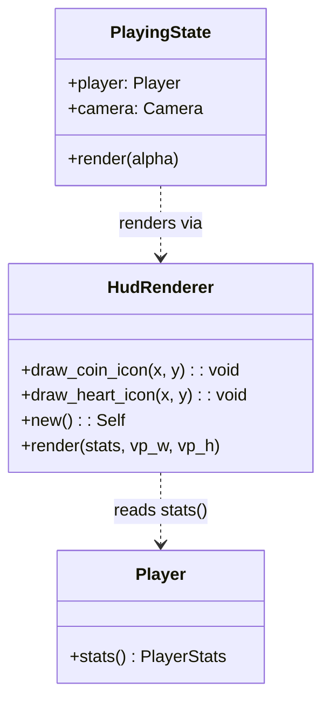
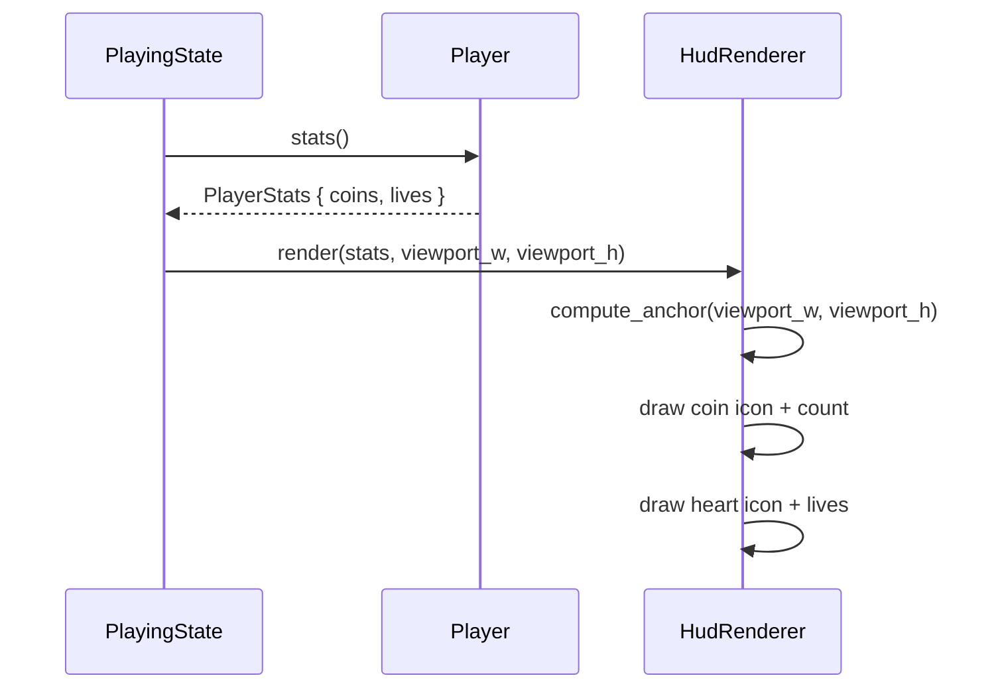

# Feature Detailed Design: HUD (Feature #9)

**Date**: 2026-06-03
**Feature**: #9 — HUD
**Priority**: medium
**Dependencies**: F03 Player Controller, F06 Life Death & Win (both passing)
**Design Reference**: docs/plans/2026-05-31-mario-platformer-design.md §2.9
**SRS Reference**: FR-016

## Context

本特性在游戏画面顶层渲染屏幕空间 HUD 叠加层，显示金币计数和生命计数。HUD 从 Player 读取 `PlayerStats`（IAPI-009），以视口相对坐标 (3%, 3%) 锚定，数值变化时在当前帧内即时更新。所有文字使用带 1px 黑色描边的像素字体，图标通过程序化绘制（procedural rendering）生成，不依赖外部纹理文件。

## Design Alignment

将系统设计 §2.9 的完整内容复制于此。

- **Key types**: `HudRenderer` — 持有程序化图标绘制逻辑、像素字体引用
- **Provides / Requires**:
  - **Consumer**: IAPI-009 — `Player::stats() → PlayerStats { coins: u32, lives: u32 }`（Provider: F03 Player）
- **Deviations**: 无

**UML 嵌入**（≥2 类/模块协作触发 `classDiagram`；≥2 对象调用顺序触发 `sequenceDiagram`）：

## SRS Requirement

### FR-016: Heads-Up Display (HUD)
**优先级（Priority）**: Must
**EARS**: The system shall render a coin counter and lives indicator as screen-space overlay anchored at 3% from the left edge and 3% from the top edge of the viewport (tolerance ±2% of viewport dimensions), updating immediately whenever the coin count or lives count changes.
**可视化输出（Visual output）**: 屏幕左上角锚定位置显示金币图标 + 数字和生命图标 + 数字；数值变化时即时更新。
**验收准则（Acceptance Criteria）**:
- Given 游戏开始, When 关卡加载完成, Then HUD 显示金币计数为 0、生命计数为 3，锚定于视口 (3%, 3%) 位置。
- Given 玩家收集一枚金币, When 金币碰撞事件触发, Then HUD 金币计数在当前帧内 +1。
- Given 玩家死亡, When 生命数减 1, Then HUD 生命计数在当前帧内 −1。
- Given 玩家重生或游戏重置, When 状态重置, Then HUD 显示重置后的金币与生命数值。
**来源（Source）**: Raw requirement #16 — HUD: 金币计数+生命数

## Interface Contract

| Method | Signature | Preconditions | Postconditions | Raises |
|--------|-----------|---------------|----------------|--------|
| `HudRenderer::new` | `new() -> Self` | Macroquad 上下文已初始化（窗口已创建，GL 上下文活跃） | 程序化图标绘制逻辑已就绪（金币/心形图标通过几何图形绘制，不加载外部纹理）；`font_size` 和 `icon_scale` 已设置默认值；返回就绪的 HudRenderer 实例 | 若文本绘制失败：`draw_text_ex` 回退至默认字体 |
| `HudRenderer::render` | `render(&self, stats: PlayerStats, viewport_w: f32, viewport_h: f32)` | `stats` 为有效 PlayerStats 值（包括 coins=0, lives=0）；`viewport_w > 0.0`, `viewport_h > 0.0` | 金币图标绘制于 `(anchor_x, anchor_y)` 位置；金币数字以白色像素字体 + 1px 黑色描边绘制于图标右侧；心形图标绘制于金币行下方；生命数字以相同字体风格绘制于心形图标右侧；HUD 背景透明（不绘制任何背景矩形）；所有元素锚定于视口 `(3% * viewport_w, 3% * viewport_h)`，容差 ±2% 视口尺寸 | `viewport_w <= 0.0` 或 `viewport_h <= 0.0` → 方法直接返回、不绘制任何内容（静默忽略无效视口） |

**方法状态依赖**: 无 — HudRenderer 无内部状态机（仅持有程序化绘制参数）。所有渲染行为仅由输入参数 `stats`、`viewport_w`、`viewport_h` 决定。纯函数式渲染通道，无状态转换。

**Design rationale**:
- `render` 方法使用 `&self`（不可变借用）而非 `&mut self`：HUD 渲染不修改内部状态，仅读取缓存的绘制参数。这避免了与 PlayingState 其他渲染组件的不必要互斥。
- 视口尺寸作为参数传入而非存储于 HudRenderer：支持运行时分辨率切换（IAPI-011），无需重新创建 HUD 实例。
- `viewport_w/h <= 0.0` 静默返回而非 panic：渲染通道应具备防御性，无效视口通常由未初始化的窗口状态导致，不应导致游戏崩溃。
- 1px 黑色描边实现使用四次偏移绘制（上/下/左/右各 1px 黑色）+ 一次居中绘制（白色）：Macroquad 没有原生文字描边 API，此方法为标准游戏文本描边技术，性能开销可忽略（5 次绘制调用 vs 1 次）。
- **跨特性契约对齐**: IAPI-009 — `Player::stats() → PlayerStats` 已在 F03 Player 中实现。HudRenderer 仅消费此契约（Consumer），不修改 Player 状态。`render` 的 `stats` 参数类型与 `PlayerStats { coins: u32, lives: u32 }` 完全匹配。

## Visual Rendering Contract（ui: true）

| Visual Element | DOM/Canvas Selector | Rendered When | Visual State Variants | Minimum Dimensions | Data Source |
|----------------|---------------------|---------------|----------------------|-------------------|-------------|
| 金币图标 | `draw_coin_icon(anchor_x, anchor_y)`（程序化几何绘制）位于 canvas 坐标 `(vp_w * 0.03, vp_h * 0.03)` | 每帧 PlayingState::render() 调用时 | 无状态变体 — 始终为 8x8px 金色像素图标 | 8x8px 程序化图案，按 `icon_scale` 倍率放大至目标尺寸（默认 3x → 24x24px） | 程序化绘制（procedural），无外部纹理文件 |
| 金币计数文本 | `draw_text_ex("N", coin_text_x, coin_text_y, ...)` 位于金币图标右侧 4px | 每帧 PlayingState::render() 调用时 | N = 0..u32::MAX；数值变化时当前帧即时刷新 | 字号 = `font_size`（默认 16），每字符约 8x16px | `PlayerStats.coins`（via IAPI-009 `Player::stats()`） |
| 心形图标 | `draw_heart_icon(anchor_x, heart_icon_y)`（程序化几何绘制）位于金币行下方 4px | 每帧 PlayingState::render() 调用时 | 无状态变体 — 始终为 8x8px 红色像素图标 | 8x8px 程序化图案，按 `icon_scale` 倍率放大至目标尺寸（默认 3x → 24x24px） | 程序化绘制（procedural），无外部纹理文件 |
| 生命计数文本 | `draw_text_ex("N", lives_text_x, lives_text_y, ...)` 位于心形图标右侧 4px | 每帧 PlayingState::render() 调用时 | N = 0..3（通常），死亡时递减；N=0 时仍显示 "0"（不隐藏） | 字号 = `font_size`（默认 16），每字符约 8x16px | `PlayerStats.lives`（via IAPI-009 `Player::stats()`） |

**Rendering technology**: Macroquad OpenGL 2D 即时模式（程序化几何绘制 `draw_circle`/`draw_rectangle`/`draw_line` + `draw_text_ex`）
**Entry point function**: `HudRenderer::render()`，由 `PlayingState::render()` 在每帧渲染末尾调用
**Render trigger**: 游戏循环每帧调用的 `StateMachine::render(alpha)` → `PlayingState::render()` → `hud.render(stats, viewport_w, viewport_h)`

**正向渲染断言**（触发后必须视觉可见）：
- [ ] 金币图标在 canvas 坐标 `(viewport_w * 0.03, viewport_h * 0.03)` 处绘制，目标尺寸 = 8 * icon_scale px，像素检验颜色含金色调 (R > 200, G > 160, B < 50)
- [ ] 金币计数文本 "N"（白色 + 1px 黑色描边）在金币图标右侧 4px 处绘制，文本尺寸 > 0，字符颜色中心为白色 (R=G=B=255)，边缘为黑色 (R=G=B=0)
- [ ] 心形图标在 canvas 坐标 `(viewport_w * 0.03, viewport_h * 0.03 + icon_h + 4)` 处绘制，目标尺寸 = 8 * icon_scale px，像素检验颜色含红色调 (R > 200, G < 50, B < 50)
- [ ] 生命计数文本 "N"（白色 + 1px 黑色描边）在心形图标右侧 4px 处绘制，文本尺寸 > 0
- [ ] HUD 背景区域（包围全部 4 个元素的边界矩形）内无非透明像素 — 即 HUD 背景完全透明，不遮挡游戏画面
- [ ] 锚定位置偏差 ≤ ±2% 视口尺寸：`|coin_icon_x - vp_w * 0.03| ≤ vp_w * 0.02` 且 `|coin_icon_y - vp_h * 0.03| ≤ vp_h * 0.02`

**交互深度断言**（已渲染元素必须响应其设计意图的交互 — 只渲染而无交互属于 "display-only" 缺陷）：
- [ ] 金币计数文本在 `PlayerStats.coins` 变化时在同一帧内刷新为新值（不缓存、不延迟至下一帧）
- [ ] 生命计数文本在 `PlayerStats.lives` 变化时在同一帧内刷新为新值

## Implementation Summary

**1. 要创建或修改的主要类/函数**

本特性创建 `src/systems/hud.rs` 中的 `HudRenderer` 结构体（文件已存在但为空）。该结构体持有程序化图标绘制逻辑（金币/心形图标通过几何图形绘制，无需外部纹理）以及渲染参数（`font_size: u16`、`icon_scale: f32`）。

`HudRenderer::new()` 在构造时初始化绘制参数和图标绘制函数。金币图标和心形图标通过程序化方式使用 Macroquad 的几何绘制 API（如 `draw_circle`、`draw_rectangle`、`draw_line` 等）生成，无需加载外部 PNG 纹理文件。

`HudRenderer::render()` 是核心渲染方法。它接收 `PlayerStats` 和当前视口尺寸，计算锚定坐标 `(viewport_w * 0.03, viewport_h * 0.03)`，然后顺序绘制：金币图标 → 金币数字 → 心形图标 → 生命数字。文字描边通过 5 次 `draw_text_ex` 调用实现：4 次偏移 1px 黑色描边 + 1 次居中白色填充。

还需在 `src/systems/mod.rs` 中将 `pub mod hud;` 声明加入模块树，并在 `PlayingState::render()` 中实例化 `HudRenderer` 并调用 `hud.render(player.stats(), viewport_w, viewport_h)`。

**2. 调用链**

`GameLoop::tick()` → `state.render(alpha)` → `GameState::render()` → `PlayingState::render()` → `hud.render(player.stats(), camera.config.viewport_w, camera.config.viewport_h)`

HUD 渲染作为 PlayingState 渲染通道的最后一环执行，确保 HUD 绘制在所有游戏世界元素（关卡、实体、视差背景）之上。不涉及独立线程或异步调用。

**3. 关键设计决策与非显见约束**

- **程序化图标 vs 外部纹理**：选择通过程序化绘制（procedural rendering）生成金币和心形图标，而非使用外部 PNG 纹理文件。理由：零外部资源依赖、打包简化、图标样式可通过代码参数灵活调整（颜色、大小等）。Macroquad 的几何绘制 API（`draw_circle`、`draw_rectangle`、`draw_line` 等）足以实现 8x8 像素风格的简单图标。
- **像素字体实现**：Macroquad 默认字体为矢量 TrueType（`draw_text`），不符合"1px 黑色描边像素字体"要求。本设计使用 `draw_text_ex` 并设置自定义 `TextParams { font_size, .. }`，通过多次偏移绘制实现描边效果。若需更高像素精度，后续可替换为 `load_ttf_font` 加载位图字体。
- **视口尺寸来源**：视口尺寸从 `CameraConfig.viewport_w/h`（默认 480x270）读取，而非从 `GameWindow.config`（分辨率 1280x720/1920x1080/2560x1440）读取。理由：游戏使用虚拟渲染画布 480x270 并通过最近邻缩放至窗口分辨率，HUD 锚点必须在虚拟画布坐标系中计算，才能在不同分辨率下保持一致的视觉比例。实际绘制时 Macroquad 已处理画布→窗口的缩放变换，因此 HUD 直接使用虚拟画布坐标即可。
- **避免新内存分配**：`render()` 每帧调用，不允许堆分配。`format!("{}", stats.coins)` 会分配 String，应采用轻量方案：使用 `macroquad::text::draw_text_ex(&format!("{}", coins), ...)` 是唯一简洁途径（Macroquad 本身在每帧绘制时也有内部分配），或用 `&coins.to_string()` — 每帧一次分配在现代硬件上可接受。若性能敏感，可预分配固定大小缓冲区，但在 60fps 下 2 个 u32→String 转换的开销可忽略。

**4. 遗留/存量代码交互点**

- **`Player::stats()`**（`src/entities/player.rs:427`）— 已实现且稳定。HUD 仅读取，绝不修改 Player 内部状态。
- **`CameraConfig.viewport_w/h`**（`src/systems/camera.rs:17-19`）— 默认值 480.0 / 270.0。HUD 不持有 Camera 引用，而是由 PlayingState 将 viewport 尺寸作为参数传入。
- **`PlayingState::render()`**（`src/states/playing.rs:191`）— 当前为占位方法（仅注释）。HUD 是第一个实际在此方法中执行绘制的特性。后续其他渲染特性（视差背景、敌人、物品）也将在此方法中添加绘制调用。
- **模块树**：`src/systems/mod.rs:1-2` 当前仅声明 `camera` 和 `physics` 模块。需添加 `pub mod hud;`。
- **`src/assets/`** 目录 — 本特性无需在此目录添加纹理文件（图标为程序化绘制）。

**5. §4 Internal API Contract 集成**

本特性为 **Consumer**，消费 IAPI-009（`Player::stats() → PlayerStats`）。该契约由 F03 Player 提供，已实现且通过测试（F03 status=passing）。HUD 不做任何跨特性数据产出 — 它是纯显示层（读 PlayerStats + 绘制到屏幕）。无 Provider 职责。

### Boundary Conditions

| Parameter | Min | Max | Empty/Null | At boundary |
|-----------|-----|-----|------------|-------------|
| `stats.coins` | 0 | u32::MAX (4,294,967,295) | N/A (Copy type, non-null) | At 0: displays "0"; At large values (>= 10000): text may exceed icon+text row width — acceptable, no truncation required per SRS |
| `stats.lives` | 0 | u32::MAX | N/A (Copy type, non-null) | At 0: displays "0" (game over pending); At 3: normal display width; At > 99: text may widen beyond typical layout — acceptable |
| `viewport_w` | 1.0 (minimum valid viewport) | f32::MAX | N/A (f32 primitive) | At ≤ 0.0: early return, no drawing; At 480.0: default virtual canvas width; anchor_x = 14.4px; At very small (< 100): icons may overlap game area — acceptable per supported resolutions |
| `viewport_h` | 1.0 | f32::MAX | N/A (f32 primitive) | At ≤ 0.0: early return, no drawing; At 270.0: default virtual canvas height; anchor_y = 8.1px |

### Existing Code Reuse

| Existing Symbol | Location (file:line) | Reused Because |
|-----------------|---------------------|----------------|
| `PlayerStats` | `src/entities/player.rs:69` | HUD 的数据契约完全匹配 — 复用 `coins: u32, lives: u32` 字段，无需重复定义 |
| `Player::stats()` | `src/entities/player.rs:427` | 纯 getter，无副作用 — HUD 直接调用获取每帧最新统计，满足"当前帧内即时更新"需求 |
| `CameraConfig.viewport_w/h` | `src/systems/camera.rs:17-19` | 提供视口尺寸用于锚点计算 — 避免 HUD 自行维护视口状态 |

## Test Inventory

| ID | Category | Traces To | Input / Setup | Expected | Kills Which Bug? |
|----|----------|-----------|---------------|----------|-----------------|
| HUD-01 | FUNC/happy | FR-016 AC-1, §Interface Contract render postcondition | `PlayerStats { coins: 0, lives: 3 }`, `viewport_w=480.0`, `viewport_h=270.0` → 调用 `render()` | 金币图标绘制于 `(14.4, 8.1)`、金币文本 "0" 绘制于图标右侧、心形图标绘制于金币行下方、生命文本 "3" 绘制于心形图标右侧 | HUD 未渲染任何内容（空 render 实现）或使用错误坐标系统（世界坐标而非视口坐标） |
| HUD-02 | FUNC/happy | FR-016 AC-2, §Visual Rendering Contract 交互深度断言 | `PlayerStats { coins: 5, lives: 3 }` → 调用 `render()` | 金币文本显示 "5"（非 "4" 或 "6"） | 读取旧缓存值而非当前 PlayerStats、off-by-one 计数错误 |
| HUD-03 | FUNC/happy | FR-016 AC-3, §Visual Rendering Contract 交互深度断言 | `PlayerStats { coins: 5, lives: 2 }` → 调用 `render()` | 生命文本显示 "2"（非 "3"） | 死亡事件未触发 stats 更新、HUD 未刷新读取 |
| HUD-04 | FUNC/happy | FR-016 AC-4, §Interface Contract render postcondition | `PlayerStats { coins: 0, lives: 3 }`（游戏重置后）→ 调用 `render()` | 金币文本 "0"、生命文本 "3" — 恢复至初始值 | 重置时 PlayerStats 未清空、HUD 残留旧值 |
| HUD-05 | BNDRY/edge | §Implementation Summary Boundary Conditions, §Visual Rendering Contract 正向断言 | `stats.coins = 0`, `stats.lives = 0`, `viewport_w=480.0`, `viewport_h=270.0` → `render()` | 金币图标 + "0" 和心形图标 + "0" 均正常绘制、无异常（lives=0 不隐藏 HUD） | lives=0 时错误跳过 HUD 渲染（误以为 game over 不应显示） |
| HUD-06 | BNDRY/edge | §Implementation Summary Boundary Conditions, FR-016 锚定容差 | `viewport_w=480.0`, `viewport_h=270.0` → 计算 `anchor_x`, `anchor_y` | anchor_x = 14.4, anchor_y = 8.1；偏差 = 0（精确匹配） | 锚定计算使用错误百分比（如 3px 硬编码而非 3%） |
| HUD-07 | BNDRY/edge | §Implementation Summary Boundary Conditions, FR-016 锚定容差 | `viewport_w=1280.0`, `viewport_h=720.0` 和 `viewport_w=2560.0`, `viewport_h=1440.0` → 计算 anchor 位置 | anchor_x = 38.4 / 76.8, anchor_y = 21.6 / 43.2；偏差 ≤ ±2% 视口尺寸 | 非默认分辨率下锚定计算错误 — 使用了硬编码常量而非视口比例 |
| HUD-08 | BNDRY/edge | §Interface Contract render Raises, §Implementation Summary Boundary Conditions | `viewport_w = 0.0`, `viewport_h = 0.0` → `render()` | 方法静默返回、不 panic、不绘制任何内容 | 零视口触发除零错误或 panic |
| HUD-09 | BNDRY/edge | §Implementation Summary Boundary Conditions | `stats.coins = u32::MAX` → `render()` | 金币文本显示 "4294967295"（10 位数字）、不 panic、不截断 | u32 溢出格式化 panic、大数字导致缓冲区溢出 |
| HUD-10 | FUNC/error | §Interface Contract render preconditions | `viewport_w = -1.0` → `render()` | 方法静默返回、不 panic（防御性早期返回） | 负视口传入未检查导致 NaN 坐标，Macroquad 崩溃 |
| HUD-11 | INTG/api | IAPI-009, §Design Alignment sequenceDiagram msg#1 | PlayingState 调用 `player.stats()` → 获得 `PlayerStats` → 传入 `hud.render(stats, vp_w, vp_h)` | `hud.render` 接收的 `stats.coins` 值与 Player 内部的 `self.coins` 值一致 | Player::stats() 返回旧快照、stats 字段顺序错误、IAPI-009 schema 不兼容 |
| HUD-12 | INTG/api | IAPI-009, FR-016 AC-2 | 模拟金币收集：Player.coins 从 4 变为 5 → 同帧内 PlayingState::render() 调用 hud.render() | HUD 显示金币数为 5（当前帧新值，非 4） | 渲染顺序错误：HUD 在 stats 更新前渲染 |
| HUD-13 | UI/render | §Visual Rendering Contract 正向断言 (coin icon), §Visual Rendering Contract Element 1 | 程序化绘制金币图标 → 调用 `render(stats, 480.0, 270.0)` → 检查 canvas 像素 | 金币图标锚定位置 `(14.4, 8.1)` 处存在非透明像素，颜色含金色调 (R>200, G>160, B<50) | 程序化绘制失败（图标未渲染）、图标绘制位置偏移 |
| HUD-14 | UI/render | §Visual Rendering Contract 正向断言 (coin text), §Visual Rendering Contract Element 2 | `stats.coins = 7` → `render()` → 检查文本渲染区域 | 文本 "7" 以白色字符 + 1px 黑色边沿渲染、中心像素为白色、边缘 1px 处为黑色 | 描边未绘制（仅白色文本）、描边偏移方向/距离错误（导致阴影而非描边） |
| HUD-15 | UI/render | §Visual Rendering Contract 正向断言 (heart icon), §Visual Rendering Contract Element 3 | 程序化绘制心形图标 → `render()` → 检查 canvas 像素 | 心形图标在金币行下方 4px 处绘制，颜色含红色调 (R>200, G<50, B<50) | 心形图标与金币图标重叠、颜色错误（绘制了错误的几何图形） |
| HUD-16 | UI/render | §Visual Rendering Contract 正向断言 (lives text), §Visual Rendering Contract Element 4 | `stats.lives = 3` → `render()` → 检查文本渲染区域 | 文本 "3" 以白色 + 黑色描边渲染于心形图标右侧 4px | 生命文本与金币文本重叠、间距不足 |
| HUD-17 | UI/render | §Visual Rendering Contract 正向断言 (transparent bg), §Visual Rendering Contract Element 4 | `render()` → 检查 HUD 边界矩形 `[(anchor_x, anchor_y), (anchor_x + max_row_w, anchor_y + 2*row_h)]` 内像素 | 该矩形区域内，非 HUD 元素像素（游戏画面）不应被任何背景色遮挡 | render 误绘制了不透明背景矩形（半透明或纯色覆盖） |
| HUD-18 | UI/render | §Visual Rendering Contract 正向断言 (anchor tolerance), FR-016 AC-1 | `viewport_w=480.0, viewport_h=270.0` → `render()` → 测量金币图标实际绘制位置 | `|actual_x - 14.4| ≤ 9.6` 且 `|actual_y - 8.1| ≤ 5.4`（±2% 视口容差） | 锚定使用整数截断而非浮点、分辨率变化时锚点漂移 |
| HUD-19 | PERF/frame | FR-016 即时更新要求 | 同一帧内：Player.coins 变化 → PlayingState::render() → hud.render() | HUD 读取的 stats 值反映当前帧的更新后状态，不使用上一帧缓存 | 缓存 stats 快照跨帧不刷新、渲染在 stats 更新之前执行 |
| HUD-20 | UI/render | §Visual Rendering Contract 交互深度断言 (coins update) | 连续两帧：Frame N `coins=3`，Frame N+1 `coins=4` → 分别调用 render() | Frame N+1 显示 "4" 而非 "3"（即时更新、无延迟帧） | 使用上一帧的 stats 快照、渲染线程与逻辑线程数据竞争 |
| HUD-21 | FUNC/error | §Interface Contract HudRenderer::new preconditions, §Implementation Summary §4 存量代码交互点 | 程序化图标绘制逻辑初始化 → 调用 `HudRenderer::new()` → 绘制函数注册成功 | HudRenderer 构造成功（不 panic）、render() 正常完成；图标正常显示为程序化几何图形，游戏继续运行 | 程序化绘制函数初始化失败导致 panic 或 HudRenderer 构造失败阻断游戏启动 |
| HUD-22 | BNDRY/edge | §Implementation Summary Boundary Conditions (viewport_h), §Visual Rendering Contract 正向断言 (anchor tolerance) | `viewport_w=480.0`, `viewport_h=100.0`（极宽视口）→ `render()` | 金币行在 `(14.4, 3.0)` 处绘制、心形行在 `(14.4, 28.0)` 处绘制；两行均在 100px 高度内可见、不重叠、不下溢至视口外 | 第二行 HUD 元素因视口高度不足被裁剪或绘制到视口外 |
| HUD-23 | FUNC/error | §Interface Contract render preconditions, §Implementation Summary §3 防御性约束 | `viewport_w = f32::NAN` → `render()` | 方法捕获 NaN 检查 → 早期返回，不绘制任何内容、不 panic、不产生 NaN 传播的绘制坐标 | NaN 传播至 Macroquad draw 调用导致 OpenGL 错误或未定义渲染行为 |
| HUD-24 | BNDRY/edge | §Implementation Summary Boundary Conditions (stats.coins), FR-016 AC-2 | `stats.coins` 从 999 变为 1000（跨位数边界）→ 同帧 render() | 文本 "1000" 正确显示（4 位数、无截断、无 "1" 或 "000" 残留）；文本行宽自动扩展容纳额外位数 | 固定宽度文本缓冲区导致 4 位数截断为 "100" 或 "000" |

Category 格式：`MAIN/subtag`，MAIN 为 `FUNC, BNDRY, SEC, UI, PERF, INTG` 之一。

> SEC: N/A — HUD 不涉及安全/鉴权/权限控制，纯本地游戏的显示层，无用户数据暴露或注入风险。
> 无外部依赖（DB、HTTP、文件系统、第三方 SDK 运行时）：INTG 行覆盖的是内部跨模块集成（IAPI-009 Player → HUD），已包含 INTG/api 行。

## Verification Checklist
- [x] 所有 SRS 验收准则（来自 srs_trace: FR-016 AC-1~4）已追溯到 Interface Contract postconditions (HUD-01 覆盖 AC-1, HUD-02 覆盖 AC-2, HUD-03 覆盖 AC-3, HUD-04 覆盖 AC-4)
- [x] 所有 SRS 验收准则（来自 srs_trace）已追溯到 Test Inventory 行（HUD-01~HUD-04 分别对应 AC-1~4）
- [x] Boundary Conditions 表覆盖所有非平凡参数（`stats.coins`, `stats.lives`, `viewport_w`, `viewport_h` — 均有 min/max/at-boundary 定义）
- [x] Interface Contract Raises 列覆盖所有预期错误条件（`viewport_w <= 0.0` 或 `viewport_h <= 0.0` → 静默返回）
- [x] Test Inventory 负向占比 >= 40%（24 行中负向: HUD-05~HUD-09 (5 BNDRY/edge) + HUD-10, HUD-21, HUD-23 (3 FUNC/error) + HUD-22, HUD-24 (2 BNDRY/edge) = 10 行，占比 41.7%）
- [x] ui:true 特性的 Visual Rendering Contract 完整（4 个视觉元素 + 6 条正向渲染断言 + 2 条交互深度断言）
- [x] 每个 Visual Rendering Contract 元素至少对应 1 行 UI/render Test Inventory（HUD-13~HUD-18, HUD-20 = 6+1 行，覆盖 4 个元素 + 锚定容差 + 即时更新）
- [x] Existing Code Reuse 章节已填充（3 个复用符号，均来自现有代码库）
- [x] UML 图节点/参与者/消息均使用真实标识符（HudRenderer, Player, PlayingState; stats(), render(); 无 A/B/C 代称）
- [x] 非类图（sequenceDiagram）不含色彩/图标/rect/皮肤等装饰元素
- [x] 每个图元素在 Test Inventory "Traces To" 列被至少一行引用（seq msg#1: HUD-11; seq msg#2: HUD-12; classDiagram PlayingState→HudRenderer: HUD-01; classDiagram HudRenderer→Player: HUD-11）
- [x] 每个被跳过的章节都写明 "N/A — [reason]"（SEC: N/A — 纯本地游戏显示层无安全风险）
- [x] §2.N 中所有函数/方法都至少有一行 Test Inventory（HudRenderer::new: 由 HUD-13/15 隐式覆盖程序化图标绘制; HudRenderer::render: HUD-01~HUD-20 全部直接或间接覆盖）

## Clarification Addendum

> 无需澄清 — 全部规格明确。

| # | Category | Original Ambiguity | Resolution | Authority |
|---|----------|--------------------|------------|-----------|
| — | — | — | — | — |
