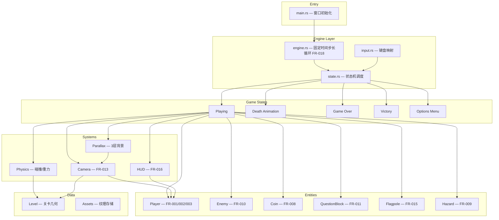
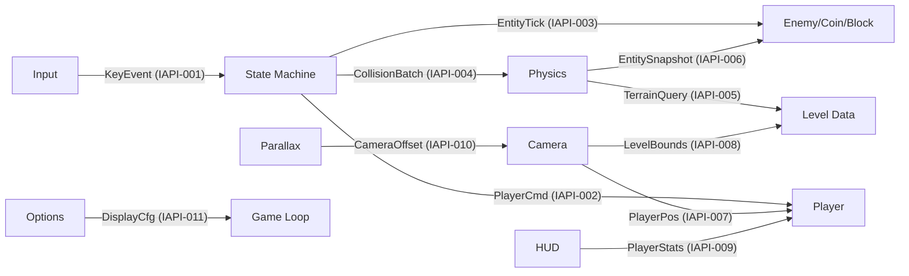
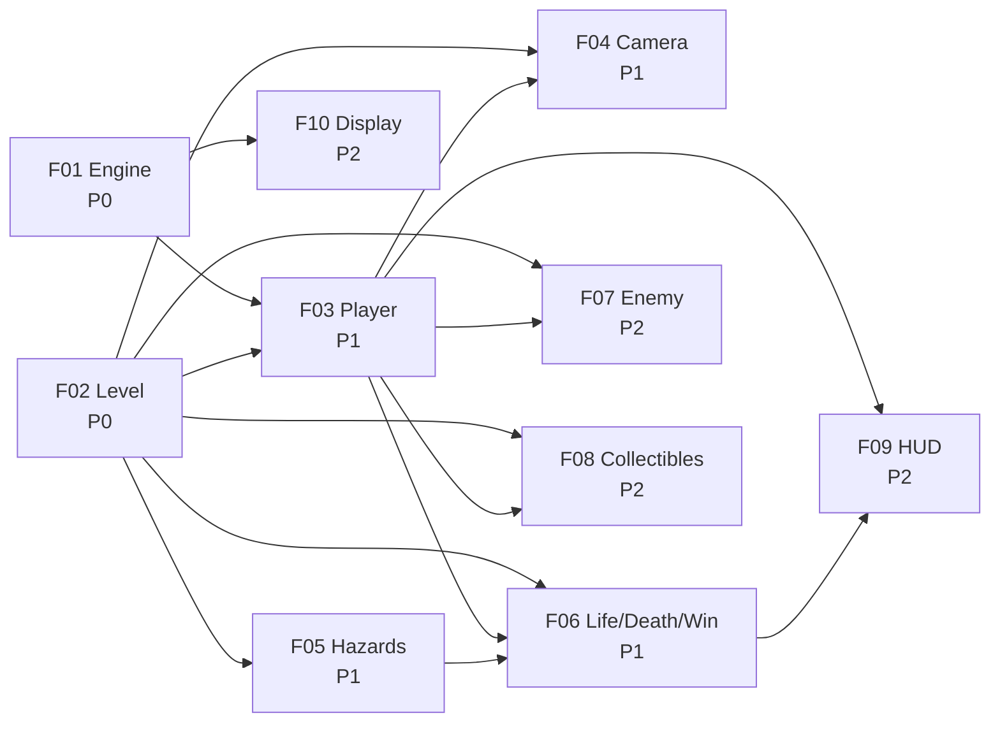

# Mario 2D Platformer Demo — 设计文档（Design Document）

**日期（Date）**: 2026-05-31
**状态（Status）**: Approved
**SRS 参考（SRS Reference）**: docs/plans/2026-05-31-mario-platformer-srs.md
**Template**: C:\Users\jxing\.claude\plugins\cache\long-task-dev\long-task\1.0.0\docs\templates\design-template.md

## 1. 架构（Architecture）

### 1.1 架构概览（Overview）

游戏采用**状态机驱动 + 模块分层**架构。主循环以 60fps 固定时间步长运行，顶层状态机（Playing → Dead → GameOver / Victory / Options）调度实体更新和渲染。实体层（Player / Enemy / Coin / QuestionBlock / Flagpole / Hazard）持有自身状态；系统层（Physics / Camera / HUD / Parallax）提供跨实体的服务。所有渲染通过 Macroquad 即时模式 API 完成，精灵图以最近邻方式从 480×270 虚拟画布缩放至目标分辨率，全部资源编译期嵌入二进制。

### 1.2 逻辑视图（Logical View）



### 1.3 组件图（Component Diagram）



### 1.4 技术栈选型与方案论证（Tech Stack Decisions & Rationale）

| Layer | Choice | Version | Why (NFR/Constraint Alignment) | Rejected Alternatives |
|-------|--------|---------|--------------------------------|----------------------|
| Language | Rust | edition 2024 | CON-001 强制；零成本抽象满足 NFR-001 (60fps)；无 GC 暂停 | C++：内存安全风险；C#：GC 暂停威胁帧率稳定性 |
| Game Framework | Macroquad | `0.4` | CON-002 强制；即时模式 API 匹配简单架构无 ECS 阻抗不匹配；内置窗口/输入/纹理/计时 | Bevy：ECS 对此项目过度工程；GGEZ：维护停滞 |
| Test Framework | Rust built-in (`#[test]`) | — (std) | 零额外依赖；单元测试覆盖实体逻辑 + 物理计算 + 摄像机算法 | — |
| Asset Format | PNG (embedded via `include_bytes!`) | — | Macroquad 原生支持；编译期嵌入满足 CON-004 (离线运行无网络依赖) | — |

### 1.5 NFR 对齐摘要（NFR Alignment）

- **NFR-001 (60fps)**：固定时间步长循环（1/60s），物理与渲染解耦；单帧模拟步数上限 5 次防止螺旋死亡；Rust 零成本抽象保证无 GC 抖动
- **NFR-002 (多分辨率)**：虚拟画布 480×270 → 目标分辨率最近邻缩放；Options 菜单实时切换；HUD 锚定 (3%, 3%) 视口相对位置，偏差 ≤ ±2%
- **NFR-003 (像素艺术)**：`macroquad::texture::set_filter_mode(Nearest)` 全局最近邻；所有精灵坐标取整 `round()`，禁用子像素渲染；每精灵 ≤ 16 色

## 2. Feature Integration Specs

### 2.1 Feature: Engine Core (FR-018)

#### 2.1.1 概览（Overview）

初始化 Macroquad 窗口与虚拟渲染目标，建立 60fps 固定时间步长循环，管理时间累加器与最大追赶步数(5)，每帧协调状态机更新→物理→渲染管线。响应 Display Config 变更请求。

#### 2.1.2 关键类型（Key Types）

- `GameLoop` — 持有时间累加器 `accumulator: f32`、固定步长 `dt: 1.0/60.0`、最大追赶步数 `max_steps: 5`
- `GameWindow` — 封装 `WindowConfig { width, height, fullscreen }`，持有虚拟渲染目标 `RenderTarget`

#### 2.1.3 集成面（Integration Surface）

**Provides**:

| Consumer Feature(s) | Contract ID | Endpoint / Method | Response |
|---------------------|-------------|-------------------|----------|
| F10 Display Config | IAPI-011 | `GameLoop::apply_display(w, h, fs)` | — (window resized) |

**Requires**: Self-contained — no external integration surface.

### 2.2 Feature: Level & Background (FR-006)

#### 2.2.1 概览（Overview）

以硬编码常量定义单个关卡的平台几何、关卡边界 (min_x, max_x, kill_y)、视差背景纹理。提供 `query_terrain(AABB) → Vec<Tile>` 地形查询接口供物理系统使用，提供 `bounds()` 供摄像机钳制。

#### 2.2.2 关键类型（Key Types）

- `Level` — 持有 `Vec<Platform>`、`LevelBounds`、`KillPlane` 阈值
- `Platform` — 单个平台：`AABB` + 精灵类型
- `ParallaxLayer` — 单层视差：纹理句柄 + 滚动速度倍率 (`scroll: 0.1 | 0.3 | 0.6`)
- `Tile` — 枚举：`Empty` / `Platform(AABB)` / `Spike(AABB)`

#### 2.2.3 集成面（Integration Surface）

**Provides**:

| Consumer Feature(s) | Contract ID | Endpoint / Method | Response |
|---------------------|-------------|-------------------|----------|
| F05 Hazards, F04 Camera | IAPI-005 | `Level::query_terrain(aabb) → Vec<Tile>` | 与查询 AABB 相交的地形 tile 列表 |
| F04 Camera | IAPI-008 | `Level::bounds() → LevelBounds` | `{ min_x, max_x, min_y, kill_y }` |

**Requires**: Self-contained — no external integration surface.

### 2.3 Feature: Player Controller (FR-001, FR-002, FR-003)

#### 2.3.1 概览（Overview）

管理玩家实体的水平移动（加速/摩擦/反向）、跳跃（按下时长控制高度、天花板碰撞）、冲刺（1.5× 速度、跳跃距离加成）、地面/空中状态转换。输出 `PlayerStats` 供 HUD 使用，输出 `pos()` 供摄像机跟随。

#### 2.3.2 关键类型（Key Types）

- `Player` — 位置 `pos: Vec2`、速度 `vel: Vec2`、碰撞体尺寸（小 16×16 / 大 16×32）、`on_ground: bool`、朝向 `facing: i8`
- `PlayerConfig` — 可配置参数：加速度、最大速度、摩擦力、跳跃初速度、最大跳跃时长、冲刺倍率 (1.5×)、空中操控系数 (0.6)
- `PlayerState` — 枚举：`Small` / `Super` (蘑菇变大后) / `Fire` (火焰花后)

#### 2.3.3 集成面（Integration Surface）

**Provides**:

| Consumer Feature(s) | Contract ID | Endpoint / Method | Response |
|---------------------|-------------|-------------------|----------|
| F04 Camera | IAPI-007 | `Player::pos() → Vec2` | `{ x, y }` |
| F09 HUD | IAPI-009 | `Player::stats() → PlayerStats` | `{ coins: u32, lives: u32 }` |

**Requires**:

| Provider Feature | Contract ID | Endpoint / Method | Request |
|-----------------|-------------|-------------------|---------|
| F01 Engine, F02 Level | IAPI-004 | Physics collision resolution | Player &mut ref + terrain query (via StateMachine orchestration) |

### 2.4 Feature: Camera System (FR-013)

#### 2.4.1 概览（Overview）

从 Player 读取位置，水平方向每帧以剩余距离 8% 收敛（玩家保持视口 35-40% 偏左），垂直方向在中央 60% 死区内不跟踪、出死区后以 5%/帧追赶。视口钳制于关卡边界，偏移输出给视差背景渲染。

#### 2.4.2 关键类型（Key Types）

- `Camera` — 当前偏移 `offset: Vec2`、目标偏移计算、死区配置 `dead_zone_pct: 0.60`
- `CameraConfig` — 水平追赶速率 (0.08)、垂直追赶速率 (0.05)、死区比例

#### 2.4.3 集成面（Integration Surface）

**Provides**:

| Consumer Feature(s) | Contract ID | Endpoint / Method | Response |
|---------------------|-------------|-------------------|----------|
| F02 Level (Parallax) | IAPI-010 | `Camera::offset() → Vec2` | `{ x, y }` — 当前视口左上角世界坐标 |

**Requires**:

| Provider Feature | Contract ID | Endpoint / Method | Request |
|-----------------|-------------|-------------------|---------|
| F03 Player | IAPI-007 | `Player::pos()` | — |
| F02 Level | IAPI-008 | `Level::bounds()` | — |

### 2.5 Feature: Hazards (FR-009)

#### 2.5.1 概览（Overview）

尖刺实体为静态危险碰撞体（16×8 px），深渊死亡平面为关卡 Y 坐标下限。当玩家碰撞体与尖刺重叠或玩家 Y 超过 kill_y 时，产生碰撞事件触发死亡流程。

#### 2.5.2 关键类型（Key Types）

- `Spike` — 位置 `pos: Vec2`、碰撞体 `AABB { w: 16, h: 8 }`
- `KillPlane` — 单一 `y_threshold: f32` 值

#### 2.5.3 集成面（Integration Surface）

**Requires**:

| Provider Feature | Contract ID | Endpoint / Method | Request |
|-----------------|-------------|-------------------|---------|
| F02 Level | IAPI-004 | Physics collision dispatch | Level terrain data (via StateMachine → Physics) |

### 2.6 Feature: Life, Death & Win (FR-014a, FR-014b, FR-014c, FR-015)

#### 2.6.1 概览（Overview）

管理生命计数 (3 初始)、检查点激活与存储。当碰撞事件为致命类型时锁定输入→播放死亡动画 1.5s→生命减 1→判断重生 (life>0) 或 GameOver (life=0)。重生时传送至最近检查点并授予 2s 无敌闪烁。旗杆触发时锁定输入→播放滑下动画→显示 Victory 画面。GameOver/Victory 画面响应空格键完全重置游戏。

#### 2.6.2 关键类型（Key Types）

- `LifeState` — `lives: u32`、`checkpoint: Option<Vec2>`
- `DeathTimer` — 1.5s 倒计时，锁输入
- `InvulnTimer` — 2.0s 倒计时 + 闪烁相位 `flicker_phase: f32` (4Hz)
- `Flagpole` — 位置、触发区域 `AABB`、动画阶段枚举 `Idle | Sliding | Done`

#### 2.6.3 集成面（Integration Surface）

**Requires**:

| Provider Feature | Contract ID | Endpoint / Method | Request |
|-----------------|-------------|-------------------|---------|
| F03 Player | — | Player position + input lock | (via StateMachine internal) |
| F02 Level | — | Level start position for respawn | (via StateMachine internal) |

### 2.7 Feature: Patrol Enemy (FR-010)

#### 2.7.1 概览（Overview）

敌人在两个路点间以恒定速度巡逻（到达端点反向）。碰撞判定分方向：玩家从上方落下（downward velocity > 0，玩家底部碰敌人顶部）→ 消灭敌人 + 玩家反弹；侧面/下方接触 → 触发玩家死亡。

#### 2.7.2 关键类型（Key Types）

- `Enemy` — 位置 `pos: Vec2`、速度 `vel: Vec2`、巡逻方向、存活标志 `alive: bool`、`waypoint_a: Vec2`、`waypoint_b: Vec2`
- `EnemyConfig` — 巡逻速度常量 `speed: f32`

#### 2.7.3 集成面（Integration Surface）

**Requires**:

| Provider Feature | Contract ID | Endpoint / Method | Request |
|-----------------|-------------|-------------------|---------|
| F02 Level | IAPI-004 | Physics collision dispatch | Level terrain (platform AABBs for ground) |

### 2.8 Feature: Collectibles & Question Blocks (FR-008, FR-011)

#### 2.8.1 概览（Overview）

金币散布关卡中，玩家碰撞收集后消失并计数 +1；死亡重生时金币复位。问号方块被玩家头部从下方撞击时切换为"已使用"状态，按概率表（金币 70% / 超级蘑菇 15% / 火焰花 15%）产出奖励物品并弹至方块上方。超级蘑菇沿地面弹跳移动，火焰花静止在产出位置。

#### 2.8.2 关键类型（Key Types）

- `Coin` — 位置、`collected: bool`、动画帧索引 `frame: u8` (4帧旋转)
- `QuestionBlock` — 位置、`used: bool`、闪烁帧 `flicker_frame: u8` (3帧)
- `PowerUp` — 枚举 `SuperMushroom | FireFlower`、位置 `pos`、速度 `vel` (蘑菇弹跳)
- `LootTable` — 概率常量 `COIN: 0.70, MUSHROOM: 0.15, FLOWER: 0.15`

#### 2.8.3 集成面（Integration Surface）

**Requires**:

| Provider Feature | Contract ID | Endpoint / Method | Request |
|-----------------|-------------|-------------------|---------|
| F02 Level | IAPI-004 | Physics collision dispatch | Coin / Block AABBs + Player contact direction |

### 2.9 Feature: HUD (FR-016)

#### 2.9.1 概览（Overview）

从 Player 读取 `PlayerStats { coins, lives }`，以视口相对坐标 (3%, 3%) 锚定渲染金币图标+数字和心形图标+数字。数值变化时当前帧内即时更新。所有文字使用 1px 黑色描边像素字体。

#### 2.9.2 关键类型（Key Types）

- `HudRenderer` — 持有金币/心形图标纹理句柄，像素字体引用

#### 2.9.3 集成面（Integration Surface）

**Requires**:

| Provider Feature | Contract ID | Endpoint / Method | Request |
|-----------------|-------------|-------------------|---------|
| F03 Player | IAPI-009 | `Player::stats() → PlayerStats` | `{ coins: u32, lives: u32 }` |

### 2.10 Feature: Display Configuration (FR-017)

#### 2.10.1 概览（Overview）

按 ESC 键呼出选项菜单覆盖层。显示当前分辨率、可选分辨率列表（720p / 1080p / 1440p）和全屏开关。方向键选择、回车确认后立即通过 IAPI-011 应用变更。再按 ESC 关闭菜单。

#### 2.10.2 关键类型（Key Types）

- `OptionsMenu` — `selected_index: usize`、`resolutions: [u32; 3]` (1280×720 / 1920×1080 / 2560×1440)、`fullscreen: bool`

#### 2.10.3 集成面（Integration Surface）

**Requires**:

| Provider Feature | Contract ID | Endpoint / Method | Request |
|-----------------|-------------|-------------------|---------|
| F01 Engine | IAPI-011 | `GameLoop::apply_display(w, h, fullscreen)` | `w: u32, h: u32, fullscreen: bool` |

## 3. 数据模型（Data Model）

[Not applicable — 无持久化存储。所有游戏状态在内存中以 struct 字段持有，关卡数据以硬编码常量嵌入二进制。无数据库、无文件读写、无序列化需求。]

## 4. 内部 API 契约（Internal API Contracts）

| Contract ID | Provider Feature | Consumer Feature(s) | Endpoint / Method | Request Schema | Response Schema | Error Codes |
|-------------|-----------------|---------------------|--------------------|---------------|----------------|-------------|
| IAPI-001 | Input | StateMachine | `InputState::collect()` | — | `InputState { left, right, jump, jump_just, sprint, esc_just, confirm }` | — |
| IAPI-002 | StateMachine | F03 Player | `Player::update(dt, input, terrain)` | `dt: f32`, `input: &InputState`, `terrain: &[Tile]` | Player mutates self | — |
| IAPI-003 | StateMachine | Entities (F05/F07/F08) | `Entity::update(dt)` | `dt: f32` | Entity mutates self | — |
| IAPI-004 | StateMachine | Physics | `Physics::resolve(player, entities, level)` | `&mut Player`, `&[EntityCollider]`, `&Level` | `Vec<CollisionEvent>` | — |
| IAPI-005 | F02 Level | Physics, F04 Camera | `Level::query_terrain(aabb)` | `AABB` | `Vec<Tile>` | — |
| IAPI-006 | Entities (F05/F07/F08) | Physics | `Entity::collider()` | — | `AABB` | — |
| IAPI-007 | F03 Player | F04 Camera | `Player::pos()` | — | `Vec2 { x, y }` | — |
| IAPI-008 | F02 Level | F04 Camera | `Level::bounds()` | — | `LevelBounds { min_x, max_x, min_y, kill_y }` | — |
| IAPI-009 | F03 Player | F09 HUD | `Player::stats()` | — | `PlayerStats { coins: u32, lives: u32 }` | — |
| IAPI-010 | F04 Camera | F02 Level (Parallax) | `Camera::offset()` | — | `Vec2 { x, y }` | — |
| IAPI-011 | F01 Engine | F10 Display Config | `GameLoop::apply_display(w, h, fs)` | `w: u32, h: u32, fullscreen: bool` | — | 若分辨率不支持 (非 720p/1080p/1440p) → 记录警告并忽略 |

**Schema 定义**（Rust）：

```rust
/// IAPI-001: 键盘输入快照
struct InputState {
    left: bool,
    right: bool,
    jump: bool,       // space held (variable jump height)
    jump_just: bool,  // space just pressed (no double-jump)
    sprint: bool,     // shift held
    esc_just: bool,   // ESC just pressed (toggle menu)
    confirm: bool,    // space/enter for menu confirm
}

/// IAPI-005/006/008 共享：轴对齐矩形
struct AABB {
    x: f32, y: f32, w: f32, h: f32,
}

/// IAPI-007/010 共享：二维向量
struct Vec2 { x: f32, y: f32 }

/// IAPI-009: 玩家公开统计
struct PlayerStats { coins: u32, lives: u32 }

/// IAPI-008: 关卡边界
struct LevelBounds { min_x: f32, max_x: f32, min_y: f32, kill_y: f32 }

/// IAPI-004: 碰撞事件枚举
enum CollisionEvent {
    CoinCollect(usize),           // index into coin array
    QuestionBlockHit(usize),      // index into block array
    EnemyStomp(usize),            // stomped from above
    EnemyContact(usize),          // side/below contact → death
    HazardContact,                // spike touched → death
    FlagpoleReached,              // reached flagpole → victory
    PitFall,                      // Y > kill_y → instant death
}

/// IAPI-005: 地形 tile
enum Tile {
    Empty,
    Platform(AABB),
    Spike(AABB),
}
```

## 5. 外部接口（External Interfaces）

[Not applicable — SRS §6 明确无 IFR 需求。游戏为纯本地桌面应用程序，所有交互均为本地键盘输入与显示器输出，不涉及外部系统接口、网络协议或第三方 API。]

## 6. 任务分解与依赖链（Task Decomposition & Dependency Chain）

### 6.1 任务分解表（Task Table）

| Priority | Feature ID | Feature Name | Mapped FRs | Dependencies | Rationale |
|---|---|---|---|---|---|
| P0 | F01 | Engine Core | FR-018 | None | 所有其他模块的运行基础——窗口创建 + 固定时间步长循环 |
| P0 | F02 | Level & Background | FR-006 | None | 关卡几何是碰撞和渲染的输入数据，可与引擎并行开发 |
| P1 | F03 | Player Controller | FR-001, FR-002, FR-003 | F01, F02 | 核心玩法手感——需要引擎循环驱动 + 平台碰撞检测 |
| P1 | F04 | Camera System | FR-013 | F03, F02 | 必须读取玩家位置和关卡边界以计算视口偏移 |
| P1 | F05 | Hazards | FR-009 | F02, F03 | Must 优先级——死亡触发依赖玩家实体和危险碰撞体 |
| P1 | F06 | Life, Death & Win | FR-014a, FR-014b, FR-014c, FR-015 | F03, F02, F05 | Must 优先级——编排完整的死亡→重生/GameOver 和旗杆→Victory 流程 |
| P2 | F07 | Patrol Enemy | FR-010 | F02, F03, F06 | 依赖关卡巡逻路点设置 + 生命/死亡系统处理伤害判定 |
| P2 | F08 | Collectibles & Blocks | FR-008, FR-011 | F02, F03 | 依赖关卡中预置的金币/方块位置 + 玩家碰撞方向判定 |
| P2 | F09 | HUD | FR-016 | F03, F06 | 依赖玩家金币/生命统计数据 |
| P2 | F10 | Display Config | FR-017 | F01 | 依赖引擎窗口管理接口 |

**优先级语义**：
- P0：Foundation — 所有其他特性所需的基础设施
- P1：Core value — 最小可玩原型的关键路径
- P2：Extended — 重要但非发布阻塞的增强功能

### 6.2 依赖链（Dependency Chain）



**关键路径**：F01 → F03 → F06（Engine → Player → Life/Death/Win），此路径构成最小可玩原型（MVP）——玩家可在关卡中移动、跳跃、死亡、重生并抵达旗杆获胜。

**全栈说明**：本项目为纯桌面游戏应用，无后端/前端分离。所有 feature 在同一 Rust crate 内通过模块接口协作。
