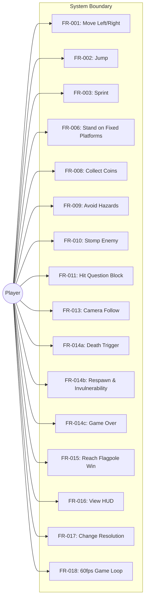
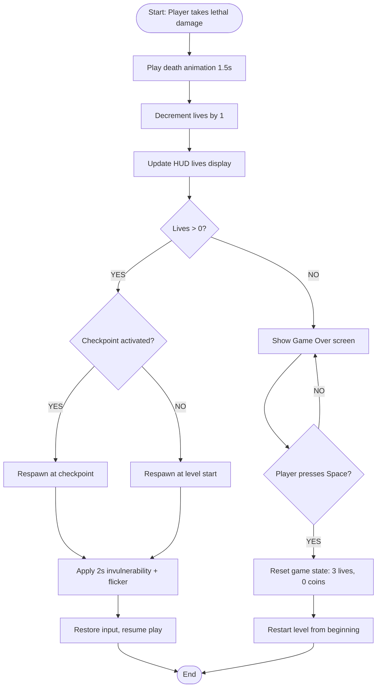
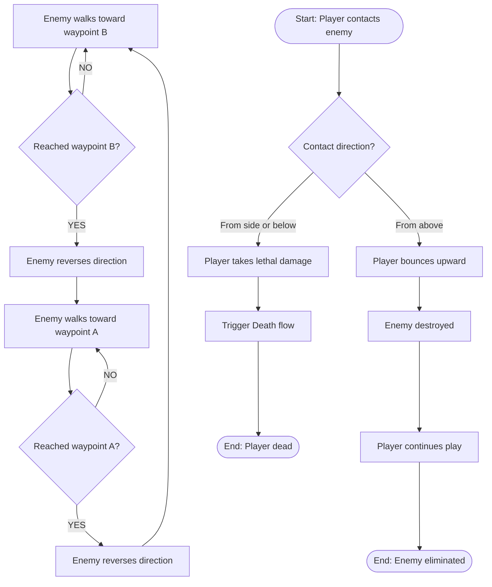

Date: 2026-05-31
Status: Approved
Standard: ISO/IEC/IEEE 29148
Template: C:\Users\jxing\.claude\plugins\cache\long-task-dev\long-task\1.0.0\docs\templates\srs-template.md

# Mario 2D Platformer Demo — 软件需求规约（Software Requirements Specification）

**日期（Date）**: 2026-05-31
**状态（Status）**: Approved
**参照标准（Standard）**: 对齐 ISO/IEC/IEEE 29148

## 1. 目的与范围（Purpose & Scope）

本项目旨在开发一款基于 Rust + Macroquad 框架的 2D 像素风格平台跳跃游戏。玩家控制一个角色在固定平台和障碍物之间跳跃穿行，收集金币、踩踏敌人、触发问号方块（产出金币、超级蘑菇或火焰花），最终抵达关卡终点的旗杆以赢得胜利。系统必须在 Windows 桌面平台上以稳定的 60fps 运行，支持 720p / 1080p / 1440p 窗口模式及全屏切换，并通过游戏内选项菜单配置分辨率。

### 1.1 范围内（In Scope）
本版本将实现：单个完整关卡（含固定平台、障碍物、敌人、金币、问号方块、检查点、旗杆），玩家能力（移动、跳跃、冲刺），力量增强系统（超级蘑菇变大+承伤、火焰花发射火球），生命与死亡系统（3条命、检查点重生、无敌帧、Game Over），胜利条件（旗杆），HUD（金币与生命显示），摄像机跟随（水平8%追赶、垂直60%死区+5%追赶），60fps 固定时间步长游戏循环，多分辨率与全屏支持（720p/1080p/1440p），以及游戏内选项菜单。

延期需求记录于 [deferred backlog](2026-05-31-mario-platformer-deferred.md)

### 1.2 范围外（Out of Scope）
- EXC-001: 多关卡 / 世界地图
- EXC-002: 复杂敌人 AI（仅支持巡逻行为）
- EXC-003: 音频 / 音乐 / 音效
- EXC-004: 存档 / 读档
- EXC-005: 多人 / 在线功能
- EXC-006: 关卡编辑器
- EXC-007: 外部网络服务或 API 调用

### 1.3 问题陈述（Problem Statement）
[Not applicable — Lite track project]

## 2. 术语与定义（Glossary & Definitions）
| 术语（Term） | 定义（Definition） | 切勿混淆于（Do NOT confuse with） |
|------|-----------|--------------------- |
| Macroquad | 一款极简 Rust 游戏框架，面向 2D/3D 开发，采用即时模式风格 | 不要与 Bevy、GGEZ、Piston 等 Rust 游戏引擎混淆 |
| 平台跳跃游戏（Platformer） | 2D 横向卷轴游戏类型，玩家在悬浮平台之间跳跃穿行 | 不要与俯视角（Top-down）或等距视角（Isometric）游戏混淆 |
| 60fps | 每秒 60 帧 —— 动作游戏的标准流畅帧率 | 不要与 30fps 或 144fps 混淆 |
| 最近邻缩放（Nearest-neighbor scaling） | 像素艺术作品放大时保留硬边缘的算法 | 不要与双线性（Bilinear）或双立方（Bicubic）缩放混淆 |
| 固定时间步长（Fixed Timestep） | 物理与逻辑更新以固定间隔（1/60s）执行，与渲染帧率解耦 | 不要与可变时间步长（delta-time 驱动）混淆 |
| 超级蘑菇（Super Mushroom） | 道具：玩家接触后角色体型变大，可承受一次敌人/危险伤害（受伤后恢复原大小） | 不要与火焰花混淆 |
| 火焰花（Fire Flower） | 道具：玩家接触后获得发射火球的能力，火球水平飞行可消灭路径上的敌人 | 不要与超级蘑菇混淆 |
| 碰撞体（Collision Body） | 游戏中用于检测物体之间是否接触的矩形边界框，驱动物理交互与伤害判定 | 不要与精灵（Sprite，纯视觉渲染）混淆 |
| 检查点（Checkpoint） | 关卡中途的存档旗标，玩家激活后死亡时从此位置而非关卡起点重生 | 不要与终点旗杆（Flagpole）混淆 |
| 死亡平面（Kill-plane） | 关卡底部一条不可见的水平线，玩家 Y 坐标超过此线时触发即死 | 不要与尖刺/陷阱等实体危险物混淆 |
| 无敌帧（Invulnerability Frames） | 玩家受伤或重生后短暂不受伤害的时间窗口，通常伴随角色闪烁视觉提示 | 不要与永久无敌（God Mode）混淆 |
| HUD（Heads-Up Display） | 叠加在游戏画面之上的固定位置 UI 元素，显示金币数、生命数等状态信息 | 不要与游戏内菜单（Pause Menu / Options Screen）混淆 |
| 螺旋死亡（Spiral-of-death） | 渲染性能不足导致物理更新累积、每帧需补算多步、进一步拖慢渲染的恶性循环 | 不要与普通帧率下降（FPS Drop）混淆 |
| 最近邻缩放 | 见"最近邻缩放（Nearest-neighbor scaling）"条目 | — |

## 3. 干系人与用户画像（Stakeholders & User Personas）
| Persona | Technical Level | Key Needs | Access Level |
|---------|----------------|-----------|------------- |
| 单人玩家（Local Player） | 低到中 —— 熟悉键盘操作、无需编程知识 | 流畅的移动手感、清晰的视觉反馈、公平的难度曲线、即开即玩 | 完整游戏访问 |

### 3.1 用例视图（Use Case View）

## 4. 功能需求（Functional Requirements）

### FR-001: Player Horizontal Movement
**优先级（Priority）**: Must
**EARS**: While the game is in the playing state, the system shall respond to Left/Right input (Arrow Left / Arrow Right or A / D keys) by applying horizontal acceleration to the player character at a configurable rate, up to a configurable maximum speed, and shall apply deceleration via simulated ground friction when no horizontal input is active.
**可视化输出（Visual output）**: 玩家角色精灵在游戏世界中水平平移；摄像机跟随玩家水平位置，使玩家保持在视口中心偏左位置。
**验收准则（Acceptance Criteria）**:
- Given 玩家站立在平台上且处于静止状态, When 按住右箭头或 D 键, Then 玩家在 0.3s 内加速至最大向右速度并保持匀速移动。
- Given 玩家正以最大速度向右移动, When 释放所有水平方向输入, Then 玩家在 0.2s 内因摩擦力减速至完全静止。
- Given 玩家正以最大速度向右移动, When 按住左箭头或 A 键, Then 玩家在 0.3s 内从向右最大速度反向加速至向左最大速度。
- Given 同时按住左箭头和右箭头（或 A 和 D）, When 两个方向键同时激活, Then 系统优先处理最后按下的方向，或使玩家减速至静止。
- Given 玩家处于空中（跳跃后或从平台边缘掉落）, When 按住水平方向键, Then 玩家获得在地面加速度 60% 的空中水平控制力。
**来源（Source）**: Raw requirement #1 — 角色操控: 左右移动

### FR-002: Player Jump
**优先级（Priority）**: Must
**EARS**: When the Space bar is pressed, the system shall apply an initial upward velocity to the player character; while Space remains held and the elapsed jump time is less than the maximum jump duration, the system shall sustain upward force; when Space is released or the maximum jump duration is reached, the system shall cease upward force and allow gravity to pull the player downward.
**可视化输出（Visual output）**: 玩家角色精灵向上跃起，跳跃高度因按下时长不同而可见变化。
**验收准则（Acceptance Criteria）**:
- Given 玩家站立在平台上, When 轻按空格键（按住 < 100ms）, Then 玩家上升至基础跳跃高度的约 40% 后开始下落。
- Given 玩家站立在平台上, When 按住空格不放, Then 玩家上升至最大跳跃高度并在最高点短暂悬停后开始下落。
- Given 玩家处于空中（非地面接触）, When 按下空格键, Then 玩家不应再次起跳（无无限跳跃）。
- Given 玩家在跳跃过程中头顶接触天花板或平台底部, When 玩家垂直速度向上且头部碰撞体碰撞上方几何体, Then 垂直速度立即归零，玩家开始下落。
- Given 玩家从较高平台边缘走出, When 玩家不再与任何平台碰撞, Then 重力立即作用于玩家，角色开始加速下落。
**来源（Source）**: Raw requirement #2 — 角色操控: 跳跃

### FR-003: Sprint
**优先级（Priority）**: Should
**EARS**: While the Shift key is held, the system shall increase the player's maximum horizontal speed by a multiplier of 1.5× and increase the maximum jump horizontal distance proportionally.
**可视化输出（Visual output）**: 玩家移动速度可见加快；跳跃时水平跨度明显增加。
**验收准则（Acceptance Criteria）**:
- Given 玩家在地面且按住 Shift, When 同时按住右箭头, Then 玩家最大水平速度为基础速度的 1.5 倍。
- Given 玩家在冲刺中起跳, When 按住 Shift + 空格, Then 玩家跳跃的水平位移比不冲刺时增加约 50%。
- Given 玩家在按住 Shift 时松开水平方向键, When 无水平输入, Then 玩家减速至静止（冲刺不影响摩擦力）。
**来源（Source）**: Raw requirement #3 — 角色操控: 加速跑

### FR-006: Fixed Platforms
**优先级（Priority）**: Must
**EARS**: The system shall provide static platform geometry at various (x, y) positions within the level bounds; while the player's collision body overlaps a platform's top surface from above with downward velocity ≤ 0, the system shall resolve the player to stand on the platform surface and reset airborne state.
**可视化输出（Visual output）**: 固定平台以像素艺术精灵渲染在场景中；玩家可见站立、行走、跳跃于不同高度平台之间。
**验收准则（Acceptance Criteria）**:
- Given 玩家从上方向下落接触平台顶部表面, When 玩家碰撞体底部与平台顶部碰撞体重叠, Then 玩家停在平台表面且垂直速度归零，可水平移动和跳跃。
- Given 玩家站在平台上, When 玩家水平移动至平台边缘之外, Then 玩家失去平台支撑并开始下落。
- Given 玩家在平台下方, When 玩家向上跳跃头顶接触到平台底部, Then 玩家垂直速度归零并开始下落（不可穿越平台）。
- Given 玩家水平移动, When 玩家侧面碰撞平台侧边碰撞体, Then 玩家水平移动被阻挡（不可穿墙）。
**来源（Source）**: Raw requirement #6 — 场景元素: 固定平台

### FR-008: Collectible Coins
**优先级（Priority）**: Should
**EARS**: When the player's collision body overlaps a coin entity, the system shall deactivate the coin, increment the coin counter by 1, and update the HUD coin display.
**可视化输出（Visual output）**: 金币精灵散布在场景各处；玩家接触时金币消失；HUD 中金币数字递增。
**验收准则（Acceptance Criteria）**:
- Given 玩家移动到金币所在位置, When 玩家碰撞体与金币碰撞体重叠, Then 金币从场景中移除且 HUD 金币计数 +1。
- Given 金币已被收集, When 玩家在同一位置再次经过, Then 金币不再出现（已收集状态持久化至关卡结束）。
- Given 玩家死亡并重生, When 玩家回到之前收集过金币的区域, Then 金币重新出现（重生复位金币）。
**来源（Source）**: Raw requirement #8 — 场景元素: 收集物(金币)

### FR-009: Hazards (Spikes and Pits)
**优先级（Priority）**: Must
**EARS**: When the player's collision body overlaps a spike or trap hazard, the system shall trigger player death; when the player falls below the level's kill-plane Y-coordinate, the system shall trigger instant player death.
**可视化输出（Visual output）**: 尖刺/陷阱以像素艺术精灵渲染在场景中；玩家接触时触发死亡动画；落入深渊时玩家精灵向下坠落消失。
**验收准则（Acceptance Criteria）**:
- Given 玩家接触到尖刺或地面陷阱, When 碰撞体与危险区域重叠, Then 玩家立即死亡并触发重生流程（FR-014b）。
- Given 玩家跳跃越过尖刺, When 玩家轨迹不与尖刺碰撞体相交, Then 玩家安全通过，不受伤。
- Given 玩家落入无底深渊（Y 坐标超过死亡平面）, When 玩家完全离开可见区域, Then 玩家立即死亡并触发重生流程。
- Given 玩家在重生后的无敌时间内, When 玩家处于无敌状态时接触危险, Then 玩家不受伤。
**来源（Source）**: Raw requirement #9 — 场景元素: 障碍/陷阱/深渊

### FR-010: Stompable Enemy
**优先级（Priority）**: Should
**备注**: Intentionally coarse — AC-1 覆盖自主实体行为（巡逻），AC-2-4 覆盖同一实体的玩家交互判定；全部关联同一 Enemy 实体，非独立关切。
**EARS**: The system shall provide a patrol enemy that walks back and forth between two waypoints; when the player lands on top of the enemy from above (player downward velocity > 0 and player bottom edge contacts enemy top edge), the system shall destroy the enemy and apply a small upward bounce to the player; when the player contacts the enemy from the side or below, the system shall trigger player death.
**可视化输出（Visual output）**: 敌人精灵在地面两个端点之间巡逻行走；被踩踏时压扁消失；从侧面碰撞时玩家受伤。
**验收准则（Acceptance Criteria）**:
- Given 敌人在地面巡逻, When 无玩家干扰, Then 敌人在 A-B 两点间以恒定速度往复移动，到达端点时转向。
- Given 玩家从上方落在敌人头顶, When 玩家向下速度 > 0 且玩家底部碰撞体接触敌人顶部碰撞体, Then 敌人被消灭并从场景移除，玩家获得小幅向上反弹。
- Given 玩家从侧面接触敌人, When 玩家水平方向与敌人碰撞体重叠且非从上方踩踏, Then 玩家受到伤害（立即死亡），触发死亡流程。
- Given 玩家从下方接触敌人, When 玩家顶部碰撞体接触敌人底部, Then 玩家受到伤害（立即死亡），触发死亡流程。
**来源（Source）**: Raw requirement #10 — 可踩踏敌人

### FR-011: Question Blocks
**优先级（Priority）**: Should
**备注**: Intentionally coarse — AC-1-3 覆盖方块激活机制，AC-4-5 覆盖奖励道具效果；全部属于问号方块奖励产出的不同变体，共享同一触发条件（头顶撞击）。
**EARS**: When the player hits a question block from below (player head collision body contacts block bottom surface while player vertical velocity > 0), the system shall deactivate the block (change to "used" visual state), randomly select a reward from the configured loot table (Coin: 70%, Super Mushroom: 15%, Fire Flower: 15%), spawn the reward above the block, and apply a downward bounce to the player.
**可视化输出（Visual output）**: 问号方块精灵从"?"变为"已使用"暗色状态；金币、蘑菇或火焰花从方块上方弹出；玩家被弹回下方。蘑菇在地面弹跳移动，火焰花静止在原地。
**验收准则（Acceptance Criteria）**:
- Given 玩家从下方头顶撞击问号方块, When 玩家头部碰撞体接触方块底部且方块未使用, Then 方块切换为已使用状态，按概率表随机产出奖励（金币70%、蘑菇15%、火焰花15%），玩家轻微弹回。
- Given 问号方块已被激活过, When 玩家再次头顶撞击, Then 方块不再产生任何物品（保持已使用状态）。
- Given 玩家从上方或侧面接触问号方块, When 接触方向不是从下向上, Then 方块不被激活，行为与普通固定平台一致。
- Given 方块产出超级蘑菇, When 蘑菇在地面弹跳移动, Then 玩家接触蘑菇后角色变大，可承受一次伤害（受伤后恢复原大小）。
- Given 方块产出火焰花, When 火焰花出现在方块上方, Then 玩家接触火焰花后获得发射火球能力，火球水平飞行可消灭路径上的敌人。
**来源（Source）**: Raw requirement #11 — 问号方块; Clarified by user: "金币+蘑菇+花"

### FR-013: Camera Follow
**优先级（Priority）**: Must
**EARS**: While the game is in the playing state, the system shall continuously update the camera viewport position to follow the player: horizontally, the camera shall close 8% of the remaining distance to the player's target position each frame, with the player kept at 35-40% from the left edge of the viewport; vertically, the camera shall maintain a dead zone covering the central 60% of the viewport height — only when the player's Y position exits this zone shall the camera close 5% of the remaining vertical distance per frame toward the player. The camera shall clamp to the level's minimum and maximum X coordinates to prevent showing areas beyond level geometry.
**可视化输出（Visual output）**: 游戏视口平滑跟随玩家水平移动；玩家始终可见，且视野前方空间多于后方；垂直方向在玩家处于屏幕中央时不移动，避免频繁晃动。
**验收准则（Acceptance Criteria）**:
- Given 玩家向右移动, When 玩家 X 坐标增加, Then 摄像机水平位置每帧向目标位置收敛剩余距离的 8%，追赶延迟不超过 80 像素。
- Given 玩家静止, When 玩家 X 坐标不变, Then 摄像机收敛至目标位置并完全静止（无振荡）。
- Given 玩家移动到关卡最左边界, When 玩家 X 坐标 ≤ 关卡最小 X 值 + 视口偏移, Then 摄像机停止在关卡左边界，左侧不显示关卡外区域。
- Given 玩家移动到关卡最右边界, When 玩家 X 坐标 ≥ 关卡最大 X 值 − 视口偏移, Then 摄像机停止在关卡右边界，右侧不显示关卡外区域。
- Given 玩家执行垂直跳跃, When 玩家 Y 坐标超出视口中央 60% 的垂直死区, Then 摄像机每帧以剩余垂直距离 5% 的速率追赶玩家 Y 坐标；当玩家在死区内时摄像机垂直位置保持不变。
**来源（Source）**: Raw requirement #13 — 摄像机: 平滑跟随; Clarified by user: "有限死区"

### FR-014a: Death Trigger
**优先级（Priority）**: Must
**EARS**: When the player contacts a lethal hazard (spike, enemy side/below, pit fall), the system shall immediately lock player input, play the death animation (1.5s), decrement the lives counter by 1, and then transition to respawn if lives > 0, or to game over state if lives = 0.
**可视化输出（Visual output）**: 玩家死亡时播放死亡动画（角色弹起后下落消失）。
**验收准则（Acceptance Criteria）**:
- Given 玩家有 N 条命且接触到即死危险, When 死亡触发, Then 生命数从 N 减至 N-1。
- Given 死亡动画播放中, When 动画持续 1.5s, Then 玩家输入被锁定，玩家不可操控。
- Given 死亡动画完成且生命数 > 0, When 动画结束, Then 系统转入重生流程（FR-014b）。
- Given 死亡动画完成且生命数 = 0, When 动画结束, Then 系统转入 Game Over 状态（FR-014c）。
**来源（Source）**: Raw requirement #14 — 死亡逻辑 (Part A)

### FR-014b: Respawn and Invulnerability
**优先级（Priority）**: Must
**备注**: Intentionally coarse — 三个步骤（位置重置/无敌授予/输入恢复）是同一重生序列的连续阶段，非独立关切。
**EARS**: When the death animation completes and lives > 0, the system shall reposition the player at the most recent checkpoint (or level start if no checkpoint activated), grant 2 seconds of invulnerability with visual flicker effect, and restore player input at the end of the invulnerability period.
**可视化输出（Visual output）**: 角色从重生点出现并短暂闪烁（无敌状态）；2秒后闪烁停止，输入恢复。
**验收准则（Acceptance Criteria）**:
- Given 玩家死亡后生命数 > 0, When 死亡动画结束, Then 玩家在最近激活的检查点位置重生；若未激活任何检查点，则在关卡起点重生。
- Given 玩家重生完成, When 重生后 2 秒内, Then 玩家处于无敌状态（角色闪烁），期间接触敌人或危险不受伤。
- Given 玩家无敌状态结束, When 2 秒无敌时间到, Then 玩家恢复正常碰撞检测且输入恢复。
- Given 玩家激活了中途检查点, When 后续死亡重生, Then 玩家在上次激活的检查点位置重生，而非关卡起点。
**来源（Source）**: Raw requirement #14 — 死亡逻辑 (Part B)

### FR-014c: Game Over
**优先级（Priority）**: Must
**EARS**: When the lives counter reaches 0 after a death, the system shall display the Game Over screen overlay; when Space is pressed on the Game Over screen, the system shall reset the game state to initial values (3 lives, 0 coins, level start position) and restart the level.
**可视化输出（Visual output）**: Game Over 文字叠加层覆盖整个画面，显示"Game Over"和"Press Space to Restart"提示。
**验收准则（Acceptance Criteria）**:
- Given 玩家生命数减至 0, When 死亡动画结束, Then 系统显示 Game Over 画面。
- Given Game Over 画面显示中, When 玩家按下空格键, Then 游戏完全重置：3 条命、0 金币、关卡从头开始。
- Given Game Over 画面显示中, When 玩家未按空格键, Then 画面持续显示，游戏不自动重启。
**来源（Source）**: Raw requirement #14 — 死亡逻辑 (Part C)

### FR-015: Win Condition (Flagpole)
**优先级（Priority）**: Must
**备注**: Intentionally coarse — 两个阶段（触发动画/胜利画面）是同一胜利序列的连续阶段，非独立关切。
**EARS**: When the player's collision body overlaps the flagpole entity at the end of the level, the system shall lock player input and play the flag-slide-down animation; upon animation completion, the system shall display the Victory screen overlay with final coin count and "Press Space to Play Again" prompt; when Space is pressed, the system shall reset and restart the level.
**可视化输出（Visual output）**: 旗杆精灵位于关卡终点；玩家接触后角色滑下旗杆；胜利画面显示"Victory!"与金币总数。
**验收准则（Acceptance Criteria）**:
- Given 玩家到达关卡终点旗杆, When 玩家碰撞体与旗杆触发区域重叠, Then 玩家输入被锁定，播放旗杆滑下动画。
- Given 旗杆动画播放完成, When 胜利画面渲染完成, Then 显示"Victory!"标题、本次金币收集总数，以及"Press Space to Play Again"提示。
- Given 胜利画面显示中, When 玩家按下空格键, Then 游戏完全重置并重新开始。
- Given 玩家在到达旗杆前死亡, When 玩家触发死亡流程, Then 胜利条件不被触发（旗杆仅在存活状态下可达）。
**来源（Source）**: Raw requirement #15 — 胜负: 到达终点旗杆

### FR-016: Heads-Up Display (HUD)
**优先级（Priority）**: Must
**EARS**: The system shall render a coin counter and lives indicator as screen-space overlay anchored at 3% from the left edge and 3% from the top edge of the viewport (tolerance ±2% of viewport dimensions), updating immediately whenever the coin count or lives count changes.
**可视化输出（Visual output）**: 屏幕左上角锚定位置显示金币图标 + 数字和生命图标 + 数字；数值变化时即时更新。
**验收准则（Acceptance Criteria）**:
- Given 游戏开始, When 关卡加载完成, Then HUD 显示金币计数为 0、生命计数为 3，锚定于视口 (3%, 3%) 位置。
- Given 玩家收集一枚金币, When 金币碰撞事件触发, Then HUD 金币计数在当前帧内 +1。
- Given 玩家死亡, When 生命数减 1, Then HUD 生命计数在当前帧内 −1。
- Given 玩家重生或游戏重置, When 状态重置, Then HUD 显示重置后的金币与生命数值。
**来源（Source）**: Raw requirement #16 — HUD: 金币计数+生命数

### FR-017: Resolution and Display Mode Configuration
**优先级（Priority）**: Should
**EARS**: The system shall provide an in-game options menu accessible during gameplay where the user can select a resolution (720p / 1080p / 1440p) from a list and toggle fullscreen mode; upon confirmation, the system shall apply the selection immediately using nearest-neighbor scaling for all rendered content.
**可视化输出（Visual output）**: 游戏内选项菜单，包含分辨率选项（720p/1080p/1440p）和全屏开关；选择后画面即时切换。
**验收准则（Acceptance Criteria）**:
- Given 游戏运行中, When 玩家打开选项菜单, Then 菜单显示当前分辨率、可选分辨率列表（720p/1080p/1440p）和全屏开关。
- Given 玩家在选项菜单中选择新分辨率, When 玩家确认选择, Then 游戏窗口调整至所选分辨率，所有内容以最近邻方式缩放。
- Given 玩家在选项菜单中开启全屏, When 玩家确认, Then 游戏切换至当前显示器的原生分辨率全屏模式。
- Given 游戏在全屏模式, When 玩家在选项菜单中关闭全屏, Then 游戏回到之前设置的窗口分辨率。
**来源（Source）**: Raw requirement #17 — 分辨率: 多分辨率+全屏支持; Clarified by user: "通过选项菜单切换"

### FR-018: Fixed-Timestep Game Loop
**优先级（Priority）**: Must
**EARS**: The system shall advance game simulation at a fixed interval of 1/60s independently of rendering frame rate; when rendering falls behind, the system shall execute at most 5 simulation steps per frame to catch up, discarding any excess accumulated time beyond this limit.
**可视化输出（Visual output）**: N/A — backend-only（游戏循环为引擎层逻辑，无直接用户可见输出；用户通过稳定流畅的操作手感间接感知）。
**验收准则（Acceptance Criteria）**:
- Given 游戏运行中, When 系统时钟推进 1 秒, Then 模拟步进恰好执行 60 次。
- Given 渲染帧率短暂下降, When 渲染跟不上模拟频率, Then 模拟继续以固定步长累进，物体运动不因帧率波动而变速。
- Given 模拟单次步进耗时超过固定时间步长, When 累积时间持续增长, Then 系统将单帧模拟步数限制在最大值 5 次，超出部分的时间被丢弃。
- Given 游戏循环启动, When 第一帧渲染前, Then 时间累加器初始化为 0，模拟与渲染时基对齐。
**来源（Source）**: Raw requirement #18 — 60fps锁定游戏循环

### 4.1 流程图（Process Flows）

#### Flow: Death & Respawn (FR-014a/FR-014b/FR-014c)

#### Flow: Enemy Patrol & Interaction (FR-010)

## 5. 非功能需求（Non-Functional Requirements）
| ID | Priority | Category (ISO 25010) | Requirement | Measurable Criterion | Measurement Method |
|----|----------|---------------------|-------------|---------------------|-------------------|
| NFR-001 | Must | Performance Efficiency (Time Behaviour) | 60fps 渲染帧率 —— 游戏在目标分辨率下稳定输出 60 帧每秒 | 99% 的帧渲染时间 ≤ 16.67ms；任意连续 60 秒窗口内帧率不低于 58fps | 内置 FPS 计数器记录每帧耗时，输出 min/max/avg/p99 帧时间日志 |
| NFR-002 | Should | Portability (Adaptability) | 多分辨率支持 —— 游戏在 720p/1080p/1440p 窗口及全屏模式下正确渲染 | HUD 元素锚定在视口 (3%, 3%) 位置，偏差不超过 ±2% 视口宽高；玩家可见区域占视口宽度 45-50% at all resolutions | 手动切换每种分辨率模式，截屏验证：HUD 位置、可见区域比例、无画面裁剪 |
| NFR-003 | Should | Usability (Aesthetics) | 像素艺术渲染 —— 所有精灵和关卡图块使用最近邻插值缩放 | 在任何分辨率下，8× 放大检查像素边界：单个像素为纯色正方形，无过渡色/模糊边缘 | 截屏后以 8× 放大检查像素边界 |

## 6. 接口需求（Interface Requirements）
[Not applicable] — 本游戏为独立桌面应用，所有交互均为本地键盘输入与显示器输出，不涉及外部系统接口、网络协议或第三方 API。

## 7. 约束（Constraints）
| ID | Constraint | Rationale |
|----|-----------|----------|
| CON-001 | 使用 Rust 语言（edition 2024）开发 | 项目技术栈选型决策 |
| CON-002 | 使用 Macroquad 游戏框架 | 极简 Rust 游戏框架，即时模式 API，无需复杂 ECS 架构 |
| CON-003 | 目标平台为 Windows 桌面（.exe 二进制） | 本版本仅支持 Windows；无 Linux/macOS/Web 构建目标 |
| CON-004 | 无外部 Web 服务或网络依赖 | 游戏为纯本地离线运行，不需要互联网连接 |

## 8. 假设与依赖（Assumptions & Dependencies）
| ID | Assumption | Impact if Invalid |
|----|-----------|------------------|
| ASM-001 | 仅支持单一本地玩家，无分屏或热座模式 | 若需多人支持，需要重新设计输入处理、摄像机系统和 HUD 布局 |
| ASM-002 | 玩家使用标准 QWERTY 键盘操作 | 若需支持手柄或其他键盘布局（AZERTY 等），需要可配置的键位映射系统 |
| ASM-003 | 关卡仅有一个（无世界地图、无关卡选择） | 若需多关卡，需要关卡加载系统、世界地图 UI 和关卡间状态传递机制 |
| ASM-004 | 关卡设计数据（平台位置、敌人位置、金币位置等）以硬编码或静态配置文件形式嵌入，无运行时关卡编辑器 | 若需关卡编辑器，需要独立的编辑工具和关卡文件序列化/反序列化格式 |
| ASM-005 | 分辨率配置通过游戏内选项菜单切换 | 已在 FR-017 中覆盖；若无效则需回退至配置文件或命令行参数方案 |

## 9. 验收准则汇总（Acceptance Criteria Summary）
| Requirement | AC Count | Key Verification |
|-------------|----------|-----------------|
| FR-001 | 5 | Movement acceleration, deceleration, reversal, conflict resolution, air control |
| FR-002 | 5 | Short jump, max jump, no infinite jump, ceiling collision, edge fall |
| FR-003 | 3 | Sprint speed, sprint jump distance, sprint deceleration |
| FR-006 | 4 | Land on platform, edge fall, bottom collision, side collision |
| FR-008 | 3 | Collect coin, collected state persistence, respawn reset |
| FR-009 | 4 | Spike death, dodge, pit death, invulnerability exception |
| FR-010 | 4 | Patrol loop, stomp kill, side damage, below damage |
| FR-011 | 5 | Block activation, used state, side contact, mushroom effect, flower effect |
| FR-013 | 5 | Horizontal follow rate, convergence, left clamp, right clamp, vertical dead-zone |
| FR-014a | 4 | Death decrement, input lock, respawn transition, game over transition |
| FR-014b | 4 | Checkpoint respawn, invulnerability 2s, invulnerability expiry, no-checkpoint fallback |
| FR-014c | 3 | Game over display, space restart, no auto-restart |
| FR-015 | 4 | Flagpole trigger, victory screen, space restart, death precedence |
| FR-016 | 4 | Initial display (3%,3% anchor), coin update, lives update, reset |
| FR-017 | 4 | Menu access, resolution change, fullscreen enter, fullscreen exit |
| FR-018 | 4 | 60 steps/sec, frame independence, max-5 catch-up guard, accumulator init |
| NFR-001 | 1 | 60fps p99 frame time ≤ 16.67ms |
| NFR-002 | 1 | Per-resolution screenshot verification |
| NFR-003 | 1 | 8× pixel boundary inspection |

## 10. 可追溯矩阵（Traceability Matrix）
| Requirement ID | Source (stakeholder need) | Verification Method |
|---------------|-------------------------|-------------------|
| FR-001 | 角色操控: 左右移动 | Automated test |
| FR-002 | 角色操控: 跳跃 | Automated test |
| FR-003 | 角色操控: 加速跑 | Automated test |
| FR-006 | 场景元素: 固定平台 | Automated test |
| FR-008 | 场景元素: 收集物(金币) | Automated test |
| FR-009 | 场景元素: 障碍/陷阱/深渊 | Automated test |
| FR-010 | 可踩踏敌人 | Automated test |
| FR-011 | 问号方块 | Automated test |
| FR-013 | 摄像机: 平滑跟随 | Automated test |
| FR-014a | 死亡逻辑: 扣生命触发 | Automated test |
| FR-014b | 死亡逻辑: 检查点重生+无敌 | Automated test |
| FR-014c | 死亡逻辑: Game Over | Automated test |
| FR-015 | 胜负: 到达终点旗杆 | Automated test |
| FR-016 | HUD: 金币计数+生命数 | Automated test |
| FR-017 | 分辨率: 多分辨率+全屏支持 | Manual test |
| FR-018 | 60fps锁定游戏循环 | Automated test |
| NFR-001 | 60fps帧率目标 | Performance measurement |
| NFR-002 | 多分辨率支持 | Manual screenshot verification |
| NFR-003 | 像素艺术渲染质量 | Visual inspection |
| CON-001 | 技术栈选型: Rust edition 2024 | Build verification |
| CON-002 | 框架选型: Macroquad | Dependency audit |
| CON-003 | 平台: Windows .exe | Platform smoke test |
| CON-004 | 离线运行: 无网络依赖 | Air-gap test |
| ASM-001 | 单玩家假设 | Scope validation |
| ASM-002 | QWERTY 键盘假设 | Input compatibility test |
| ASM-003 | 单关卡假设 | Scope validation |
| ASM-004 | 静态关卡数据假设 | Data integrity test |
| ASM-005 | 选项菜单配置假设 | Manual menu test |

## 11. 遗留问题（Open Questions）
None — all clarifications obtained during elicitation and quality review.
